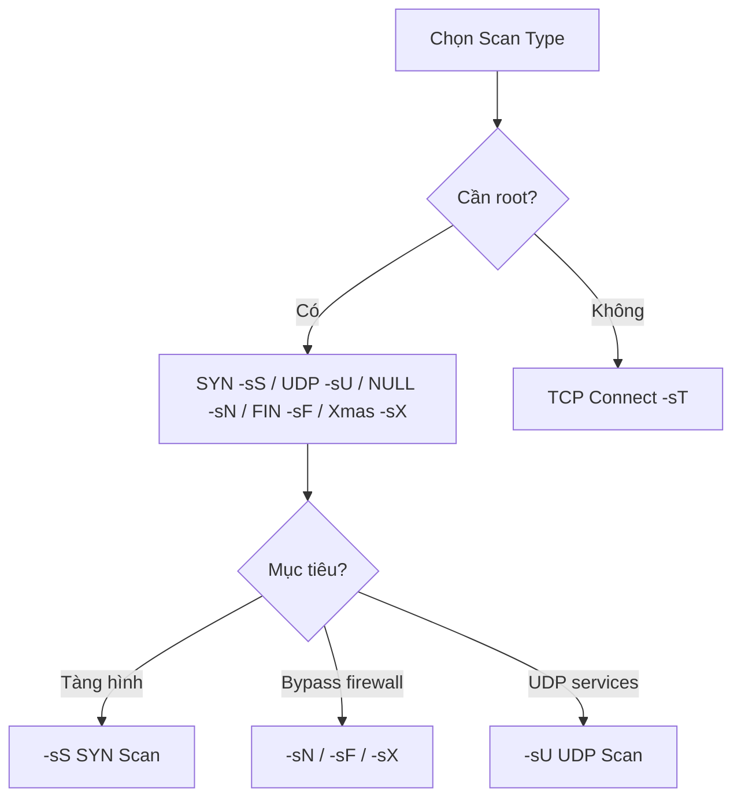
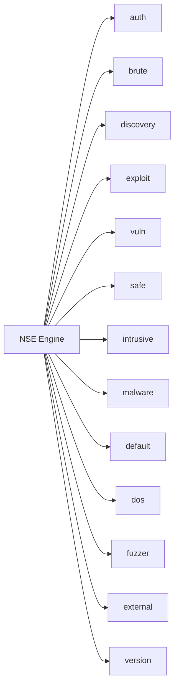

# Nmap Cheatsheet 

<!--more-->

## Mục lục nhanh

```
1. Cú pháp & Cấu trúc lệnh
2. Target Specification
3. Host Discovery (Ping Scan)
4. Scan Techniques (Loại quét)
5. Port Specification
6. Service & Version Detection
7. OS Detection
8. NSE — Nmap Scripting Engine
9. Timing & Performance
10. Firewall / IDS Evasion
11. Output
12. Troubleshooting & Debugging
13. Ndiff — So sánh kết quả
14. Một số lệnh thực chiến
```

---

## 1. Cú pháp & Cấu trúc lệnh

```bash
nmap [Scan Type(s)] [Options] {target specification}
```

!!! tip "Quy tắc chung"
    - `[target]` có thể là IP, hostname, CIDR range, hoặc file danh sách.
    - Hầu hết các scan type yêu cầu **quyền root/sudo** (raw packet).
    - Các option có thể **kết hợp** tự do: `nmap -sS -sV -O -A -T4 target`.

---

## 2. Target Specification

### Các cách xác định mục tiêu

| Cú pháp | Ví dụ | Mô tả |
|---------|-------|-------|
| IP đơn | `nmap 192.168.1.1` | Scan một địa chỉ IP |
| Nhiều IP | `nmap 192.168.1.1 10.0.0.5` | Scan nhiều IP riêng lẻ |
| Range | `nmap 192.168.1.1-254` | Scan dải IP từ .1 đến .254 |
| CIDR | `nmap 192.168.1.0/24` | Scan cả subnet /24 |
| Hostname | `nmap scanme.nmap.org` | Scan theo domain |
| Từ file | `nmap -iL targets.txt` | Đọc danh sách target từ file |
| Ngẫu nhiên | `nmap -iR 100` | Scan 100 host ngẫu nhiên trên internet |
| Loại trừ IP | `nmap 192.168.1.0/24 --exclude 192.168.1.1` | Bỏ qua IP cụ thể |
| Loại trừ từ file | `nmap 192.168.1.0/24 --excludefile skip.txt` | Bỏ qua danh sách trong file |
| IPv6 | `nmap -6 2607:f0d0:1002:51::4` | Scan địa chỉ IPv6 |

!!! note "File `targets.txt`"
    Mỗi target trên một dòng. Hỗ trợ IP, hostname, CIDR, range đều được.

    ```
    192.168.1.1
    10.0.0.0/24
    scanme.nmap.org
    ```

---

## 3. Host Discovery

> Trước khi scan port, Nmap cần biết host nào đang **alive**. Đây là bước host discovery.

### Các phương thức Ping

| Switch | Ví dụ | Mô tả |
|--------|-------|-------|
| `-sn` | `nmap -sn 192.168.1.0/24` | Ping scan (chỉ host discovery, không scan port) |
| `-Pn` | `nmap -Pn 192.168.1.1` | Skip host discovery, cứ scan port dù target không phản hồi ping |
| `-sL` | `nmap -sL 192.168.1.0/24` | List scan — chỉ liệt kê target, không gửi packet nào |
| `-PS` | `nmap -PS22,80,443 192.168.1.0/24` | TCP SYN ping tới port chỉ định (mặc định port 80) |
| `-PA` | `nmap -PA22,80 192.168.1.0/24` | TCP ACK ping |
| `-PU` | `nmap -PU53 192.168.1.0/24` | UDP ping tới port chỉ định |
| `-PE` | `nmap -PE 192.168.1.0/24` | ICMP Echo ping |
| `-PP` | `nmap -PP 192.168.1.0/24` | ICMP Timestamp ping |
| `-PM` | `nmap -PM 192.168.1.0/24` | ICMP Address Mask ping |
| `-PR` | `nmap -PR 192.168.1.0/24` | ARP ping (chỉ hoạt động trong LAN, rất nhanh và chính xác) |
| `-PY` | `nmap -PY 192.168.1.0/24` | SCTP INIT ping |
| `-PO` | `nmap -PO 192.168.1.0/24` | IP Protocol ping |
| `-n` | `nmap -n 192.168.1.1` | Không thực hiện DNS resolution (nhanh hơn) |
| `-R` | `nmap -R 192.168.1.1` | Bắt buộc reverse DNS resolution |
| `--system-dns` | `nmap --system-dns target` | Dùng DNS resolver của hệ điều hành thay vì Nmap's internal |
| `--dns-servers` | `nmap --dns-servers 8.8.8.8 target` | Chỉ định DNS server cụ thể |
| `--traceroute` | `nmap --traceroute target` | Trace route tới host sau khi scan |

!!! warning "Khi nào dùng `-Pn`?"
    Dùng `-Pn` khi target bị **firewall block ICMP** (drop ping). Ví dụ Windows Firewall mặc định block ping — nếu không có `-Pn`, Nmap sẽ kết luận host offline và bỏ qua.

    ```bash
    nmap -Pn 192.168.1.1    # Scan dù không ping được
    ```

---

## 4. Scan Techniques

> Switch `-s` xác định **loại scan** — ảnh hưởng trực tiếp đến tính tàng hình, độ chính xác và yêu cầu quyền.



### Bảng tổng hợp Scan Types

| Switch | Tên | Mô tả chi tiết |
|--------|-----|----------------|
| `-sS` | **SYN Scan** | Gửi SYN, nhận SYN-ACK (open) hoặc RST (closed). **Không hoàn thành 3-way handshake** → stealth hơn. Cần root. Default khi có root. |
| `-sT` | **TCP Connect Scan** | Hoàn thành 3-way handshake hoàn chỉnh. Không cần root nhưng **dễ bị log** hơn. Default khi không có root. |
| `-sU` | **UDP Scan** | Scan UDP port. Chậm và khó (UDP không có handshake). Cần root. |
| `-sN` | **NULL Scan** | Gửi packet không có flag nào. Bypass một số firewall/IDS. |
| `-sF` | **FIN Scan** | Gửi chỉ FIN flag. Bypass firewall không stateful. |
| `-sX` | **Xmas Scan** | Bật FIN + PSH + URG flags (gói "sáng như cây Xmas"). Bypass firewall. |
| `-sA` | **ACK Scan** | Dùng để **map firewall rules** và phân biệt filtered vs unfiltered port, không detect open/closed. |
| `-sW` | **Window Scan** | Giống ACK nhưng phân tích TCP window size để phát hiện open port trên một số OS. |
| `-sM` | **Maimon Scan** | FIN + ACK. Một số BSD-based sẽ drop packet nếu port open. |
| `-sI` | **Idle/Zombie Scan** | Scan hoàn toàn ẩn danh qua một host "zombie". Cực kỳ stealth. |
| `-sO` | **IP Protocol Scan** | Liệt kê IP protocols mà host hỗ trợ (TCP, UDP, ICMP, IGMP...). |
| `-sR` | **RPC Scan** | Xác định các RPC service và version (deprecated, dùng `-sV` thay). |
| `--scanflags` | **Custom TCP Scan** | Tự chỉ định TCP flags: `--scanflags URGACKPSHRSTSYNFIN` |
| `--send-eth` | Raw Ethernet | Gửi packet ở Ethernet layer |
| `--send-ip` | Raw IP | Gửi packet ở IP layer |

!!! info "SYN vs TCP Connect — khi nào dùng gì?"
    - **`-sS`**: Dùng trong pentest thực tế, cần root, stealthy hơn vì không hoàn thành connection.
    - **`-sT`**: Khi không có root (user thường), hoặc cần scan qua proxy. Dễ bị phát hiện hơn.

??? example "Ví dụ thực chiến"
    ```bash
    # SYN scan nhanh, stealth
    sudo nmap -sS -T4 192.168.1.0/24

    # UDP scan (chậm, cần kiên nhẫn)
    sudo nmap -sU -p 53,67,68,123,161 192.168.1.1

    # Kết hợp TCP + UDP cùng lúc
    sudo nmap -sS -sU -p T:80,443,U:53,161 192.168.1.1

    # Idle zombie scan (cực stealth)
    sudo nmap -sI zombie_ip target_ip

    # Custom flags
    sudo nmap --scanflags SYNFIN 192.168.1.1
    ```

### Port States — Các trạng thái port

| State | Ý nghĩa |
|-------|---------|
| `open` | Port đang lắng nghe, có service chạy |
| `closed` | Port không có service nhưng **reachable** (RST received) |
| `filtered` | Firewall block packet, Nmap không xác định được |
| `unfiltered` | Port reachable nhưng không xác định open/closed (ACK scan) |
| `open\|filtered` | Nmap không phân biệt được (thường với UDP/NULL/FIN/Xmas) |
| `closed\|filtered` | Không xác định closed hay filtered (Idle scan) |

---

## 5. Port Specification

| Switch | Ví dụ | Mô tả |
|--------|-------|-------|
| `-p [port]` | `nmap -p 80 target` | Scan port cụ thể |
| `-p [range]` | `nmap -p 1-1024 target` | Scan dải port |
| `-p [list]` | `nmap -p 22,80,443,8080 target` | Scan list port |
| `-p U:,T:` | `nmap -p U:53,T:80,443 target` | Mix UDP và TCP port |
| `-p-` | `nmap -p- target` | Scan **toàn bộ** 65535 port |
| `-p 0-` | `nmap -p 0- target` | Bao gồm cả port 0 |
| `-F` | `nmap -F target` | Fast scan — chỉ scan **100 port phổ biến nhất** |
| `--top-ports` | `nmap --top-ports 1000 target` | Scan top N port phổ biến nhất |
| `-r` | `nmap -r target` | Scan tuần tự theo thứ tự số (mặc định ngẫu nhiên) |
| `-p [service]` | `nmap -p http,https target` | Scan theo tên service (tra `/etc/services`) |

!!! tip "Scan thông minh hơn với `--top-ports`"
    Thay vì scan toàn bộ 65535 port (mất hàng giờ), scan top 1000 port thường cover ~95% service thực tế:

    ```bash
    nmap --top-ports 1000 192.168.1.1
    ```

---

## 6. Service & Version Detection

> Nmap không chỉ biết port open — nó còn có thể **fingerprint service** và phát hiện version cụ thể.

| Switch | Ví dụ | Mô tả |
|--------|-------|-------|
| `-sV` | `nmap -sV target` | Detect service/version trên open port |
| `-sV --version-intensity [0-9]` | `nmap -sV --version-intensity 5 target` | Độ sâu probe (0=nhẹ, 9=cực sâu). Mặc định 7 |
| `-sV --version-light` | `nmap -sV --version-light target` | Intensity 2 — nhanh hơn, ít chính xác hơn |
| `-sV --version-all` | `nmap -sV --version-all target` | Intensity 9 — thử mọi probe |
| `--version-trace` | `nmap -sV --version-trace target` | Debug chi tiết quá trình version detection |
| `-A` | `nmap -A target` | **Aggressive mode**: bật `-sV -O -sC --traceroute` cùng lúc |

??? example "Output mẫu `-sV`"
    ```
    PORT    STATE  SERVICE  VERSION
    22/tcp  open   ssh      OpenSSH 8.2p1 Ubuntu 4ubuntu0.5
    80/tcp  open   http     Apache httpd 2.4.41
    443/tcp open   https    nginx 1.18.0
    3306/tcp open  mysql    MySQL 8.0.30
    ```

---

## 7. OS Detection

> Nmap dùng **TCP/IP stack fingerprinting** — phân tích sự khác biệt nhỏ trong cách OS implement TCP/IP để đoán OS.

| Switch | Ví dụ | Mô tả |
|--------|-------|-------|
| `-O` | `nmap -O target` | Enable OS detection |
| `-O --osscan-guess` | `nmap -O --osscan-guess target` | Ép Nmap đoán dù confidence thấp |
| `-O --osscan-limit` | `nmap -O --osscan-limit target` | Chỉ thử OS detect khi có ít nhất 1 open + 1 closed port |
| `-O --max-os-tries [n]` | `nmap -O --max-os-tries 2 target` | Giới hạn số lần thử OS detect |
| `-A` | `nmap -A target` | Bao gồm OS detection + version + scripts + traceroute |

!!! warning "OS Detection cần ít nhất 1 open và 1 closed port"
    Nếu firewall filter hết port, OS detection sẽ thất bại. Dùng thêm `--osscan-guess` để Nmap vẫn trả về kết quả tốt nhất có thể, dù confidence không cao.

---

## 8. NSE — Nmap Scripting Engine

> NSE (Nmap Scripting Engine) là một trong những tính năng mạnh nhất của Nmap. Scripts được viết bằng **Lua** và nằm tại `/usr/share/nmap/scripts/`.



### Script Categories

| Category | Mô tả |
|----------|-------|
| `auth` | Xác thực: bypass auth, detect null session, v.v. |
| `brute` | Brute force credentials (SSH, FTP, HTTP, SMB...) |
| `default` | Scripts an toàn, chạy với `-sC`. Thường dùng nhất |
| `discovery` | Thu thập thông tin: DNS, SNMP, SMB share, v.v. |
| `dos` | Kiểm tra denial-of-service (cẩn thận!) |
| `exploit` | Khai thác lỗ hổng |
| `external` | Gọi third-party service bên ngoài (Shodan, Whois...) |
| `fuzzer` | Fuzz input để tìm crash/bug |
| `intrusive` | Có thể gây ảnh hưởng đến target (crash, log, v.v.) |
| `malware` | Detect malware/backdoor trên target |
| `safe` | Scripts an toàn, không gây tác hại |
| `version` | Hỗ trợ phát hiện version service |
| `vuln` | Kiểm tra các lỗ hổng đã biết (CVE) |

### Cú pháp chạy Scripts

| Switch | Ví dụ | Mô tả |
|--------|-------|-------|
| `-sC` | `nmap -sC target` | Chạy tất cả script thuộc category `default` |
| `--script default` | `nmap --script default target` | Tương đương `-sC` |
| `--script [name]` | `nmap --script banner target` | Chạy script cụ thể |
| `--script [wildcard]` | `nmap --script "http-*" target` | Chạy tất cả script match pattern |
| `--script [cat]` | `nmap --script vuln target` | Chạy toàn bộ category |
| `--script [cat1,cat2]` | `nmap --script "default,safe" target` | Nhiều category |
| `--script "not [cat]"` | `nmap --script "not intrusive" target` | Loại trừ category |
| `--script-args` | `nmap --script snmp-sysdescr --script-args snmpcommunity=public target` | Truyền argument cho script |
| `--script-trace` | `nmap --script banner --script-trace target` | Debug script execution |
| `--script-updatedb` | `nmap --script-updatedb` | Cập nhật database scripts |

### Useful NSE Script Examples

=== "Web"
    ```bash
    # Phát hiện XSS
    nmap -p80 --script http-unsafe-output-escaping scanme.nmap.org

    # Phát hiện SQL Injection
    nmap -p80 --script http-sql-injection scanme.nmap.org

    # Sinh sitemap của web server
    nmap -Pn --script http-sitemap-generator scanme.nmap.org

    # Scan web server ngẫu nhiên nhanh
    nmap -n -Pn -p 80 --open -sV --script banner,http-title -iR 1000

    # Detect WAF
    nmap -p80,443 --script http-waf-detect target

    # Directory brute force
    nmap -p80 --script http-enum target
    ```

=== "SMB"
    ```bash
    # Enum SMB shares
    nmap -p445 --script smb-enum-shares target

    # Enum SMB users
    nmap -p445 --script smb-enum-users target

    # Kiểm tra EternalBlue (MS17-010)
    nmap -p445 --script smb-vuln-ms17-010 target

    # Tất cả SMB script an toàn
    nmap -p445 --script "smb-enum*,smb-ls,smb-os-discovery,smb-vuln*" target

    # OS discovery qua SMB
    nmap -p445 --script smb-os-discovery target
    ```

=== "DNS"
    ```bash
    # Brute force subdomain
    nmap --script dns-brute domain.com

    # Zone transfer
    nmap --script dns-zone-transfer --script-args dns-zone-transfer.domain=target.com -p53 ns.target.com
    ```

=== "SNMP / SSH / FTP"
    ```bash
    # SNMP info
    nmap -sU -p161 --script snmp-info target
    nmap -sU -p161 --script snmp-sysdescr --script-args snmpcommunity=public target

    # SSH auth methods
    nmap -p22 --script ssh-auth-methods target

    # Brute force FTP
    nmap -p21 --script ftp-brute target

    # Anonymous FTP
    nmap -p21 --script ftp-anon target
    ```

=== "Vuln Scan"
    ```bash
    # Quét toàn bộ vuln scripts
    nmap --script vuln target

    # Heartbleed
    nmap -p443 --script ssl-heartbleed target

    # ShellShock
    nmap -p80 --script http-shellshock target

    # Slowloris DoS check
    nmap -p80 --script http-slowloris-check target
    ```

!!! tip "Tìm scripts theo keyword"
    ```bash
    # Liệt kê tất cả scripts liên quan đến http
    ls /usr/share/nmap/scripts/ | grep http

    # Tìm script theo description
    nmap --script-help "http-*"
    nmap --script-help vuln
    ```

---

## 9. Timing & Performance

### Timing Templates

> Nmap có 6 template tốc độ từ `T0` (cực chậm) đến `T5` (cực nhanh). Lựa chọn phụ thuộc vào **network stability** và **IDS evasion** yêu cầu.

| Template | Tên | Mô tả | Use case |
|----------|-----|-------|---------|
| `-T0` | Paranoid | Mỗi probe cách nhau 5 phút | IDS evasion tuyệt đối, cực chậm |
| `-T1` | Sneaky | Mỗi probe cách nhau 15 giây | Stealth scan, tránh IDS |
| `-T2` | Polite | Chậm, dùng ít bandwidth | Không muốn ảnh hưởng đến mạng |
| `-T3` | Normal | **Default** khi không chỉ định | Cân bằng tốc độ/stealth |
| `-T4` | Aggressive | Giả sử mạng nhanh, đáng tin | Pentest nội bộ, CTF |
| `-T5` | Insane | Nhanh nhất, có thể bỏ sót | Lab / mạng cực nhanh |

```bash
nmap -T4 192.168.1.0/24    # Recommended cho pentest nội bộ
nmap -T1 target            # Stealth scan chậm
```

### Timing & Performance Switches Chi Tiết

| Switch | Ví dụ | Mô tả |
|--------|-------|-------|
| `--min-rate` | `--min-rate 100` | Tối thiểu N packet/giây |
| `--max-rate` | `--max-rate 1000` | Tối đa N packet/giây |
| `--min-parallelism` | `--min-parallelism 10` | Tối thiểu N probe song song |
| `--max-parallelism` | `--max-parallelism 1` | Tối đa N probe song song |
| `--min-hostgroup` | `--min-hostgroup 50` | Tối thiểu N host scan song song |
| `--max-hostgroup` | `--max-hostgroup 1024` | Tối đa N host trong group |
| `--min-rtt-timeout` | `--min-rtt-timeout 100ms` | RTT timeout tối thiểu |
| `--max-rtt-timeout` | `--max-rtt-timeout 5s` | RTT timeout tối đa |
| `--initial-rtt-timeout` | `--initial-rtt-timeout 500ms` | RTT timeout khởi đầu |
| `--max-retries` | `--max-retries 3` | Số lần retry tối đa |
| `--host-timeout` | `--host-timeout 30m` | Từ bỏ host sau bao lâu |
| `--scan-delay` | `--scan-delay 1s` | Delay tối thiểu giữa các probe |
| `--max-scan-delay` | `--max-scan-delay 5s` | Delay tối đa giữa các probe |
| `--defeat-rst-ratelimit` | `--defeat-rst-ratelimit` | Bypass giới hạn tốc độ RST |
| `--ttl` | `--ttl 64` | Đặt TTL cho packet gửi đi |

!!! tip "Tăng tốc scan lớn"
    ```bash
    # Scan subnet nhanh, ít bỏ sót
    nmap -T4 --min-rate 1000 --max-retries 2 192.168.1.0/24

    # Giới hạn tốc độ để không làm sập mạng production
    nmap --max-rate 50 --scan-delay 500ms 192.168.1.0/24
    ```

---

## 10. Firewall / IDS Evasion & Spoofing

!!! danger "Lưu ý pháp lý"
    Các kỹ thuật này chỉ dùng trong **authorized pentest** hoặc **môi trường lab**. Sử dụng trái phép là vi phạm pháp luật.

### Kỹ thuật evasion

| Switch | Ví dụ | Mô tả |
|--------|-------|-------|
| `-f` | `nmap -f target` | **Fragment packets** — chia nhỏ IP packet thành các fragment 8 byte. Bypass packet filter cũ |
| `-f -f` | `nmap -ff target` | Fragment 2 lần (16 byte mỗi fragment) |
| `--mtu` | `nmap --mtu 24 target` | Tự set MTU (phải là bội số của 8) |
| `-D` | `nmap -D RND:10 target` | **Decoy scan** — gửi từ nhiều IP giả ngẫu nhiên để làm khó trace |
| `-D` | `nmap -D 10.0.0.1,10.0.0.2,ME target` | Decoy cụ thể, `ME` là IP thật xen giữa |
| `-sI` | `nmap -sI zombie_ip target` | **Idle/Zombie Scan** — scan ẩn danh hoàn toàn qua host zombie |
| `-S` | `nmap -S fake_ip target` | Spoof source IP (cần `-e` và `-Pn`) |
| `-g` / `--source-port` | `nmap -g 53 target` | Giả mạo source port (ví dụ 53 để giả DNS traffic) |
| `--proxies` | `nmap --proxies http://proxy:8080 target` | Relay qua HTTP/SOCKS4 proxy |
| `--data-length` | `nmap --data-length 200 target` | Thêm random data vào packet để bypass fingerprinting |
| `--randomize-hosts` | `nmap --randomize-hosts target_range` | Ngẫu nhiên hóa thứ tự scan target |
| `--spoof-mac` | `nmap --spoof-mac 0 target` | Spoof MAC address ngẫu nhiên |
| `--spoof-mac` | `nmap --spoof-mac Dell target` | Spoof MAC theo vendor |
| `--spoof-mac` | `nmap --spoof-mac AA:BB:CC:DD:EE:FF target` | Spoof MAC cụ thể |
| `--badsum` | `nmap --badsum target` | Gửi packet với checksum sai — test firewall/IDS phản ứng thế nào |

### Lệnh IDS Evasion tổng hợp

```bash
# Kết hợp nhiều kỹ thuật
sudo nmap -f -T0 -n -Pn \
  --data-length 200 \
  --spoof-mac 0 \
  -D RND:5,ME \
  -g 53 \
  --source-port 53 \
  192.168.1.1
```

??? info "Cơ chế Idle/Zombie Scan"
    Zombie scan lợi dụng **IP ID sequence** của một host "idle" (ít traffic):

    1. Nmap gửi SYN/ACK tới zombie → nhận RST, đọc IP ID hiện tại
    2. Nmap gửi SYN tới target nhưng **spoof source IP là zombie**
    3. Nếu target port open → target gửi SYN-ACK về zombie → zombie gửi RST → IP ID zombie tăng
    4. Nếu target port closed → target gửi RST về zombie → IP ID không tăng
    5. Nmap probe zombie lại → so sánh IP ID để suy ra trạng thái port

    ```bash
    # Bước 1: Tìm zombie có IP ID không ngẫu nhiên
    nmap --script ipidseq zombie_candidate

    # Bước 2: Thực hiện idle scan
    sudo nmap -sI zombie_ip:80 target_ip
    ```

---

## 11. Output

### Các định dạng output

| Switch | Ví dụ | Mô tả |
|--------|-------|-------|
| `-oN` | `nmap -oN scan.txt target` | **Normal** output — readable cho người đọc |
| `-oX` | `nmap -oX scan.xml target` | **XML** output — dùng với tools khác (Metasploit, custom parser) |
| `-oG` | `nmap -oG scan.gnmap target` | **Grepable** output — dễ xử lý với `grep`, `awk`, `cut` |
| `-oA` | `nmap -oA scan_result target` | **All formats** — tạo cả 3 file cùng lúc (`.nmap`, `.xml`, `.gnmap`) |
| `-oS` | `nmap -oS l33t.txt target` | "Script kiddie" output — encode kỳ quặc (ít dùng) |
| `-oG -` | `nmap -oG - target` | Grepable output ra **stdout** thay vì file |
| `--append-output` | `nmap -oN file.txt --append-output target` | Append vào file thay vì ghi đè |
| `--stats-every` | `nmap --stats-every 10s target` | In statistics mỗi N giây |

### Verbosity & Debug

| Switch | Ví dụ | Mô tả |
|--------|-------|-------|
| `-v` | `nmap -v target` | Verbose — thông tin thêm khi scan |
| `-vv` | `nmap -vv target` | Rất verbose |
| `-d` | `nmap -d target` | Debug level 1 |
| `-d9` | `nmap -d9 target` | Debug level tối đa (rất nhiều output) |
| `--reason` | `nmap --reason target` | Giải thích lý do port ở trạng thái đó |
| `--open` | `nmap --open target` | Chỉ hiển thị **open port** (bỏ filtered/closed) |
| `--packet-trace` | `nmap --packet-trace target` | Hiện toàn bộ packet gửi/nhận |

### Xử lý output thực chiến

```bash
# Tìm web server đang chạy trong subnet
nmap -p80 -sV -oG - --open 192.168.1.0/24 | grep open

# Lấy danh sách IP alive
nmap -sn 192.168.1.0/24 -oG - | grep "Status: Up" | cut -d" " -f2

# Đếm port xuất hiện nhiều nhất
grep " open " scan.nmap | awk '{print $1}' | sort | uniq -c | sort -rn

# Convert XML sang HTML
xsltproc nmap.xml -o nmap.html

# Import vào Metasploit
msf> db_import scan.xml
```

---

## 12. Troubleshooting & Debugging

| Switch | Ví dụ | Mô tả |
|--------|-------|-------|
| `-h` | `nmap -h` | Help nhanh |
| `-V` | `nmap -V` | Hiển thị version của Nmap |
| `--iflist` | `nmap --iflist` | Liệt kê network interfaces và routes |
| `-e` | `nmap -e eth0 target` | Chỉ định interface cụ thể |
| `--reason` | `nmap --reason target` | Lý do port state (reset, syn-ack, ...) |
| `--open` | `nmap --open target` | Chỉ show open/open\|filtered port |
| `--packet-trace` | `nmap --packet-trace -T4 target` | Trace từng packet gửi/nhận |
| `-d` | `nmap -d target` | Debug output |

---

## 13. Ndiff — So sánh kết quả scan

> `ndiff` là tool đi kèm Nmap để **so sánh hai file kết quả scan XML**, rất hữu ích khi theo dõi thay đổi mạng theo thời gian.

```bash
# So sánh hai file XML
ndiff scan1.xml scan2.xml

# Verbose mode (hiện chi tiết hơn)
ndiff -v scan1.xml scan2.xml

# Output dạng XML
ndiff --xml scan1.xml scan2.xml
```

!!! tip "Workflow theo dõi thay đổi mạng"
    ```bash
    # Lần 1 — baseline
    nmap -oX baseline.xml 192.168.1.0/24

    # Lần 2 — sau một tuần
    nmap -oX week2.xml 192.168.1.0/24

    # So sánh
    ndiff baseline.xml week2.xml
    ```
    Output sẽ hiển thị host mới xuất hiện, port mới open, port đã đóng, service thay đổi.

---

## 14. Lệnh thực chiến theo tình huống

=== "Reconnaissance ban đầu"
    ```bash
    # 1. Host discovery — ai đang sống trong mạng
    nmap -sn 192.168.1.0/24

    # 2. Scan nhanh top 100 port trên subnet
    nmap -F 192.168.1.0/24

    # 3. Scan chi tiết với version detection
    nmap -sS -sV -O -T4 192.168.1.0/24

    # 4. Scan toàn diện với default scripts
    nmap -A -T4 target
    ```

=== "Web Application"
    ```bash
    # Scan web và detect tech stack
    nmap -p80,443,8080,8443 -sV --script "http-*" target

    # Enum web directories
    nmap -p80 --script http-enum target

    # Phát hiện WAF
    nmap -p80,443 --script http-waf-detect target

    # Detect XSS, SQLi
    nmap -p80 --script http-sql-injection,http-unsafe-output-escaping target

    # Grab HTTP headers
    nmap -p80 --script http-headers target
    ```

=== "Network Mapping"
    ```bash
    # Aggressive scan toàn subnet
    sudo nmap -A -T4 192.168.1.0/24 -oA full_scan

    # Chỉ scan port phổ biến, nhanh
    nmap --top-ports 100 192.168.1.0/24 -oG quick.gnmap

    # Traceroute kết hợp
    nmap --traceroute -sn 192.168.1.0/24
    ```

=== "Stealth / Evasion"
    ```bash
    # Chậm, phân mảnh packet, decoy
    sudo nmap -sS -T1 -f -D RND:5 --data-length 100 target

    # Xmas/NULL/FIN để bypass stateless firewall
    sudo nmap -sX target
    sudo nmap -sN target
    sudo nmap -sF target

    # Source port giả là DNS (53)
    sudo nmap -g 53 -sS target

    # Qua proxy
    nmap --proxies socks4://proxy_ip:1080 target
    ```

=== "CTF Recon Template"
    ```bash
    TARGET=10.10.10.1

    # Bước 1: Quick port discovery
    sudo nmap -sS -T4 --min-rate 5000 -p- $TARGET -oN ports.txt

    # Bước 2: Extract open ports
    PORTS=$(grep "open" ports.txt | cut -d'/' -f1 | tr '\n' ',' | sed 's/,$//')

    # Bước 3: Deep scan các port open
    sudo nmap -sC -sV -p$PORTS $TARGET -oA detail_scan

    # Bước 4: Vuln scan
    sudo nmap --script vuln -p$PORTS $TARGET -oN vuln_scan.txt
    ```

=== "Post-Exploitation / Lateral"
    ```bash
    # Phát hiện Samba/SMB
    nmap -p445 --script smb-os-discovery,smb-enum-shares target

    # Phát hiện MS17-010 (EternalBlue)
    nmap -p445 --script smb-vuln-ms17-010 target

    # SSH brute (cẩn thận với rate limit)
    nmap -p22 --script ssh-brute --script-args userdb=users.txt,passdb=pass.txt target

    # SNMP community string
    nmap -sU -p161 --script snmp-brute target
    ```

---

## Tổng hợp Quick Reference

```
TARGET SPECIFICATION
  nmap 192.168.1.1            Single IP
  nmap 192.168.1.1-254        Range
  nmap 192.168.1.0/24         CIDR
  nmap -iL list.txt           From file
  nmap -iR 100                Random 100 hosts
  nmap --exclude IP           Exclude IP
  nmap -6 IPv6                IPv6

HOST DISCOVERY
  -sn        Ping scan only (no port scan)
  -Pn        Skip ping (assume host up)
  -PS 80,443 TCP SYN ping
  -PA 80     TCP ACK ping
  -PE        ICMP Echo ping
  -PP        ICMP Timestamp ping
  -PR        ARP ping (LAN only)
  -n         No DNS resolution
  -R         Force DNS resolution

SCAN TYPES
  -sS    SYN (stealth, default+root)
  -sT    TCP Connect (no root)
  -sU    UDP scan
  -sN    NULL scan
  -sF    FIN scan
  -sX    Xmas scan
  -sA    ACK scan (firewall mapping)
  -sI    Idle/Zombie scan
  -sO    IP protocol scan
  --scanflags SYNFIN  Custom flags

PORT SPECIFICATION
  -p 80          Single port
  -p 80,443      Multiple ports
  -p 1-1024      Range
  -p-            All 65535 ports
  -p U:53,T:80   TCP+UDP
  -F             Top 100
  --top-ports N  Top N ports

SERVICE/VERSION DETECTION
  -sV                  Version detection
  -sV --version-all    Max intensity
  -A                   Aggressive (OS+Ver+Scripts+Trace)

OS DETECTION
  -O                OS detection
  -O --osscan-guess Guess aggressively

NSE SCRIPTS
  -sC                 Default scripts
  --script [name]     Specific script
  --script "http-*"   Wildcard
  --script vuln       Category
  --script-updatedb   Update DB

TIMING
  -T0  Paranoid    -T3  Normal
  -T1  Sneaky      -T4  Aggressive
  -T2  Polite      -T5  Insane
  --min-rate N     Min packets/sec
  --max-rate N     Max packets/sec

EVASION
  -f              Fragment packets
  --mtu 24        Custom MTU
  -D RND:5        Decoy scan
  -g 53           Spoof source port
  -S fake_ip      Spoof source IP
  --spoof-mac 0   Random MAC
  --data-length N Add random data

OUTPUT
  -oN file.txt    Normal
  -oX file.xml    XML
  -oG file.gnmap  Grepable
  -oA basename    All three formats
  -v / -vv        Verbose
  --reason        Show port state reason
  --open          Only open ports

MISC
  -V              Nmap version
  -h              Help
  --iflist        List interfaces
  -e eth0         Use specific interface
```
