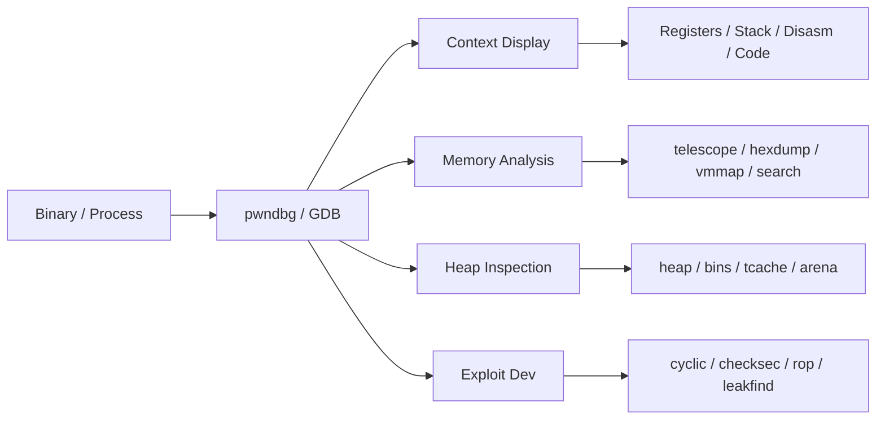

## pwndbg Cheatsheet

<!--more-->

### Tổng quan

pwndbg là GDB/LLDB plugin dành cho exploit development, reverse engineering và binary analysis. Được viết bằng Python, nó bổ sung hàng trăm lệnh và cải thiện output của GDB mặc định.



### Cài đặt

```bash
# Cài đặt pwndbg
git clone https://github.com/pwndbg/pwndbg
cd pwndbg
./setup.sh

# Kiểm tra
gdb -q
# Trong GDB: pwndbg

# Cài với LLDB
./setup.sh --lldb

# Cài trên Arch Linux
pacman -S pwndbg

# Docker
docker pull pwndbg/pwndbg
```

---

### 1. Khởi động và Điều hướng cơ bản

```bash
# ---- Khởi động GDB với pwndbg ----
gdb ./binary                      # Load binary
gdb -q ./binary                   # Load binary (quiet mode)
gdb ./binary core                 # Load binary với core dump
gdb -p <PID>                      # Attach vào running process
gdb --args ./binary arg1 arg2     # Load binary với arguments

# ---- Chạy chương trình ----
run                               # Chạy (viết tắt: r)
run arg1 arg2                     # Chạy với arguments
run < input.txt                   # Chạy với stdin redirect
start                             # Chạy và dừng tại main()
starti                            # Chạy và dừng tại instruction đầu tiên
entry                             # Dừng tại entry point (pwndbg)

# ---- Continue / Step ----
continue                          # Tiếp tục chạy (viết tắt: c)
step                              # Step into (vào function) (viết tắt: s)
next                              # Step over (qua function) (viết tắt: n)
stepi                             # Step một instruction (assembly) (viết tắt: si)
nexti                             # Next instruction, không vào function (viết tắt: ni)
finish                            # Chạy đến khi return từ function hiện tại
until <addr>                      # Chạy đến địa chỉ nhất định

# ---- pwndbg Step commands ----
nextcall                          # Chạy đến CALL instruction tiếp theo
nextjmp                           # Chạy đến JUMP instruction tiếp theo
nextret                           # Chạy đến RET instruction tiếp theo
nextsyscall                       # Chạy đến SYSCALL tiếp theo
stepsyscall                       # Step vào SYSCALL
stepret                           # Step đến RET
stepover                          # Step over (như next nhưng smarter)
xuntil <addr>                     # Execute đến địa chỉ

# ---- Quit ----
quit                              # Thoát (viết tắt: q)
```

---

### 2. Context và Display

> pwndbg tự động hiển thị context (registers, stack, disassembly, code) mỗi khi dừng.

```bash
# ---- Context ----
context                           # Hiển thị context (pwndbg)
ctx                               # Alias cho context

# Cấu hình context sections:
set context-sections 'regs disasm code stack backtrace'
set context-sections 'regs disasm code'

# Số dòng disassembly hiển thị
set context-disasm-lines 20

# Số dòng stack
set context-stack-lines 10

# Context history
contextprev                       # Hiển thị context trước đó
contextnext                       # Hiển thị context tiếp theo

# ---- Registers ----
regs                              # Hiển thị registers (pwndbg, đẹp hơn info regs)
info registers                    # GDB standard
info all-registers                # Tất cả registers kể cả float/SSE

# Xem giá trị register
p $rax                            # In giá trị RAX
p/x $rip                          # In RIP dạng hex
p/d $rsp                          # In RSP dạng decimal

# Set register value
set $rax = 0
set $rip = 0x401234

# ARM/AArch64
cpsr                              # Current Program Status Register (ARM)
fsbase                            # FS base register
gsbase                            # GS base register
setflag <flag> <0|1>              # Set CPU flag (e.g. ZF, CF)

# ---- Disassembly ----
disassemble                       # Disassemble function hiện tại
disassemble main                  # Disassemble function main
disassemble 0x401000              # Disassemble từ địa chỉ
disassemble 0x401000, 0x401050    # Disassemble range
x/20i $rip                        # 20 instructions từ RIP (GDB)
nearpc                            # Disassembly quanh PC (pwndbg)
nearpc 20                         # 20 instructions
emulate                           # Disassembly với emulation (unicorn engine)
```

---

### 3. Breakpoints

```bash
# ---- Đặt breakpoint ----
break main                        # BP tại function main (viết tắt: b)
break *0x401234                   # BP tại địa chỉ cụ thể
break *main+10                    # BP tại offset từ symbol
break file.c:42                   # BP tại line số trong source
tbreak main                       # Temporary BP (xóa sau khi hit 1 lần)

# ---- pwndbg breakpoints ----
breakrva 0x1234                   # BP tại RVA (relative virtual address) — tự add base PIE
bp 0x401234                       # WinDbg-style breakpoint (pwndbg compat layer)

# ---- Conditional breakpoints ----
break main if $rdi == 0           # BP với condition
break *0x401234 if *(int*)$rsp == 0x41414141

# ---- Quản lý breakpoints ----
info breakpoints                  # Liệt kê BP (viết tắt: i b)
disable 1                         # Disable BP số 1
enable 1                          # Enable BP số 1
delete 1                          # Xóa BP số 1
delete                            # Xóa tất cả BP
ignore 1 5                        # Ignore BP 1, 5 lần tiếp theo

# pwndbg
bl                                # List breakpoints (WinDbg compat)
bc 1                              # Clear BP 1
bd 1                              # Disable BP 1
be 1                              # Enable BP 1

# ---- Watchpoints (data breakpoints) ----
watch *0x404000                   # Break khi địa chỉ bị write
rwatch *0x404000                  # Break khi địa chỉ bị read
awatch *0x404000                  # Break khi access (read hoặc write)

# ---- Break-if-taken / if-not-taken ----
# pwndbg specific
break-if-taken                    # Break nếu jump được taken
break-if-not-taken                # Break nếu jump không được taken
```

---

### 4. Memory Inspection

```bash
# ---- Xem bộ nhớ (GDB standard) ----
x/10gx $rsp                      # 10 giant (8-byte) hex words từ RSP
x/20wx 0x404000                  # 20 word (4-byte) hex
x/30bx $rip                      # 30 bytes hex từ RIP
x/10s 0x404000                   # 10 strings từ địa chỉ
x/10i 0x401000                   # 10 instructions (disassembly)

# Format specifiers:
# o(octal), x(hex), d(decimal), u(unsigned), t(binary), f(float), a(address), c(char), s(string), i(instruction)
# Size: b(byte), h(halfword=2), w(word=4), g(giant=8)

# ---- Telescope (pwndbg) ----
# Recursively dereference pointers — cực kỳ hữu ích
telescope $rsp                   # Xem stack từ RSP
telescope $rsp 20                # 20 entries
telescope 0x404000               # Xem từ địa chỉ cụ thể
telescope 0x404000 30            # 30 entries

# ---- Hexdump (pwndbg) ----
hexdump $rsp                     # Hexdump từ RSP
hexdump 0x404000                 # Hexdump từ địa chỉ
hexdump 0x404000 100             # 100 bytes

# WinDbg compat hexdump commands:
db 0x404000                      # Dump bytes
dw 0x404000                      # Dump words (2 bytes)
dd 0x404000                      # Dump dwords (4 bytes)
dq 0x404000                      # Dump qwords (8 bytes)
da 0x404000                      # Dump ASCII string
ds 0x404000                      # Dump string

# ---- Write memory (pwndbg/WinDbg compat) ----
eb 0x404000 0x41                 # Write byte 0x41 to address
ew 0x404000 0x1234               # Write word
ed 0x404000 0x12345678           # Write dword
eq 0x404000 0x1234567890abcdef   # Write qword
ez 0x404000 "hello"              # Write string (null-terminated)
eza 0x404000 "hello"             # Write ASCII string

# Patch memory
patch 0x401234 "nop; nop"        # Patch với assembly instructions
patch 0x401234 b'\x90\x90'       # Patch với bytes
patch-list                        # List patches đã áp dụng
patch-revert                      # Revert patches

# ---- Xinfo ----
xinfo 0x404000                   # Thông tin chi tiết về địa chỉ (section, permissions...)
xinfo $rsp

# ---- Distance ----
distance 0x401000 0x401050       # Tính khoảng cách giữa 2 địa chỉ

# ---- XOR memory ----
xor 0x404000 100 0x41            # XOR 100 bytes từ địa chỉ với key 0x41

# ---- Memory frob ----
memfrob 0x404000 100             # XOR với 42 (từng byte)
```

---

### 5. Virtual Memory Maps

```bash
# vmmap — hiển thị memory map với permissions và thông tin
vmmap                            # Toàn bộ virtual memory map
vmmap libc                       # Lọc theo tên
vmmap 0x404000                   # Kiểm tra địa chỉ thuộc segment nào

# ELF sections
elfsections                      # Liệt kê ELF sections (.text, .data, .bss, ...)

# Thêm/xóa manual vmmap entries
vmmap-add 0x1000 0x2000 rwx "[custom]"
vmmap-clear

# Load vmmap từ file
vmmap-load /path/to/vmmap.txt

# Thông tin PIE base
piebase                          # In PIE base address

# Explore vmmap interactively
vmmap-explore
```

---

### 6. Stack Analysis

```bash
# Stack inspection
stack                            # Hiển thị stack (pwndbg)
stack 30                         # 30 entries
stackf                           # Stack với frame info

# Stack canary
canary                           # Tìm và hiển thị stack canary value

# Return address
retaddr                          # Hiển thị return addresses trên stack

# Stack explore
stack-explore                    # Interactive stack exploration

# Backtrace
backtrace                        # Call stack (viết tắt: bt)
backtrace full                   # Với local variables
frame N                          # Switch đến frame N
up / down                        # Di chuyển qua frames (pwndbg: up/down)
info frame                       # Thông tin frame hiện tại

# WinDbg compat
k                                # Backtrace (WinDbg style)
```

---

### 7. Heap Analysis (glibc ptmalloc2)

> pwndbg cung cấp bộ công cụ phong phú để phân tích glibc heap — cực kỳ quan trọng cho heap exploitation.

```bash
# ---- Arena ----
arena                            # Thông tin main arena
arenas                           # Tất cả arenas (multi-threaded)
mp                               # Malloc parameters (mp_ struct)

# ---- Heap chunks ----
heap                             # Liệt kê tất cả chunks trong heap
heap -v                          # Verbose mode
heap --pid <PID>                 # Heap của process khác
malloc-chunk 0x405010            # Thông tin chunk tại địa chỉ
top-chunk                        # Thông tin top chunk

# ---- Bins ----
bins                             # Tất cả bins (fastbins + tcache + small + large + unsorted)
fastbins                         # Chỉ fastbins
smallbins                        # Small bins
largebins                        # Large bins
unsortedbin                      # Unsorted bin
tcache                           # tcache (glibc 2.26+)
tcachebins                       # tcache bins với counts

# ---- Visualize heap ----
vis-heap-chunks                  # Visual representation của heap chunks
vis-heap-chunks --all            # Bao gồm cả free chunks

# ---- Heap exploitation helpers ----
find-fake-fast 0x404060          # Tìm fake fastbin chunk gần địa chỉ
try-free 0x405010                # Giả lập free() tại địa chỉ — kiểm tra lỗi

# ---- Heap info ----
hi                               # Heap info tổng quan

# ---- Track heap ----
track-heap                       # Track allocations real-time
```

---

### 8. GOT / PLT Analysis

```bash
# GOT — Global Offset Table
got                              # Hiển thị GOT entries (tên, địa chỉ, giá trị)
gotplt                           # GOT + PLT combined view

# PLT — Procedure Linkage Table
plt                              # Hiển thị PLT entries

# Track GOT modifications real-time
track-got                        # Enable GOT tracking

# Link map
linkmap                          # Walk link_map structures (loaded libraries)

# Library info
libcinfo                         # Thông tin về libc được load

# ---- ELF info ----
elfsections                      # ELF sections
argc                             # Argument count
argv                             # Argument vector
auxv                             # Auxiliary vector
auxv-explore                     # Interactive auxv explorer
envp                             # Environment pointer
```

---

### 9. Searching

```bash
# ---- Search (pwndbg) ----
search -s "hello"                # Tìm string
search -x "41424344"             # Tìm hex bytes
search -b 0x41                   # Tìm byte
search -w 0x1234                 # Tìm word (2 bytes)
search -d 0x12345678             # Tìm dword (4 bytes)
search -q 0x1234567890abcdef     # Tìm qword (8 bytes)
search -p 0x404000               # Tìm pointer

# Giới hạn vùng search
search -s "flag" --writable      # Chỉ trong writable regions
search -s "/bin/sh" libc         # Chỉ trong libc

# ---- Strings (pwndbg) ----
strings 0x404000 100             # Tìm strings trong 100 bytes từ địa chỉ

# ---- Leak finding ----
leakfind 0x404000                # Tìm pointer chains từ địa chỉ
leakfind 0x404000 --depth 5      # Depth tối đa 5 hops

probeleak 0x404000               # Probe for leakable pointers
probeleak 0x404000 0x405000      # Trong range

# ---- P2P — Pointer to Pointer ----
p2p 0x404000                     # Tìm pointers trỏ đến địa chỉ này
```

---

### 10. ROP Gadgets

```bash
# ---- ROP (pwndbg + ROPgadget/ropper) ----
rop                              # Tìm ROP gadgets (cần ROPgadget)
rop --grep "pop rdi"             # Lọc theo pattern
rop --grep "ret"                 # Tìm tất cả ret gadgets

ropper                           # Dùng ropper thay thế
ropper --search "pop rdi"

# ---- Sigreturn frame ----
sigreturn                        # Tạo SROP frame

# ---- One-gadget ----
onegadget                        # Tìm one-gadget (execve("/bin/sh",...))

# ---- Cyclic pattern ----
cyclic 100                       # Tạo cyclic pattern 100 bytes (de Bruijn sequence)
cyclic -l 0x61616166             # Tìm offset của pattern
cyclic 200 -n 8                  # Pattern với chunk size 8 (64-bit)
```

---

### 11. Exploit Development Utilities

```bash
# ---- Checksec ----
checksec                         # Kiểm tra security features của binary
# Output: RELRO, Stack Canary, NX, PIE, RPATH, RUNPATH, Fortify

# ---- Assembly inline ----
asm "mov rax, 1; syscall"        # Assemble và in bytes

# ---- Errno ----
errno 13                         # Tên của errno 13 (EACCES)
errno                            # Errno hiện tại

# ---- Threads ----
threads                          # List threads
killthreads                      # Kill tất cả threads ngoại trừ current

# ---- Process info ----
procinfo                         # Info về process (UID, GID, fds, SELinux context)
pid                              # Process ID

# ---- ASLR ----
aslr                             # Kiểm tra ASLR status
aslr off                         # Tắt ASLR (cần quyền)

# ---- Hijack FD ----
hijack-fd 1 /tmp/output.txt      # Redirect fd 1 (stdout) sang file

# ---- Mmap / Mprotect ----
mmap 0x1337000 0x1000 rwx        # Allocate memory
mprotect 0x404000 0x1000 rwx     # Change permissions

# ---- Spray ----
spray 0x404000 100 0x41          # Spray memory với byte pattern

# ---- Cymbol (Symbol lookup) ----
cymbol malloc                    # Tìm địa chỉ symbol

# ---- Plist ----
plist 0x4040a0                   # Walk linked list tại địa chỉ

# ---- Valist ----
valist 0x4040a0                  # Walk va_list

# ---- Hex2ptr ----
hex2ptr 0x4007f6                 # Convert hex string sang pointer
```

---

### 12. Kernel Debugging

> pwndbg hỗ trợ kernel debugging qua QEMU GDB stub.

```bash
# Kết nối QEMU
target remote localhost:1234     # Kết nối đến QEMU GDB stub

# ---- Kernel info ----
kversion                         # Kernel version
kcmdline                         # Kernel command line
kconfig                          # Kernel configuration
kbase                            # Kernel base address
klookup commit_creds             # Lookup kernel symbol

# ---- Kernel processes ----
kcurrent                         # Current task_struct
ktask                            # Walk task list

# ---- Kernel modules ----
kmod                             # List kernel modules

# ---- Memory ----
kdmesg                           # Đọc dmesg từ memory
kfile                            # File-related kernel structures

# ---- Security ----
kchecksec                        # Kernel security features

# ---- BPF ----
kbpf                             # BPF programs và maps

# ---- Paging ----
pagewalk 0xffff888000000000      # Walk page tables
pageinfo 0xffff888000000000      # Thông tin trang
v2p 0xffff888012345678           # Virtual to physical
p2v 0x12345678                   # Physical to virtual
kbase                            # KASLR base

# ---- SLUB Allocator ----
slab                             # SLUB slab info

# ---- Buddy Allocator ----
buddydump                        # Dump buddy allocator state

# ---- MSR ----
msr 0xc0000082                   # Read Model-Specific Register

# ---- GDT ----
gdt                              # Global Descriptor Table

# ---- Android Binder ----
binder                           # Android Binder IPC structures
```

---

### 13. Configuration & Theming

```bash
# ---- Xem cấu hình ----
pwndbg                           # Liệt kê tất cả commands
config                           # Xem/set configuration options
config context-backtrace-lines 5 # Set số dòng backtrace

# ---- Theme ----
theme                            # Xem color theme settings
theme stack-address              # Màu của stack addresses

# ---- Save config ----
configfile                       # In đường dẫn config file
# Edit ~/.config/pwndbg/config.py để lưu settings

# ---- Tips ----
tips                             # Hiển thị random tip về pwndbg

# ---- Version ----
version                          # pwndbg version

# ---- Bugreport ----
bugreport                        # Tạo bug report

# ---- Heap config ----
heap-config                      # Xem heap-related configuration
```

---

### 14. Decompiler & AI Integration

```bash
# ---- Decompiler integration ----
# Hỗ trợ IDA, Binary Ninja, Ghidra, angr-management
decompiler-integration           # Setup decompiler integration
decomp                           # Xem decompiled code tại PC hiện tại

# IDA
r2                               # Kết nối radare2
r2pipe                           # Raw r2pipe command

# Rizin
rz                               # Kết nối rizin
rzpipe                           # Raw rzpipe command

# ---- AI assistance ----
ai "explain this function"       # AI analysis (cần setup)
```

---

### 15. WinDbg Compatibility Layer

> pwndbg có đầy đủ WinDbg commands — hữu ích cho người từ Windows background chuyển sang.

```bash
# Breakpoints
bp 0x401234                      # Set breakpoint
bl                               # List breakpoints
bc 1                             # Clear BP 1
bd 1                             # Disable BP 1
be 1                             # Enable BP 1

# Memory display
db 0x404000                      # Display bytes
dw 0x404000                      # Display words
dd 0x404000                      # Display dwords
dq 0x404000                      # Display qwords
dds 0x404000                     # Display with symbols
da 0x404000                      # Display ASCII
ds 0x404000                      # Display string

# Memory write
eb 0x404000 0x41                 # Edit byte
ew 0x404000 0x1234               # Edit word
ed 0x404000 0xdeadbeef           # Edit dword
eq 0x404000 0xdeadbeefcafebabe   # Edit qword
ez 0x404000 "hello"              # Edit string
eza 0x404000 "hello"             # Edit ASCII string

# Execution
go                               # Continue (WinDbg go)
pc                               # Program counter value

# Stack
k                                # Call stack
ln 0x401234                      # List nearest symbols

# Process
peb                              # Process Environment Block (Windows)
```

---

### 16. Workflow Mẫu — Heap Exploitation

```bash
# Bước 1: Kiểm tra binary
gdb ./pwn_challenge
checksec

# Bước 2: Chạy và xem heap layout
start
heap
vis-heap-chunks

# Bước 3: Sau vài alloc/free
continue
# (khi BP hit)
bins
tcachebins

# Bước 4: Tìm libc address leak
telescope $rsp 30
search -p 0x7f0000000000         # Tìm libc addresses

# Bước 5: Tính offset
piebase
distance 0x401000 0x401234

# Bước 6: ROP chain
rop --grep "pop rdi; ret"
onegadget

# Bước 7: Exploit
cyclic 200
# (crash)
cyclic -l <crash value>          # Tìm offset
```

---

### 17. pwndbg Commands Quick Reference

```
--- NAVIGATION ---
r / run         Chạy chương trình
c / continue    Tiếp tục
s / step        Step into
n / next        Step over
si              Stepi (assembly)
ni              Nexti (assembly)
finish          Đến return
q / quit        Thoát

--- BREAKPOINTS ---
b *<addr>       Breakpoint tại address
tb *<addr>      Temporary breakpoint
i b             Info breakpoints
d <num>         Delete breakpoint
watch *<addr>   Watchpoint

--- DISPLAY ---
context / ctx   Hiển thị context
regs            Registers
telescope $rsp  Dereference stack
hexdump <addr>  Hexdump
stack           Stack view
nearpc          Disassembly quanh PC

--- MEMORY ---
vmmap           Virtual memory map
search -s "str" Tìm string
search -x "hex" Tìm hex bytes
x/Nfmt <addr>   Xem memory (GDB)
patch <addr>    Patch memory
xinfo <addr>    Address info

--- HEAP ---
heap            Liệt kê chunks
bins            Tất cả bins
tcachebins      tcache bins
vis-heap-chunks Visual heap
arena           Arena info

--- EXPLOIT ---
checksec        Security features
cyclic N        Cyclic pattern
cyclic -l val   Tìm offset
rop             ROP gadgets
leakfind        Tìm leak chains
canary          Stack canary

--- GOT/PLT ---
got             GOT entries
plt             PLT entries
piebase         PIE base address
```

> **Tài nguyên tham khảo thêm**:
> - pwndbg docs: `https://pwndbg.re/stable/`
> - pwndbg CHEATSHEET PDF: `https://pwndbg.re/dev/CHEATSHEET.pdf`
