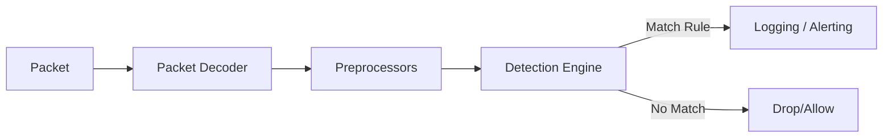

# Snort Cheat Sheet

<!--more-->

Snort là một IDS/IPS dựa trên mạng (NIDS), có khả năng phân tích lưu lượng thời gian thực và khớp gói tin dựa trên bộ quy tắc đã định nghĩa.

---

## 1. Kiến trúc và Luồng xử lý (Architecture)

Hiểu cách một gói tin đi qua các tầng của Snort giúp bạn tối ưu hóa hiệu suất quét.



- **Packet Decoder:** Giải mã các giao thức lớp liên kết dữ liệu.
- **Preprocessors:** Sắp xếp lại các mảnh gói tin (fragmentation), giải mã HTTP, chống kỹ thuật lẩn tránh (evasion).
- **Detection Engine:** "Trái tim" của Snort, nơi so khớp gói tin với bộ Rules.
- **Output Modules:** Xuất kết quả ra log file, database hoặc gửi cảnh báo qua syslog.

---

## 2. Các chế độ hoạt động (Operation Modes)

Snort có thể chạy ở 3 chế độ chính tùy thuộc vào tham số dòng lệnh.

=== "Sniffer Mode"
    Đọc gói tin và hiển thị lên màn hình.
    ```bash
    snort -v       # Hiển thị tiêu đề TCP/IP
    snort -vd      # Hiển thị thêm dữ liệu gói tin (Payload)
    snort -vde     # Hiển thị cả tiêu đề lớp liên kết (Data Link)
    ```

=== "Packet Logger Mode"
    Ghi gói tin vào ổ đĩa để phân tích sau.
    ```bash
    snort -dev -l ./log                     # Ghi log vào thư mục chỉ định
    snort -dev -l ./log -h 192.168.1.0/24   # Chỉ ghi log mạng nội bộ
    snort -l ./log -b                       # Ghi log dưới dạng nhị phân (pcap)
    ```

=== "IDS/IPS Mode"
    Phân tích dựa trên luật và đưa ra cảnh báo hoặc chặn.
    ```bash
    snort -c /etc/snort/snort.conf -A console   # Chạy với file cấu hình, xuất cảnh báo ra console
    snort -c /etc/snort/snort.conf -q           # Chạy ở chế độ im lặng (Quiet)
    ```

---

## 3. Cấu trúc một quy tắc Snort (Rule Anatomy)

Một Rule gồm 2 phần chính: **Rule Header** và **Rule Options**.

`Action Protocol Address Port Direction Address Port (Options)`

### Rule Header

| Thành phần | Ví dụ | Giải thích |
| :--- | :--- | :--- |
| **Action** | `alert` | Hành động (alert, log, pass, drop, reject). |
| **Protocol** | `tcp` | Giao thức (tcp, udp, icmp, ip). |
| **Source IP** | `$EXTERNAL_NET` | IP nguồn (có thể dùng biến hoặc dải IP). |
| **Source Port** | `any` | Cổng nguồn. |
| **Direction** | `->` | Hướng dòng dữ liệu ( `->`, `<>`, `<-` ). |
| **Dest IP** | `$HOME_NET` | IP đích. |
| **Dest Port** | `80` | Cổng đích. |

---

## 4. Rule Options (Từ khóa quan trọng)

Phần Options nằm trong dấu ngoặc đơn `()`, các tùy chọn cách nhau bởi dấu `;`.

### Phân loại Metadata & General
- **msg:** Chuỗi văn bản hiển thị khi cảnh báo được kích hoạt. `msg:"Giao dich SQL Injection";`
- **sid:** Snort ID (Định danh duy nhất).
    - `< 1,000,000`: Dành cho luật mặc định của Snort.
    - `> 1,000,000`: Dành cho luật người dùng tự viết.
- **rev:** Phiên bản của luật. `rev:1;`
- **classtype:** Phân loại kiểu tấn công (ví dụ: `web-application-attack`).

### Phân loại Payload Detection (So khớp nội dung)
- **content:** Tìm kiếm chuỗi ký tự hoặc mã Hex trong gói tin.
    - `content:"|00 01 86 a5|";` (Tìm mã Hex)
    - `content:"GET";` (Tìm chuỗi ASCII)
- **nocase:** Không phân biệt chữ hoa/thường.
- **offset / depth:** Giới hạn phạm vi tìm kiếm nội dung (Từ byte X, độ sâu Y).
- **distance / within:** Tìm nội dung thứ 2 dựa trên vị trí của nội dung thứ nhất.
- **pcre:** Sử dụng biểu thức chính quy (Perl Compatible Regular Expressions).

### Phân loại Non-Payload (Tiêu đề gói tin)
- **ttl:** Kiểm tra giá trị Time To Live. `ttl:10;`
- **flags:** Kiểm tra cờ TCP (S: SYN, A: ACK, F: FIN, R: RST, P: PSH, U: URG). `flags:S;`
- **seq:** Kiểm tra số Sequence của TCP.
- **dsize:** Kiểm tra kích thước của Payload. `dsize:>500;`

---

## 5. Ví dụ thực tế về Snort Rules

??? details "Phát hiện tấn công SSH Brute Force"
    ```bash
    alert tcp $EXTERNAL_NET any -> $CONF_NET 22 (msg:"Kha nghi SSH Brute Force"; flags:S; threshold:type threshold, track by_src, count 5, seconds 60; sid:1000001; rev:1;)
    ```
    *Giải thích:* Cảnh báo nếu một IP nguồn gửi 5 gói tin SYN đến cổng 22 trong vòng 60 giây.

??? details "Phát hiện SQL Injection (từ khóa UNION SELECT)"
    ```bash
    alert tcp $EXTERNAL_NET any -> $HTTP_SERVERS $HTTP_PORTS (msg:"SQL Injection Detected - UNION SELECT"; flow:established,to_server; content:"UNION"; nocase; content:"SELECT"; nocase; distance:1; sid:1000002;)
    ```
    *Giải thích:* Tìm từ khóa "UNION" và "SELECT" gần nhau trong luồng HTTP gửi tới server.

??? details "Phát hiện Ping lạ (ICMP Echo Request)"
    ```bash
    alert icmp $EXTERNAL_NET any -> $HOME_NET any (msg:"ICMP Ping Detected"; itype:8; sid:1000003;)
    ```

---

## 6. Biến và Cấu hình (snort.conf)

Các biến giúp Rule linh hoạt hơn khi thay đổi môi trường mạng.

```bash
# Định nghĩa mạng nội bộ
ipvar HOME_NET [192.168.1.0/24,10.0.0.0/8]

# Định nghĩa mạng bên ngoài (mọi thứ không phải HOME_NET)
ipvar EXTERNAL_NET !$HOME_NET

# Đường dẫn tới file chứa rules
var RULE_PATH /etc/snort/rules
include $RULE_PATH/local.rules
```

---

## 7. Các lệnh kiểm tra và gỡ lỗi

!!! info "Kiểm tra cú pháp"
    Trước khi chạy chính thức, hãy luôn kiểm tra xem file cấu hình có lỗi không:
    ```bash
    snort -T -c /etc/snort/snort.conf
    ```
    - `-T`: Test mode.
    - `-c`: Chỉ định file config.

| Cờ (Flag) | Công dụng |
| :--- | :--- |
| `-i <iface>` | Chọn giao diện mạng (eth0, wlan0). |
| `-N` | Tắt chế độ ghi log (chỉ cảnh báo). |
| `-r <file.pcap>` | Đọc và phân tích file pcap offline. |
| `-k none` | Bỏ qua checksum (hữu ích khi phân tích traffic lỗi). |

---

## 8. Thresholding (Ngưỡng cảnh báo)

Để tránh bị ngập lụt cảnh báo (Alert flooding), sử dụng `threshold`.

- **Limit:** Cảnh báo tối đa N lần trong khoảng thời gian T.
- **Threshold:** Chỉ cảnh báo khi đạt tối thiểu N lần trong khoảng T.
- **Both:** Kết hợp cả hai.

```bash
# Cú pháp đặt trong Rule Options
threshold:type limit, track by_src, count 1, seconds 300;
```

---

## 9. Mẹo học sâu và tối ưu hóa

!!! tip "Thứ tự kiểm tra luật"
    Mặc định Snort kiểm tra theo thứ tự: **Pass -> Drop -> Alert -> Log**. Bạn có thể thay đổi điều này trong config bằng lệnh `config order`.

!!! warning "Lưu ý về Performance"
    - Tránh dùng `content` quá ngắn (ví dụ 1-2 byte) vì sẽ gây ra nhiều kết quả khớp giả, làm chậm CPU.
    - Sử dụng từ khóa `flow:established` để Snort chỉ kiểm tra các gói tin thuộc một kết nối đã bắt tay thành công, giảm tải cho việc phân tích các gói tin rác.

---

!!! success "Kết luận"
    Việc làm chủ Snort nằm ở khả năng viết **Rule**. Hãy bắt đầu bằng việc đọc các bộ luật có sẵn (`community.rules`) để hiểu cách các chuyên gia bắt các loại mã độc hiện đại.
