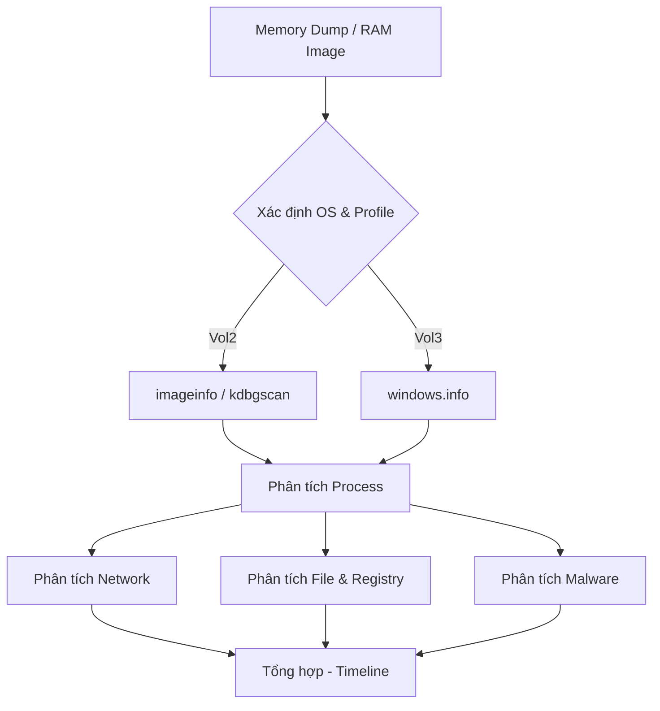

# Volatility Cheatsheet 

<!--more-->

---

##  Volatility

### Kiến trúc và Workflow tổng quan



> **Lưu ý quan trọng — List vs Scan plugins**
>
> **List plugins** (`pslist`, `dlllist`, ...) đi theo các cấu trúc linked-list của Windows Kernel (`_EPROCESS`). Chúng nhanh nhưng có thể bị lừa bởi malware dùng DKOM (Direct Kernel Object Manipulation) để unlink process khỏi danh sách.
>
> **Scan plugins** (`psscan`, `cmdscan`, ...) đọc thẳng bộ nhớ và tìm kiếm các magic tag/pool tag (ví dụ `Proc` cho process). Chậm hơn nhưng tìm được cả process đã thoát hoặc bị ẩn. Khi điều tra malware, nên **chạy cả hai** và so sánh kết quả.

---

### Cài đặt

=== "Volatility 3 (Khuyên dùng)"

    ```bash
    # Cài từ pip
    pip3 install volatility3

    # Hoặc clone từ GitHub (luôn mới nhất)
    git clone https://github.com/volatilityfoundation/volatility3.git
    cd volatility3
    pip3 install -r requirements.txt
    python3 setup.py install

    # Cài symbol packs (bắt buộc cho Windows analysis)
    # Tải về và giải nén vào volatility3/volatility/symbols/
    wget https://downloads.volatilityfoundation.org/volatility3/symbols/windows.zip
    wget https://downloads.volatilityfoundation.org/volatility3/symbols/linux.zip
    wget https://downloads.volatilityfoundation.org/volatility3/symbols/mac.zip

    # Cài thêm các dependencies tùy chọn
    pip3 install yara-python pycryptodome capstone distorm3

    # Kiểm tra
    python3 vol.py -h
    ```

=== "Volatility 2 (Legacy)"

    ```bash
    # Cài Python 2.7 và pip2 trước
    git clone https://github.com/volatilityfoundation/volatility.git
    cd volatility
    python2 setup.py install

    # Cài dependencies
    pip2 install distorm3 yara-python pycrypto openpyxl ujson

    # Kiểm tra
    python2 vol.py -h

    # Profile tùy chỉnh (Linux/Mac)
    # Tạo thư mục: plugins/overlays/linux/
    # Đặt file .zip profile vào đó
    ./vol.py --plugins=/path/to/plugins --info | grep Profile

    # Download thêm profiles
    git clone https://github.com/volatilityfoundation/profiles
    ```

---

### 1. System Information

> Bước đầu tiên khi phân tích bất kỳ memory image nào — xác định OS, kiến trúc, profile phù hợp.

=== "Volatility 2"

    ```bash
    # Nhận diện image, đề xuất profile (quan trọng nhất)
    vol.py -f memory.dmp imageinfo

    # Tìm kiếm KDBG header — chính xác hơn imageinfo
    # Nên dùng kdbgscan nếu imageinfo cho nhiều profile
    vol.py -f memory.dmp kdbgscan

    # Kiểm tra số process trong output kdbgscan:
    # GOOD: PsActiveProcessHead : 0xfffff800... (37 processes)
    # BAD:  PsActiveProcessHead : 0xfffff800... (0 processes)
    # → Chọn profile có số process > 0

    # Xem tất cả profiles hỗ trợ
    vol.py --info | grep Profile

    # Xem tất cả plugins
    vol.py --info

    # Thông tin về crash dump
    vol.py -f memory.dmp crashinfo

    # Thông tin VMware snapshot
    vol.py -f memory.dmp vmwareinfo

    # Thông tin VirtualBox
    vol.py -f memory.dmp vboxinfo

    # Thông tin Hibernate file
    vol.py -f memory.dmp hibinfo
    ```

=== "Volatility 3"

    ```bash
    # Thông tin OS và kernel — thay thế imageinfo
    python3 vol.py -f memory.dmp windows.info.Info

    # Vol3 tự động nhận diện OS, không cần chỉ định profile
    # Symbol tables được load tự động từ thư mục symbols/

    # Xem statistics về memory image
    python3 vol.py -f memory.dmp windows.statistics.Statistics

    # Xem crash dump info
    python3 vol.py -f memory.dmp windows.crashinfo.Crashinfo

    # Tìm Linux banner (dùng với Linux memory dumps)
    python3 vol.py -f memory.dmp banners.Banners

    # Xem tất cả plugins có sẵn
    python3 vol.py -h

    # Liệt kê tất cả plugin với mô tả
    python3 vol.py --list-plugins
    ```

??? note "Sự khác biệt imageinfo vs kdbgscan (Vol2)"
    `imageinfo` chỉ đề xuất profile dựa trên metadata. `kdbgscan` thực sự scan bộ nhớ tìm `KdDebuggerDataBlock` — cấu trúc quan trọng chứa `PsActiveProcessHead`. Profile nào có số process > 0 là profile đúng. Luôn dùng `kdbgscan` để xác nhận kết quả `imageinfo`.

---

### 2. Process Analysis

> Phân tích process là bước cốt lõi. So sánh kết quả giữa các plugin khác nhau để phát hiện process ẩn.

=== "Volatility 2"

    ```bash
    # ---- Liệt kê process ----

    # Đi theo EPROCESS linked list — có thể bị DKOM bypass
    vol.py -f memory.dmp --profile=Win7SP1x64 pslist

    # Scan pool tag 'Proc' — phát hiện hidden/terminated processes
    vol.py -f memory.dmp --profile=Win7SP1x64 psscan

    # Hiển thị dạng cây cha-con (parent-child)
    vol.py -f memory.dmp --profile=Win7SP1x64 pstree

    # So sánh nhiều phương pháp liệt kê — phát hiện hidden processes
    # Process xuất hiện trong psscan nhưng không có trong pslist → suspicious!
    vol.py -f memory.dmp --profile=Win7SP1x64 psxview

    # ---- Thông tin chi tiết process ----

    # Command line arguments của từng process
    vol.py -f memory.dmp --profile=Win7SP1x64 cmdline

    # Scan _COMMAND_HISTORY structures
    vol.py -f memory.dmp --profile=Win7SP1x64 cmdscan

    # Scan _CONSOLE_INFORMATION — bao gồm lịch sử cmd.exe ngay cả khi đã đóng
    vol.py -f memory.dmp --profile=Win7SP1x64 consoles

    # Environment variables của process
    vol.py -f memory.dmp --profile=Win7SP1x64 envars
    vol.py -f memory.dmp --profile=Win7SP1x64 envars -p <PID>

    # Privileges token của process
    vol.py -f memory.dmp --profile=Win7SP1x64 privs
    vol.py -f memory.dmp --profile=Win7SP1x64 privs --pid=<PID>
    # Lọc privileges nguy hiểm:
    vol.py -f memory.dmp --profile=Win7SP1x64 privs | grep "SeDebugPrivilege\|SeImpersonatePrivilege\|SeTcbPrivilege"

    # Security Identifiers (SIDs) của process
    vol.py -f memory.dmp --profile=Win7SP1x64 getsids
    vol.py -f memory.dmp --profile=Win7SP1x64 getsids -p <PID>
    vol.py -f memory.dmp --profile=Win7SP1x64 getservicesids

    # Job links
    vol.py -f memory.dmp --profile=Win7SP1x64 joblinks

    # ---- Dump process ----

    # Dump process executable (PE file)
    vol.py -f memory.dmp --profile=Win7SP1x64 procdump -p <PID> --dump-dir=/output/

    # Dump toàn bộ addressable memory của process
    vol.py -f memory.dmp --profile=Win7SP1x64 memdump -p <PID> --dump-dir=/output/

    # ---- DLL & Handles ----

    # Danh sách DLL được load bởi process
    vol.py -f memory.dmp --profile=Win7SP1x64 dlllist
    vol.py -f memory.dmp --profile=Win7SP1x64 dlllist -p <PID>

    # Dump DLL
    vol.py -f memory.dmp --profile=Win7SP1x64 dlldump -p <PID> --dump-dir=/output/

    # Danh sách handles (file, registry key, process, thread...)
    vol.py -f memory.dmp --profile=Win7SP1x64 handles
    vol.py -f memory.dmp --profile=Win7SP1x64 handles -p <PID>
    vol.py -f memory.dmp --profile=Win7SP1x64 handles -p <PID> --object-type=File
    vol.py -f memory.dmp --profile=Win7SP1x64 handles -p <PID> --object-type=Key
    vol.py -f memory.dmp --profile=Win7SP1x64 handles -p <PID> --object-type=Process
    vol.py -f memory.dmp --profile=Win7SP1x64 handles -p <PID> --object-type=Thread
    vol.py -f memory.dmp --profile=Win7SP1x64 handles -p <PID> --object-type=Mutant

    # Detect unlinked DLLs — DLL ẩn không xuất hiện trong PEB
    vol.py -f memory.dmp --profile=Win7SP1x64 ldrmodules
    vol.py -f memory.dmp --profile=Win7SP1x64 ldrmodules -p <PID>

    # ---- Threads ----
    vol.py -f memory.dmp --profile=Win7SP1x64 thrdscan

    # ---- Strings của process ----
    strings -a -td memory.dmp > /tmp/strings.txt
    vol.py -f memory.dmp --profile=Win7SP1x64 strings --string-file=/tmp/strings.txt
    ```

=== "Volatility 3"

    ```bash
    # ---- Liệt kê process ----

    # Đi theo EPROCESS linked list
    python3 vol.py -f memory.dmp windows.pslist.PsList

    # Pool tag scanning — phát hiện hidden processes
    python3 vol.py -f memory.dmp windows.psscan.PsScan

    # Hiển thị cây cha-con
    python3 vol.py -f memory.dmp windows.pstree.PsTree

    # ---- Thông tin chi tiết process ----

    # Command line arguments
    python3 vol.py -f memory.dmp windows.cmdline.CmdLine

    # Environment variables
    python3 vol.py -f memory.dmp windows.envars.Envars
    python3 vol.py -f memory.dmp windows.envars.Envars --pid <PID>

    # Privileges token
    python3 vol.py -f memory.dmp windows.privileges.Privs
    python3 vol.py -f memory.dmp windows.privileges.Privs --pid <PID>
    # Lọc privileges nguy hiểm:
    python3 vol.py -f memory.dmp windows.privileges.Privs | grep "SeDebugPrivilege\|SeImpersonatePrivilege"

    # SIDs của từng process
    python3 vol.py -f memory.dmp windows.getsids.GetSIDs
    python3 vol.py -f memory.dmp windows.getsids.GetSIDs --pid <PID>
    python3 vol.py -f memory.dmp windows.getservicesids.GetServiceSIDs

    # Job links
    python3 vol.py -f memory.dmp windows.joblinks.JobLinks

    # Thông tin sessions (logon sessions)
    python3 vol.py -f memory.dmp windows.sessions.Sessions

    # ---- Dump process ----

    # Dump executable và DLLs của process
    python3 vol.py -f memory.dmp -o /output/ windows.dumpfiles.DumpFiles --pid <PID>

    # Dump memory map của process (thay memdump)
    python3 vol.py -f memory.dmp -o /output/ windows.memmap.Memmap --dump --pid <PID>

    # ---- DLL & Handles ----

    # Danh sách DLL
    python3 vol.py -f memory.dmp windows.dlllist.DllList
    python3 vol.py -f memory.dmp windows.dlllist.DllList --pid <PID>

    # Danh sách handles
    python3 vol.py -f memory.dmp windows.handles.Handles
    python3 vol.py -f memory.dmp windows.handles.Handles --pid <PID>

    # Detect unlinked DLLs
    python3 vol.py -f memory.dmp windows.ldrmodules.LdrModules
    python3 vol.py -f memory.dmp windows.ldrmodules.LdrModules --pid <PID>

    # ---- VAD (Virtual Address Descriptor) ----
    python3 vol.py -f memory.dmp windows.vadinfo.VadInfo
    python3 vol.py -f memory.dmp windows.vadinfo.VadInfo --pid <PID>
    python3 vol.py -f memory.dmp windows.vadwalk.VadWalk --pid <PID>

    # ---- Strings của process ----
    strings -a -td memory.dmp > /tmp/strings.txt
    python3 vol.py -f memory.dmp windows.strings.Strings --strings-file /tmp/strings.txt
    ```

??? tip "Chiến lược phát hiện Hidden Process"
    1. Chạy `pslist` và `psscan`, so sánh kết quả
    2. Process xuất hiện trong `psscan` nhưng **không** trong `pslist` → bị DKOM unlink → suspect malware
    3. Chạy `pstree` kiểm tra parent-child: `cmd.exe` là con của `Word.exe`? Rất đáng ngờ
    4. Kiểm tra path của process: `svchost.exe` chạy từ `C:\Temp\` thay vì `C:\Windows\System32\`? Malware!
    5. Với Vol2, dùng `psxview` để so sánh tất cả các phương pháp cùng lúc

---

### 3. Network Analysis

> Phân tích kết nối mạng — phát hiện C2, lateral movement, data exfiltration.

=== "Volatility 2"

    ```bash
    # Windows Vista+ (TCP/UDP connections)
    vol.py -f memory.dmp --profile=Win7SP1x64 netscan

    # Giống netscan nhưng dùng netstat structure
    vol.py -f memory.dmp --profile=Win7SP1x64 netstat

    # ---- Windows XP / Server 2003 ONLY ----

    # TCP connections (active only)
    vol.py -f memory.dmp --profile=WinXPSP3x86 connections

    # TCP connections pool scan (bao gồm đã đóng)
    vol.py -f memory.dmp --profile=WinXPSP3x86 connscan

    # Open sockets (TCP + UDP)
    vol.py -f memory.dmp --profile=WinXPSP3x86 sockets

    # Socket pool scan
    vol.py -f memory.dmp --profile=WinXPSP3x86 sockscan

    # ---- Linux network ----
    vol.py -f memory.dmp --profile=LinuxUbuntu_5_4_0x64 linux_ifconfig
    vol.py -f memory.dmp --profile=LinuxUbuntu_5_4_0x64 linux_netstat
    vol.py -f memory.dmp --profile=LinuxUbuntu_5_4_0x64 linux_netfilter
    vol.py -f memory.dmp --profile=LinuxUbuntu_5_4_0x64 linux_arp
    vol.py -f memory.dmp --profile=LinuxUbuntu_5_4_0x64 linux_route_cache
    vol.py -f memory.dmp --profile=LinuxUbuntu_5_4_0x64 linux_list_raw
    ```

=== "Volatility 3"

    ```bash
    # Scan network objects trong memory image
    python3 vol.py -f memory.dmp windows.netscan.NetScan

    # Traverses network tracking structures (chính xác hơn netscan)
    python3 vol.py -f memory.dmp windows.netstat.NetStat

    # Lọc kết nối theo trạng thái ESTABLISHED
    python3 vol.py -f memory.dmp windows.netscan.NetScan | grep ESTABLISHED

    # Lọc kết nối theo port
    python3 vol.py -f memory.dmp windows.netscan.NetScan | grep ":4444\|:1337\|:8080"

    # Lưu kết quả ra file để phân tích
    python3 vol.py -f memory.dmp windows.netscan.NetScan > netscan_output.txt

    # Lưu ý: Các plugin XP/2003 (connections, connscan, sockets, sockscan)
    # đã bị deprecated và KHÔNG có trong Volatility 3
    ```

??? warning "XP vs Vista+ Network Plugins"
    - `connections` / `connscan` / `sockets` / `sockscan`: Chỉ dùng được với **Windows XP và Server 2003**. Hoàn toàn không có trong Vol3.
    - `netscan`: Dùng cho **Windows Vista trở lên**. Hiển thị cả TCP lẫn UDP, cả active lẫn closed connections.
    - Khi phân tích, tập trung vào: kết nối lạ (port không phổ biến), kết nối đến IP nước ngoài, process không phải browser mà có kết nối HTTP/HTTPS.

---

### 4. File System Analysis

> Tìm file trong memory image, extract file đã bị xóa hoặc đang mở.

=== "Volatility 2"

    ```bash
    # ---- Scan và liệt kê files ----

    # Scan pool tag 'File' trong memory
    vol.py -f memory.dmp --profile=Win7SP1x64 filescan

    # Lọc tìm file theo tên
    vol.py -f memory.dmp --profile=Win7SP1x64 filescan | grep -i ".exe\|.dll\|.bat\|.ps1"

    # Lọc theo thư mục
    vol.py -f memory.dmp --profile=Win7SP1x64 filescan | grep -i "temp\|appdata\|downloads"

    # ---- Extract files ----

    # Dump tất cả files (cached + memory-mapped)
    vol.py -f memory.dmp --profile=Win7SP1x64 dumpfiles --dump-dir=/output/

    # Dump file theo physical offset (lấy từ filescan)
    vol.py -f memory.dmp --profile=Win7SP1x64 dumpfiles --dump-dir=/output/ -Q 0x3e3d8b50

    # Dump files của một process cụ thể
    vol.py -f memory.dmp --profile=Win7SP1x64 dumpfiles --dump-dir=/output/ -p <PID>

    # ---- MFT (Master File Table) ----
    # MFT chứa metadata của mọi file trên NTFS
    vol.py -f memory.dmp --profile=Win7SP1x64 mftparser

    # Lưu MFT output ra file
    vol.py -f memory.dmp --profile=Win7SP1x64 mftparser > mft_output.txt

    # ---- VAD dump ----
    # Dump toàn bộ VAD sections
    vol.py -f memory.dmp --profile=Win7SP1x64 vaddump -p <PID> --dump-dir=/output/

    # VAD info
    vol.py -f memory.dmp --profile=Win7SP1x64 vadinfo
    vol.py -f memory.dmp --profile=Win7SP1x64 vadinfo -p <PID>

    # VAD tree view
    vol.py -f memory.dmp --profile=Win7SP1x64 vadtree
    vol.py -f memory.dmp --profile=Win7SP1x64 vadwalk -p <PID>

    # ---- Linux filesystem ----
    vol.py -f memory.dmp --profile=LinuxUbuntu_5_4_0x64 linux_enumerate_files
    vol.py -f memory.dmp --profile=LinuxUbuntu_5_4_0x64 linux_find_file -F /etc/passwd
    vol.py -f memory.dmp --profile=LinuxUbuntu_5_4_0x64 linux_recover_filesystem

    # ---- SSL Keys & Certs ----
    vol.py -f memory.dmp --profile=Win7SP1x64 dumpcerts --dump-dir=/output/
    ```

=== "Volatility 3"

    ```bash
    # ---- Scan files ----
    python3 vol.py -f memory.dmp windows.filescan.FileScan

    # Lọc theo extension
    python3 vol.py -f memory.dmp windows.filescan.FileScan | grep -i ".exe\|.dll\|.bat"

    # ---- Extract files ----

    # Dump tất cả files
    python3 vol.py -f memory.dmp -o /output/ windows.dumpfiles.DumpFiles

    # Dump file theo virtual address (lấy từ filescan)
    python3 vol.py -f memory.dmp -o /output/ windows.dumpfiles.DumpFiles --virtaddr <0xAAAAA>

    # Dump file theo physical address
    python3 vol.py -f memory.dmp -o /output/ windows.dumpfiles.DumpFiles --physaddr <0xBBBBB>

    # Dump files của process
    python3 vol.py -f memory.dmp -o /output/ windows.dumpfiles.DumpFiles --pid <PID>

    # ---- VAD ----
    python3 vol.py -f memory.dmp windows.vadinfo.VadInfo
    python3 vol.py -f memory.dmp windows.vadinfo.VadInfo --pid <PID>
    python3 vol.py -f memory.dmp windows.vadwalk.VadWalk --pid <PID>

    # Memory map
    python3 vol.py -f memory.dmp windows.memmap.Memmap --pid <PID>

    # ---- SSL Certificates (từ Registry) ----
    python3 vol.py -f memory.dmp windows.registry.certificates.Certificates

    # Lưu ý: mftparser KHÔNG có trong Vol3
    # Dùng Vol2 hoặc công cụ khác như Autopsy để parse MFT
    ```

??? info "MFT — Master File Table"
    MFT là thành phần quan trọng của NTFS, lưu metadata của **mọi file** trên volume (tên, kích thước, timestamp, permissions, location). Trong forensics, MFT giúp phục hồi metadata của file đã xóa (dù nội dung có thể đã overwrite). `mftparser` của Vol2 scan memory tìm các MFT entry fragments — cực kỳ hữu ích khi điều tra file deletion.

---

### 5. Registry Analysis

> Registry Windows lưu cấu hình hệ thống, persistence mechanisms, credentials.

=== "Volatility 2"

    ```bash
    # ---- Liệt kê registry hives ----

    # Pool scan tìm registry hives
    vol.py -f memory.dmp --profile=Win7SP1x64 hivescan

    # Liệt kê hives với đường dẫn đầy đủ và virtual address
    vol.py -f memory.dmp --profile=Win7SP1x64 hivelist

    # ---- Đọc registry keys ----

    # In tất cả root keys
    vol.py -f memory.dmp --profile=Win7SP1x64 printkey

    # In key cụ thể
    vol.py -f memory.dmp --profile=Win7SP1x64 printkey -K "SOFTWARE\Microsoft\Windows\CurrentVersion\Run"

    # Persistence mechanisms phổ biến:
    vol.py -f memory.dmp --profile=Win7SP1x64 printkey -K "SOFTWARE\Microsoft\Windows\CurrentVersion\Run"
    vol.py -f memory.dmp --profile=Win7SP1x64 printkey -K "SOFTWARE\Microsoft\Windows\CurrentVersion\RunOnce"
    vol.py -f memory.dmp --profile=Win7SP1x64 printkey -K "SYSTEM\CurrentControlSet\Services"

    # In key theo offset hive
    vol.py -f memory.dmp --profile=Win7SP1x64 printkey -o 0x9670e9d0 -K "SOFTWARE\Microsoft\Windows\CurrentVersion\Run"

    # ---- Dump toàn bộ hive ----
    # Lấy offset từ hivelist trước
    vol.py -f memory.dmp --profile=Win7SP1x64 hivedump -o 0x9aad6148 --dump-dir=/output/

    # Dump tất cả hives
    vol.py -f memory.dmp --profile=Win7SP1x64 hivedump --dump-dir=/output/

    # ---- UserAssist ----
    # UserAssist keys ghi lại các program đã được execute
    # Dữ liệu được ROT13 encode
    vol.py -f memory.dmp --profile=Win7SP1x64 userassist
    ```

=== "Volatility 3"

    ```bash
    # ---- Liệt kê registry hives ----

    # Pool scan
    python3 vol.py -f memory.dmp windows.registry.hivescan.HiveScan

    # Liệt kê với đường dẫn
    python3 vol.py -f memory.dmp windows.registry.hivelist.HiveList

    # ---- Đọc registry keys ----

    # In root keys
    python3 vol.py -f memory.dmp windows.registry.printkey.PrintKey

    # In key cụ thể
    python3 vol.py -f memory.dmp windows.registry.printkey.PrintKey \
        --key "SOFTWARE\Microsoft\Windows\CurrentVersion\Run"

    # Persistence mechanisms:
    python3 vol.py -f memory.dmp windows.registry.printkey.PrintKey \
        --key "SOFTWARE\Microsoft\Windows\CurrentVersion\Run"
    python3 vol.py -f memory.dmp windows.registry.printkey.PrintKey \
        --key "SYSTEM\CurrentControlSet\Services"
    python3 vol.py -f memory.dmp windows.registry.printkey.PrintKey \
        --key "SOFTWARE\Microsoft\Windows NT\CurrentVersion\Winlogon"

    # ---- UserAssist ----
    python3 vol.py -f memory.dmp windows.registry.userassist.UserAssist

    # ---- SSL Certificates từ registry ----
    python3 vol.py -f memory.dmp windows.registry.certificates.Certificates

    # Lưu ý: hivedump hiện không có plugin tương đương trực tiếp trong Vol3
    # Có thể dùng dumpfiles với offset của hive file để extract
    ```

??? tip "Registry keys quan trọng cần kiểm tra"
    | Key Path | Mục đích kiểm tra |
    |---|---|
    | `...\CurrentVersion\Run` | Autostart programs |
    | `...\CurrentVersion\RunOnce` | Run once programs |
    | `SYSTEM\CurrentControlSet\Services` | Services (malware thường cài service) |
    | `SAM\Domains\Account\Users` | Local user accounts |
    | `SOFTWARE\Microsoft\Windows NT\CurrentVersion\Winlogon` | Winlogon hijacking |
    | `SYSTEM\CurrentControlSet\Control\Terminal Server` | RDP configuration |

---

### 6. Malware Analysis

> Phát hiện injected code, rootkits, hooks, và các kỹ thuật evasion.

=== "Volatility 2"

    ```bash
    # ---- Tìm injected code ----

    # Tìm memory regions: executable + không phải image backed + MZ header hoặc shellcode
    vol.py -f memory.dmp --profile=Win7SP1x64 malfind

    # Kết hợp với dump để phân tích tĩnh sau
    vol.py -f memory.dmp --profile=Win7SP1x64 malfind --dump-dir=/output/

    # Chỉ scan process cụ thể
    vol.py -f memory.dmp --profile=Win7SP1x64 malfind -p <PID>

    # ---- API Hooks ----
    # Phát hiện IAT/EAT hooks và inline hooks trong kernel/user space
    vol.py -f memory.dmp --profile=Win7SP1x64 apihooks
    vol.py -f memory.dmp --profile=Win7SP1x64 apihooks -p <PID>

    # ---- SSDT Hooks ----
    # System Service Descriptor Table — rootkit thường hook SSDT
    vol.py -f memory.dmp --profile=Win7SP1x64 ssdt

    # ---- Driver IRP Hooks ----
    vol.py -f memory.dmp --profile=Win7SP1x64 driverirp

    # ---- Kernel Callbacks ----
    vol.py -f memory.dmp --profile=Win7SP1x64 callbacks

    # ---- Kernel Modules ----
    vol.py -f memory.dmp --profile=Win7SP1x64 modules
    vol.py -f memory.dmp --profile=Win7SP1x64 modscan

    # Dump kernel module
    vol.py -f memory.dmp --profile=Win7SP1x64 moddump -b <base_address> --dump-dir=/output/

    # ---- Mutexes (Mutex) ----
    # Malware thường tạo mutex để tránh chạy nhiều instance
    vol.py -f memory.dmp --profile=Win7SP1x64 mutantscan
    vol.py -f memory.dmp --profile=Win7SP1x64 handles -p <PID> -t mutant

    # ---- Symlinks ----
    vol.py -f memory.dmp --profile=Win7SP1x64 symlinkscan

    # ---- YARA Scanning ----
    vol.py -f memory.dmp --profile=Win7SP1x64 yarascan -Y "https://"
    vol.py -f memory.dmp --profile=Win7SP1x64 yarascan -y /path/to/rules.yar
    # Scan specific process
    vol.py -f memory.dmp --profile=Win7SP1x64 yarascan -p <PID> -Y "powershell"

    # ---- MBR Analysis ----
    vol.py -f memory.dmp --profile=Win7SP1x64 mbrparser

    # ---- Skeleton Key Detection ----
    vol.py -f memory.dmp --profile=Win7SP1x64 skeleton_key_check

    # ---- Linux Malware ----
    vol.py -f memory.dmp --profile=LinuxUbuntu_5_4_0x64 linux_check_afinfo
    vol.py -f memory.dmp --profile=LinuxUbuntu_5_4_0x64 linux_check_creds
    vol.py -f memory.dmp --profile=LinuxUbuntu_5_4_0x64 linux_check_fop
    vol.py -f memory.dmp --profile=LinuxUbuntu_5_4_0x64 linux_check_idt
    vol.py -f memory.dmp --profile=LinuxUbuntu_5_4_0x64 linux_check_syscall
    vol.py -f memory.dmp --profile=LinuxUbuntu_5_4_0x64 linux_check_modules
    vol.py -f memory.dmp --profile=LinuxUbuntu_5_4_0x64 linux_keyboard_notifiers
    ```

=== "Volatility 3"

    ```bash
    # ---- Tìm injected code ----

    # Tìm hidden và injected code
    python3 vol.py -f memory.dmp windows.malfind.Malfind

    # Kết hợp dump
    python3 vol.py -f memory.dmp -o /output/ windows.malfind.Malfind --dump

    # Chỉ scan process cụ thể
    python3 vol.py -f memory.dmp windows.malfind.Malfind --pid <PID>

    # ---- SSDT ----
    python3 vol.py -f memory.dmp windows.ssdt.SSDT

    # ---- Driver IRP Hooks ----
    python3 vol.py -f memory.dmp windows.driverirp.DriverIrp

    # ---- Kernel Callbacks ----
    python3 vol.py -f memory.dmp windows.callbacks.Callbacks

    # ---- Kernel Modules ----
    python3 vol.py -f memory.dmp windows.modules.Modules
    python3 vol.py -f memory.dmp windows.modscan.ModScan

    # Detect rootkit-hidden drivers
    python3 vol.py -f memory.dmp windows.drivermodule.DriverModule

    # ---- Mutexes ----
    python3 vol.py -f memory.dmp windows.mutantscan.MutantScan

    # ---- Symlinks ----
    python3 vol.py -f memory.dmp windows.symlinkscan.SymlinkScan

    # ---- YARA Scanning ----
    # Scan VAD regions (user space)
    python3 vol.py -f memory.dmp windows.vadyarascan.VadYaraScan --yara-rules "https://"
    python3 vol.py -f memory.dmp windows.vadyarascan.VadYaraScan --yara-file /path/to/rules.yar
    python3 vol.py -f memory.dmp windows.vadyarascan.VadYaraScan --yara-rules "cmd.exe" --pid <PID1> <PID2>

    # Scan toàn bộ (kernel + user)
    python3 vol.py -f memory.dmp yarascan.YaraScan --yara-rules "MZ"
    python3 vol.py -f memory.dmp yarascan.YaraScan --yara-file /path/to/rules.yar

    # ---- MBR ----
    python3 vol.py -f memory.dmp windows.mbrscan.MBRScan

    # ---- Skeleton Key ----
    python3 vol.py -f memory.dmp windows.skeleton_key_check.Skeleton_Key_Check

    # ---- Linux Malware ----
    python3 vol.py -f memory.dmp linux.check_afinfo.Check_afinfo
    python3 vol.py -f memory.dmp linux.check_creds.Check_creds
    python3 vol.py -f memory.dmp linux.check_idt.Check_idt
    python3 vol.py -f memory.dmp linux.check_syscall.Check_syscall
    python3 vol.py -f memory.dmp linux.check_modules.Check_modules
    python3 vol.py -f memory.dmp linux.tty_check.tty_check
    ```

??? warning "Malfind — Cách hoạt động và False Positives"
    `malfind` tìm memory regions thỏa mãn:
    - **Executable** (PAGE_EXECUTE_*)
    - **Không phải image-backed** (không map từ file trên disk)
    - Thường có header `MZ` (PE file) hoặc shellcode patterns
    
    **False positives phổ biến**: JIT-compiled code (.NET, Java, JavaScript engines), packed/obfuscated benign software. Luôn verify thủ công bằng cách phân tích hex dump của region đó.

---

### 7. Credential Extraction

> Dump hashes và secrets từ memory để phân tích authentication artifacts.

=== "Volatility 2"

    ```bash
    # SAM + SYSTEM hashes (NTLM hashes của local accounts)
    vol.py -f memory.dmp --profile=Win7SP1x64 hashdump

    # Domain cached credentials (DCC/DCC2)
    # Stored when domain controller unreachable
    vol.py -f memory.dmp --profile=Win7SP1x64 cachedump

    # LSA Secrets — service account passwords, cached credentials
    vol.py -f memory.dmp --profile=Win7SP1x64 lsadump

    # Clipboard contents — có thể chứa passwords được copy
    vol.py -f memory.dmp --profile=Win7SP1x64 clipboard
    ```

=== "Volatility 3"

    ```bash
    # SAM + SYSTEM hashes
    python3 vol.py -f memory.dmp windows.hashdump.Hashdump

    # Domain cached credentials
    python3 vol.py -f memory.dmp windows.cachedump.Cachedump

    # LSA Secrets
    python3 vol.py -f memory.dmp windows.lsadump.Lsadump

    # Clipboard — chưa có plugin native trong Vol3
    # Dùng Vol2 hoặc strings grep
    ```

??? info "Credential extraction workflow"
    ```mermaid
    flowchart LR
        A[Memory Dump] --> B[hashdump]
        A --> C[cachedump]
        A --> D[lsadump]
        B --> E[NTLM Hashes]
        C --> F[Domain Cached Creds]
        D --> G[LSA Secrets, Service Passwords]
        E --> H[Pass-the-Hash / Cracking]
        F --> H
        G --> I[Plaintext creds, Token abuse]
    ```

---

### 8. User Activity & Miscellaneous

=== "Volatility 2"

    ```bash
    # ---- Lịch sử command ----
    vol.py -f memory.dmp --profile=Win7SP1x64 cmdline
    vol.py -f memory.dmp --profile=Win7SP1x64 cmdscan
    vol.py -f memory.dmp --profile=Win7SP1x64 consoles

    # Bash history (Linux)
    vol.py -f memory.dmp --profile=LinuxUbuntu_5_4_0x64 linux_bash

    # ---- Clipboard ----
    vol.py -f memory.dmp --profile=Win7SP1x64 clipboard

    # ---- Notepad text (text đang hiển thị) ----
    vol.py -f memory.dmp --profile=Win7SP1x64 notepad

    # ---- Screenshot ----
    vol.py -f memory.dmp --profile=Win7SP1x64 screenshot --dump-dir=/output/

    # ---- IE History ----
    vol.py -f memory.dmp --profile=Win7SP1x64 iehistory

    # ---- UserAssist (programs executed) ----
    vol.py -f memory.dmp --profile=Win7SP1x64 userassist

    # ---- Services ----
    vol.py -f memory.dmp --profile=Win7SP1x64 svcscan
    vol.py -f memory.dmp --profile=Win7SP1x64 getservicesids

    # ---- Sessions ----
    vol.py -f memory.dmp --profile=Win7SP1x64 sessions

    # ---- Timeline ----
    # Chạy tất cả plugins liên quan đến thời gian và sắp xếp theo time
    vol.py -f memory.dmp --profile=Win7SP1x64 timeliner

    # ---- Drivers ----
    vol.py -f memory.dmp --profile=Win7SP1x64 driverscan
    vol.py -f memory.dmp --profile=Win7SP1x64 devicetree

    # ---- Desktop Windows ----
    vol.py -f memory.dmp --profile=Win7SP1x64 windows
    vol.py -f memory.dmp --profile=Win7SP1x64 wintree
    vol.py -f memory.dmp --profile=Win7SP1x64 deskscan

    # ---- Version info ----
    vol.py -f memory.dmp --profile=Win7SP1x64 verinfo

    # ---- Import scan ----
    vol.py -f memory.dmp --profile=Win7SP1x64 impscan -p <PID>

    # ---- Timers ----
    vol.py -f memory.dmp --profile=Win7SP1x64 timers
    vol.py -f memory.dmp --profile=Win7SP1x64 gditimers
    ```

=== "Volatility 3"

    ```bash
    # ---- Lịch sử command ----
    python3 vol.py -f memory.dmp windows.cmdline.CmdLine

    # Bash history (Linux)
    python3 vol.py -f memory.dmp linux.bash.Bash

    # ---- UserAssist ----
    python3 vol.py -f memory.dmp windows.registry.userassist.UserAssist

    # ---- Services ----
    python3 vol.py -f memory.dmp windows.svcscan.SvcScan
    python3 vol.py -f memory.dmp windows.getservicesids.GetServiceSIDs

    # ---- Sessions ----
    python3 vol.py -f memory.dmp windows.sessions.Sessions

    # ---- Timeline ----
    python3 vol.py -f memory.dmp timeliner.Timeliner

    # ---- Drivers ----
    python3 vol.py -f memory.dmp windows.driverscan.DriverScan
    python3 vol.py -f memory.dmp windows.devicetree.DeviceTree

    # ---- Version info ----
    python3 vol.py -f memory.dmp windows.verinfo.VerInfo

    # ---- Virtual Memory Map ----
    python3 vol.py -f memory.dmp windows.virtmap.VirtMap

    # ---- Big Pools ----
    python3 vol.py -f memory.dmp windows.bigpools.BigPools

    # Lưu ý: clipboard, notepad, screenshot, iehistory
    # Chỉ có trong Volatility 2, không có trong Vol3
    ```

---

### 9. Strings Analysis

> Tìm kiếm artifacts văn bản trong memory dump — nhanh, không cần plugin.

```bash
# Tìm IPv4 addresses
strings -a memory.dmp | grep -E "\b([0-9]{1,3}\.){3}[0-9]{1,3}\b"

# Tìm URLs
strings -a memory.dmp | grep -E "https?://[^\s]+"

# Tìm email addresses
strings -a memory.dmp | grep -oE "\b[A-Za-z0-9._%+-]+@[A-Za-z0-9.-]+\.[A-Za-z]{2,4}\b"

# Tìm CMD / PowerShell artifacts
strings -a memory.dmp | grep -iE "(cmd\.exe|powershell|bash)[^\s]+"

# Tìm Windows paths
strings -a memory.dmp | grep -iE "C:\\\\(Users|Windows|Temp|AppData)[^\s]+"

# Tìm Base64 strings (có thể là encoded payload)
strings -a memory.dmp | grep -E "[A-Za-z0-9+/]{40,}={0,2}"

# Tìm registry paths
strings -a memory.dmp | grep -iE "HKEY_(LOCAL_MACHINE|CURRENT_USER)[^\s]+"

# Strings kết hợp với Vol3
strings -a -td memory.dmp > /tmp/strings.txt
python3 vol.py -f memory.dmp windows.strings.Strings --strings-file /tmp/strings.txt

# Strings kết hợp với Vol2
strings -a -td memory.dmp > /tmp/strings.txt
vol.py -f memory.dmp --profile=Win7SP1x64 strings --string-file /tmp/strings.txt
```

---

### 10. All Available Plugins Reference

=== "Volatility 2 — Tất cả Plugins"

    ```
    atoms           - Print session and window station atom tables
    atomscan        - Pool scanner for atom tables
    bigpools        - Dump the big page pools using BigPagePoolScanner
    bioskbd         - Reads the keyboard buffer from Real Mode memory
    callbacks       - Print system-wide notification routines
    clipboard       - Extract the contents of the windows clipboard
    cmdline         - Display process command-line arguments
    cmdscan         - Extract command history by scanning for _COMMAND_HISTORY
    connections     - Print list of open connections [Windows XP and 2003 Only]
    connscan        - Pool scanner for tcp connections
    consoles        - Extract command history by scanning for _CONSOLE_INFORMATION
    crashinfo       - Dump crash-dump information
    deskscan        - Pool scanner for tagDESKTOP (desktops)
    devicetree      - Show device tree
    dlldump         - Dump DLLs from a process address space
    dlllist         - Print list of loaded dlls for each process
    driverirp       - Driver IRP hook detection
    drivermodule    - Associate driver objects to kernel modules
    driverscan      - Pool scanner for driver objects
    dumpcerts       - Dump RSA private and public SSL keys
    dumpfiles       - Extract memory mapped and cached files
    editbox         - Displays information about Edit controls
    eventhooks      - Print details on windows event hooks
    filescan        - Pool scanner for file objects
    gahti           - Dump the USER handle type information
    gditimers       - Print installed GDI timers and callbacks
    gdt             - Display Global Descriptor Table
    handles         - Print list of open handles for each process
    hashdump        - Dumps user hashes (SAM+SYSTEM)
    hibinfo         - Dump hibernation file information
    hivedump        - Prints out a hive
    hivelist        - Print list of registry hives
    hivescan        - Pool scanner for registry hives
    idt             - Display Interrupt Descriptor Table
    iehistory       - Reconstruct Internet Explorer cache/history
    imagecopy       - Copies a physical address space out as a raw DD image
    imageinfo       - Identify information for the image
    impscan         - Scan for calls to imported functions
    joblinks        - Print process job link information
    kdbgscan        - Search for and dump potential KDBG values
    kpcrscan        - Search for and dump potential KPCR values
    ldrmodules      - Detect unlinked DLLs
    malfind         - Find hidden and injected code
    mbrparser       - Scans for and parses potential Master Boot Records
    memdump         - Dump the addressable memory for a process
    memmap          - Print the memory map
    messagehooks    - List desktop and thread window message hooks
    mftparser       - Scans for and parses potential MFT entries
    moddump         - Dump a kernel driver to an executable file sample
    modscan         - Pool scanner for kernel modules
    modules         - Print list of loaded modules
    multiscan       - Scan for various objects at once
    mutantscan      - Pool scanner for mutex objects
    notepad         - List currently displayed notepad text
    objtypescan     - Scan for Windows object type objects
    patcher         - Patches memory based on page scans
    printkey        - Print a registry key, subkeys and values
    privs           - Display process privileges
    procdump        - Dump a process to an executable file sample
    pslist          - Print all running processes (EPROCESS list)
    psscan          - Pool scanner for process objects
    pstree          - Print process list as a tree
    psxview         - Find hidden processes with various listings
    screenshot      - Save a pseudo-screenshot based on GDI windows
    sessions        - List details on _MM_SESSION_SPACE
    skeleton_key_check - Looks for Skeleton Key malware signs
    sockets         - Print list of open sockets [XP/2003 Only]
    sockscan        - Pool scanner for tcp socket objects [XP/2003 Only]
    ssdt            - Display SSDT entries
    strings         - Match physical offsets to virtual addresses
    svcscan         - Scan for Windows services
    symlinkscan     - Pool scanner for symlink objects
    thrdscan        - Pool scanner for thread objects
    timers          - Print kernel timers and associated module DPCs
    timeliner       - Creates a timeline from various artifacts
    unloadedmodules - Print list of unloaded modules
    userassist      - Print userassist registry keys
    userhandles     - Dump the USER handle tables
    vaddump         - Dumps out the vad sections to a file
    vadinfo         - Dump the VAD info
    vadtree         - Walk the VAD tree in tree format
    vadwalk         - Walk the VAD tree
    verinfo         - Print version information from PE images
    vmwareinfo      - Dump VMware VMSS/VMSN information
    volshell        - Shell in the memory image
    windows         - Print Desktop Windows
    wintree         - Print Z-Order Desktop Windows Tree
    wndscan         - Pool scanner for window stations
    yarascan        - Scan process or kernel memory with Yara signatures
    apihooks        - Detect API hooks in process and kernel memory
    lsadump         - Dump LSA secrets
    cachedump       - Dump domain cached credentials
    getservicesids  - Get the SID of each service
    getsids         - Print SIDs owning each process
    linux_bash      - Recover bash history from memory
    linux_netstat   - Display active network connections
    linux_pslist    - List Linux processes
    linux_check_syscall - Check syscall table for hooks
    ```

=== "Volatility 3 — Tất cả Plugins"

    ```
    timeliner.Timeliner                     - Timeline từ tất cả plugins thời gian
    banners.Banners                         - Tìm Linux banners trong dump
    yarascan.YaraScan                       - Scan toàn bộ memory với YARA

    windows.bigpools.BigPools               - List big page pools
    windows.cachedump.Cachedump             - Dump domain cached credentials
    windows.callbacks.Callbacks             - List kernel callbacks và notification routines
    windows.cmdline.CmdLine                 - List process command line arguments
    windows.crashinfo.Crashinfo             - Info từ Windows crash dump
    windows.devicetree.DeviceTree           - Device tree theo drivers
    windows.dlllist.DllList                 - List loaded modules trong memory image
    windows.driverirp.DriverIrp             - List IRPs cho drivers
    windows.drivermodule.DriverModule       - Detect drivers ẩn bởi rootkit
    windows.driverscan.DriverScan           - Scan for drivers trong memory
    windows.dumpfiles.DumpFiles             - Dump cached file contents từ memory
    windows.envars.Envars                   - Process environment variables
    windows.filescan.FileScan               - Scan for file objects
    windows.getservicesids.GetServiceSIDs   - List process token SIDs (services)
    windows.getsids.GetSIDs                 - Print SIDs owning each process
    windows.handles.Handles                 - List process open handles
    windows.hashdump.Hashdump               - Dump SAM hashes từ memory
    windows.info.Info                       - OS & kernel details
    windows.joblinks.JobLinks               - Process job link info
    windows.ldrmodules.LdrModules           - Loaded modules (detect unlinked DLLs)
    windows.lsadump.Lsadump                 - Dump LSA secrets từ memory
    windows.malfind.Malfind                 - Find hidden và injected code
    windows.mbrscan.MBRScan                 - Scan and parse Master Boot Records
    windows.memmap.Memmap                   - Print memory map
    windows.modscan.ModScan                 - Scan for modules
    windows.modules.Modules                 - List loaded kernel modules
    windows.mutantscan.MutantScan           - Scan for mutexes
    windows.netscan.NetScan                 - Scan for network objects
    windows.netstat.NetStat                 - Traverse network tracking structures
    windows.poolscanner.PoolScanner         - Generic pool scanner
    windows.privileges.Privs                - List process token privileges
    windows.pslist.PsList                   - List processes (EPROCESS)
    windows.psscan.PsScan                   - Scan for processes (pool tag)
    windows.pstree.PsTree                   - Process tree by parent PID
    windows.registry.certificates.Certificates - List certs trong registry
    windows.registry.hivelist.HiveList      - List registry hives
    windows.registry.hivescan.HiveScan      - Scan for registry hives
    windows.registry.printkey.PrintKey      - List registry keys
    windows.registry.userassist.UserAssist  - Print UserAssist keys
    windows.sessions.Sessions               - Processes với session info
    windows.skeleton_key_check.Skeleton_Key_Check - Detect Skeleton Key malware
    windows.ssdt.SSDT                       - List system call table
    windows.statistics.Statistics           - Memory space statistics
    windows.strings.Strings                 - Map strings to processes
    windows.symlinkscan.SymlinkScan         - Scan for symlinks
    windows.vadinfo.VadInfo                 - List process memory ranges (VAD)
    windows.vadwalk.VadWalk                 - Walk the VAD tree
    windows.vadyarascan.VadYaraScan         - YARA scan trên VAD regions
    windows.verinfo.VerInfo                 - Version info từ PE files
    windows.virtmap.VirtMap                 - List virtual mapped sections
    windows.svcscan.SvcScan                 - Scan for Windows services
    windows.devicetree.DeviceTree           - Device tree
    linux.bash.Bash                         - Recover bash history
    linux.check_afinfo.Check_afinfo         - Verify network protocol function pointers
    linux.check_creds.Check_creds           - Check shared credential structures
    linux.check_idt.Check_idt               - Verify IDT integrity
    linux.check_syscall.Check_syscall       - Check syscall table hooks
    linux.check_modules.Check_modules       - Compare module list vs sysfs
    linux.tty_check.tty_check               - Check tty devices for hooks
    ```

---

> **Tài nguyên tham khảo thêm**:
>
> - Volatility 3 docs: `https://volatility3.readthedocs.io`
> - Volatility 2 wiki: `https://github.com/volatilityfoundation/volatility/wiki/Command-Reference`
> - HackTricks Volatility: `https://hacktricks.wiki/en/generic-methodologies-and-resources/basic-forensic-methodology/memory-dump-analysis/volatility-cheatsheet.html`
