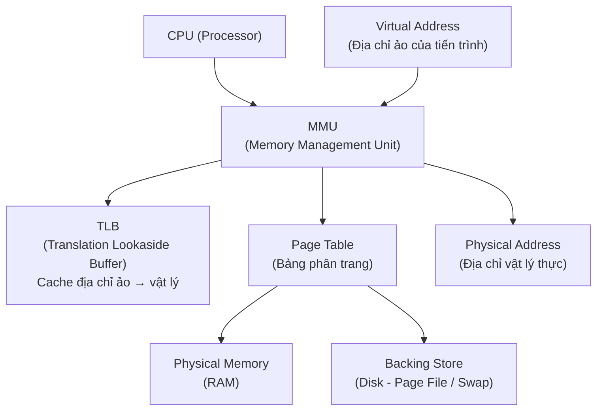
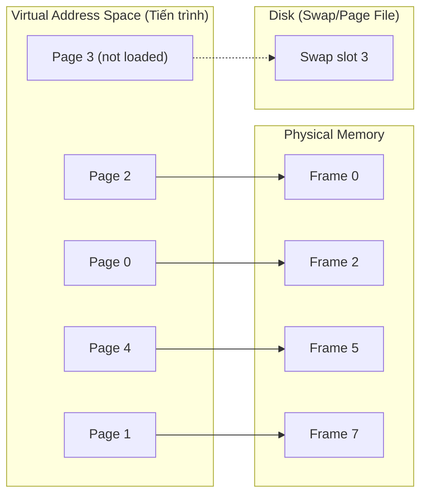
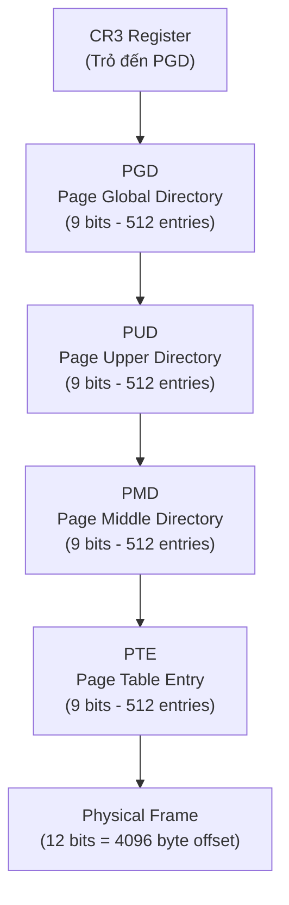
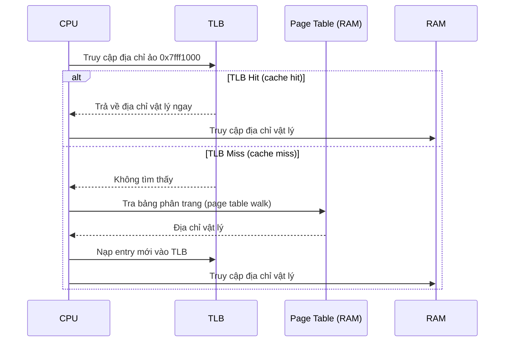
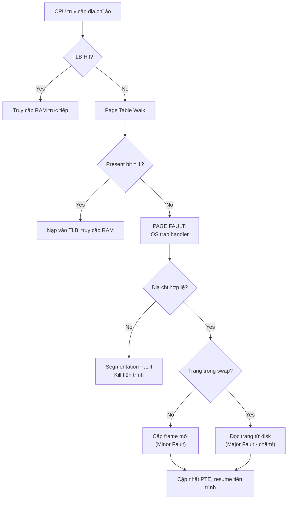
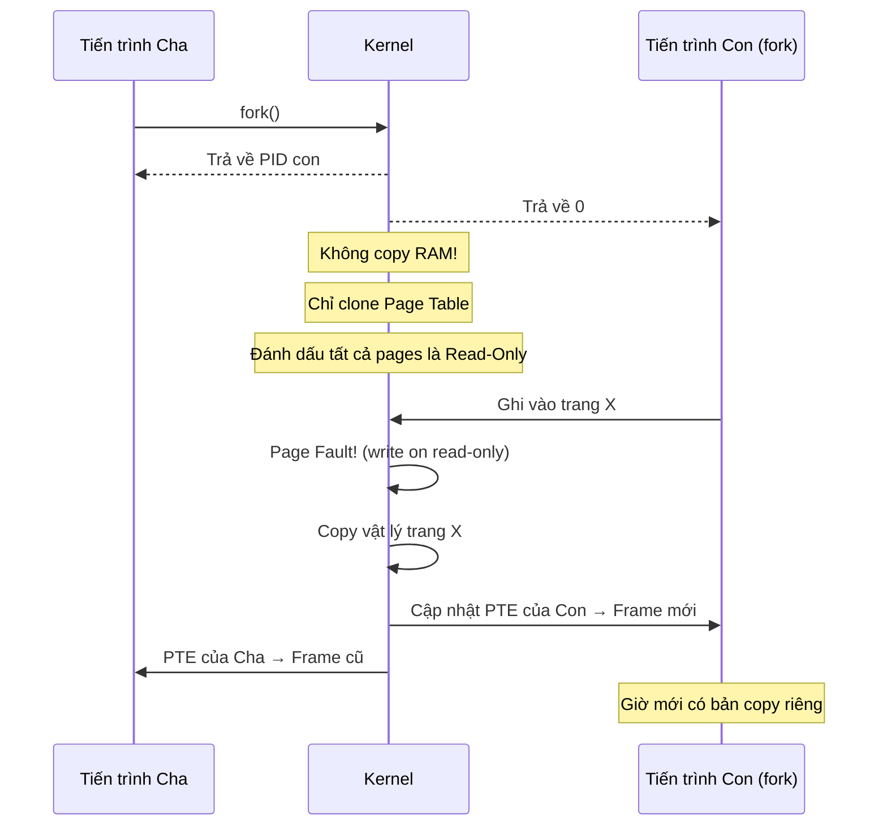
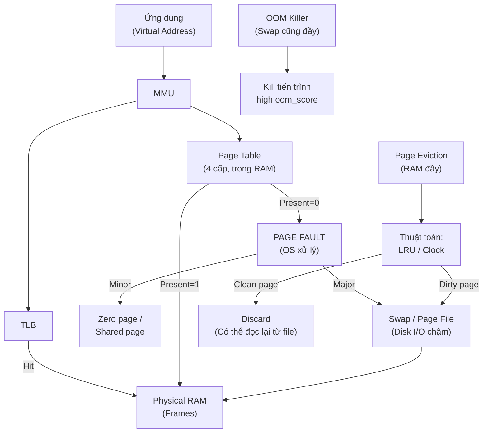

# Cheatsheet: Lệnh Windows & Linux + Cơ chế Paging

<!--more-->

---

## Lệnh Hệ Thống - Toàn Diện

### 1. Quản lý File & Thư mục

=== "Windows (CMD/PowerShell)"

    **Xem danh sách file/thư mục**

    ```bat
    :: CMD
    dir                        :: Liệt kê thư mục hiện tại
    dir /a                     :: Bao gồm file ẩn
    dir /s                     :: Đệ quy vào thư mục con
    dir /b                     :: Chỉ tên file (bare format)
    dir /o:n                   :: Sắp xếp theo tên
    dir /o:d                   :: Sắp xếp theo ngày
    dir C:\Users /s /b         :: Tìm đệ quy tại đường dẫn cụ thể

    :: PowerShell
    Get-ChildItem              :: Tương đương ls / dir
    Get-ChildItem -Hidden      :: Bao gồm file ẩn
    Get-ChildItem -Recurse     :: Đệ quy
    Get-ChildItem -Filter *.txt :: Lọc theo extension
    Get-ChildItem | Sort-Object Name       :: Sắp xếp theo tên
    Get-ChildItem | Sort-Object LastWriteTime :: Sắp xếp theo ngày sửa
    ```

    **Tạo thư mục / file**

    ```bat
    :: CMD
    mkdir TenThuMuc
    mkdir "Thu Muc Co Khoang Trang"
    mkdir C:\parent\child\grandchild   :: Tạo cả cây thư mục

    echo. > file.txt            :: Tạo file rỗng
    echo Noi dung > file.txt    :: Tạo file với nội dung
    type nul > file.txt         :: Cách khác tạo file rỗng

    :: PowerShell
    New-Item -ItemType Directory -Name "TenThuMuc"
    New-Item -ItemType File -Name "file.txt"
    New-Item -ItemType File -Name "file.txt" -Value "Noi dung"
    New-Item -Path "C:\a\b\c" -ItemType Directory -Force  :: Tạo cả cây
    ```

    **Đổi tên**

    ```bat
    :: CMD
    ren file.txt moi.txt
    ren "ten cu.txt" "ten moi.txt"
    ren *.txt *.bak             :: Đổi hàng loạt

    :: PowerShell
    Rename-Item -Path "file.txt" -NewName "moi.txt"
    Get-ChildItem *.txt | Rename-Item -NewName { $_.Name -replace '.txt','.bak' }
    ```

    **Copy**

    ```bat
    :: CMD
    copy source.txt dest.txt
    copy *.txt C:\backup\
    xcopy C:\src C:\dst /E /I /H    :: /E=bao gồm thư mục con rỗng, /I=đích là thư mục, /H=file ẩn
    robocopy C:\src C:\dst /MIR     :: Mirror (đồng bộ hoàn toàn)
    robocopy C:\src C:\dst /E /LOG:log.txt  :: Copy + ghi log

    :: PowerShell
    Copy-Item "file.txt" "backup.txt"
    Copy-Item "C:\src" "C:\dst" -Recurse
    Copy-Item "C:\src\*" "C:\dst\" -Recurse -Force
    ```

    **Di chuyển (Move)**

    ```bat
    :: CMD
    move file.txt C:\other\
    move *.log C:\logs\

    :: PowerShell
    Move-Item "file.txt" "C:\other\"
    Move-Item "C:\src\*.log" "C:\logs\"
    ```

    **Xóa**

    ```bat
    :: CMD
    del file.txt
    del /f file.txt             :: Force (xóa file read-only)
    del /q *.tmp                :: Quiet (không hỏi)
    del /s /q C:\temp\*.*       :: Đệ quy, quiet
    rmdir TenThuMuc
    rmdir /s /q TenThuMuc       :: Xóa thư mục và nội dung, không hỏi

    :: PowerShell
    Remove-Item "file.txt"
    Remove-Item "file.txt" -Force           :: Bao gồm read-only
    Remove-Item "ThuMuc" -Recurse -Force    :: Xóa cả thư mục
    Remove-Item "C:\temp\*" -Recurse -Force :: Xóa nội dung bên trong
    ```

    **Đọc nội dung file**

    ```bat
    :: CMD
    type file.txt
    more file.txt               :: Đọc từng trang

    :: PowerShell
    Get-Content file.txt
    Get-Content file.txt -TotalCount 10     :: 10 dòng đầu
    Get-Content file.txt -Tail 10           :: 10 dòng cuối
    Get-Content file.txt | Select-String "pattern"  :: Tìm kiếm
    ```

    **Tìm kiếm file**

    ```bat
    :: CMD
    where python                :: Tìm file thực thi trong PATH
    dir /s /b *.log             :: Tìm file theo pattern đệ quy

    :: PowerShell
    Get-ChildItem -Path C:\ -Filter "*.log" -Recurse -ErrorAction SilentlyContinue
    Get-ChildItem -Path C:\ -Recurse | Where-Object { $_.Name -like "*report*" }
    ```

=== "Linux (Bash)"

    **Xem danh sách file/thư mục**

    ```bash
    ls                          # Liệt kê thư mục hiện tại
    ls -l                       # Long format (quyền, owner, size, date)
    ls -a                       # Bao gồm file ẩn (bắt đầu bằng .)
    ls -la                      # Long format + ẩn
    ls -lh                      # Human-readable size (KB, MB)
    ls -lt                      # Sắp xếp theo thời gian (mới nhất trước)
    ls -lS                      # Sắp xếp theo kích thước (lớn nhất trước)
    ls -R                       # Đệ quy
    ls --color=auto             # Màu sắc phân loại
    tree                        # Cấu trúc cây thư mục
    tree -L 2                   # Chỉ 2 cấp sâu
    ```

    **Tạo thư mục / file**

    ```bash
    mkdir ten_thu_muc
    mkdir -p /duong/dan/day/du  # Tạo cả cây thư mục (-p = parents)
    mkdir -m 755 thu_muc        # Tạo kèm phân quyền

    touch file.txt              # Tạo file rỗng hoặc cập nhật timestamp
    touch file1.txt file2.txt   # Tạo nhiều file cùng lúc
    echo "Noi dung" > file.txt  # Tạo file với nội dung (ghi đè)
    echo "Them dong" >> file.txt # Append vào file
    cat > file.txt              # Nhập nội dung từ stdin (Ctrl+D để kết thúc)
    ```

    **Đổi tên**

    ```bash
    mv ten_cu.txt ten_moi.txt   # mv dùng để đổi tên và di chuyển
    mv thu_muc_cu/ thu_muc_moi/

    # Đổi tên hàng loạt
    rename 's/.txt/.bak/' *.txt          # Dùng rename (Perl-based)
    for f in *.txt; do mv "$f" "${f%.txt}.bak"; done  # Dùng loop bash
    ```

    **Copy**

    ```bash
    cp source.txt dest.txt
    cp -r src/ dst/             # Copy thư mục đệ quy
    cp -p file.txt backup.txt   # Giữ nguyên metadata (permission, timestamp)
    cp -a src/ dst/             # Archive mode = -dpR (giữ mọi thuộc tính)
    cp -u src/ dst/             # Chỉ copy nếu source mới hơn destination
    cp -v file.txt backup.txt   # Verbose (hiển thị tiến trình)

    # rsync - mạnh hơn cp
    rsync -av src/ dst/         # Verbose, archive
    rsync -avz src/ user@host:dst/  # Qua SSH, nén dữ liệu
    rsync -av --delete src/ dst/    # Xóa file ở dst không có ở src
    rsync -av --progress src/ dst/  # Hiển thị tiến trình
    ```

    **Di chuyển (Move)**

    ```bash
    mv file.txt /other/path/
    mv file.txt /other/path/newname.txt  # Vừa di chuyển vừa đổi tên
    mv *.log /var/logs/
    mv -i file.txt dst/         # Interactive (hỏi trước khi ghi đè)
    mv -n file.txt dst/         # No-clobber (không ghi đè nếu đã tồn tại)
    ```

    **Xóa**

    ```bash
    rm file.txt
    rm -f file.txt              # Force (không báo lỗi nếu không tồn tại)
    rm -r thu_muc/              # Đệ quy (xóa thư mục)
    rm -rf thu_muc/             # Force + Recursive (NGUY HIỂM!)
    rm -i *.tmp                 # Interactive (hỏi từng file)
    rmdir thu_muc               # Chỉ xóa thư mục RỖNG

    # An toàn hơn rm -rf
    trash-put file.txt          # Chuyển vào thùng rác (cần gói trash-cli)
    ```

    **Đọc nội dung file**

    ```bash
    cat file.txt                # Đọc toàn bộ
    cat -n file.txt             # Kèm số dòng
    more file.txt               # Đọc từng trang (chỉ tiến về phía trước)
    less file.txt               # Đọc từng trang (có thể cuộn lên/xuống)
    head file.txt               # 10 dòng đầu (mặc định)
    head -n 20 file.txt         # 20 dòng đầu
    tail file.txt               # 10 dòng cuối
    tail -n 20 file.txt         # 20 dòng cuối
    tail -f /var/log/syslog     # Real-time (theo dõi log liên tục)
    tac file.txt                # Đọc ngược (dòng cuối lên trước)
    ```

    **Tìm kiếm file**

    ```bash
    find / -name "file.txt"                  # Tìm theo tên (chính xác)
    find / -name "*.log"                     # Tìm theo pattern
    find / -iname "*.Log"                    # Không phân biệt hoa/thường
    find /home -type f                       # Chỉ file
    find /home -type d                       # Chỉ thư mục
    find / -size +100M                       # File lớn hơn 100MB
    find / -mtime -7                         # Sửa đổi trong 7 ngày gần đây
    find / -perm 644                         # Theo quyền
    find / -user username                    # Theo owner
    find / -name "*.tmp" -delete             # Tìm và xóa
    find / -name "*.log" -exec gzip {} \;   # Tìm và nén

    locate file.txt             # Tìm nhanh (dùng database updatedb)
    which python3               # Tìm vị trí lệnh trong PATH
    whereis python3             # Tìm binary + source + man pages
    ```

---

### 2. Quản lý User & Group

=== "Windows"

    **User Management**

    ```bat
    :: Xem danh sách user
    net user
    Get-LocalUser                               :: PowerShell

    :: Thêm user
    net user TenUser MatKhau /add
    net user TenUser MatKhau /add /fullname:"Ho Ten" /comment:"Mo ta"
    New-LocalUser -Name "TenUser" -Password (ConvertTo-SecureString "MatKhau" -AsPlainText -Force) -FullName "Ho Ten"

    :: Đổi mật khẩu
    net user TenUser MatKhauMoi
    Set-LocalUser -Name "TenUser" -Password (ConvertTo-SecureString "MatKhauMoi" -AsPlainText -Force)

    :: Vô hiệu hóa / Kích hoạt user
    net user TenUser /active:no     :: Vô hiệu hóa
    net user TenUser /active:yes    :: Kích hoạt
    Disable-LocalUser -Name "TenUser"
    Enable-LocalUser -Name "TenUser"

    :: Xóa user
    net user TenUser /delete
    Remove-LocalUser -Name "TenUser"

    :: Xem thông tin chi tiết user
    net user TenUser
    Get-LocalUser -Name "TenUser" | Format-List *

    :: Cài đặt thời hạn mật khẩu
    net user TenUser /expires:12/31/2025
    net user TenUser /passwordchg:yes   :: Cho phép đổi mật khẩu
    net user TenUser /passwordreq:yes   :: Bắt buộc có mật khẩu
    ```

    **Group Management**

    ```bat
    :: Xem danh sách group
    net localgroup
    Get-LocalGroup

    :: Tạo group
    net localgroup TenGroup /add
    New-LocalGroup -Name "TenGroup" -Description "Mo ta nhom"

    :: Xóa group
    net localgroup TenGroup /delete
    Remove-LocalGroup -Name "TenGroup"

    :: Thêm user vào group
    net localgroup TenGroup TenUser /add
    Add-LocalGroupMember -Group "TenGroup" -Member "TenUser"

    :: Xóa user khỏi group
    net localgroup TenGroup TenUser /delete
    Remove-LocalGroupMember -Group "TenGroup" -Member "TenUser"

    :: Xem thành viên của group
    net localgroup TenGroup
    Get-LocalGroupMember -Group "TenGroup"

    :: Thêm user vào Administrators
    net localgroup Administrators TenUser /add
    Add-LocalGroupMember -Group "Administrators" -Member "TenUser"
    ```

=== "Linux"

    **User Management**

    ```bash
    # Xem danh sách user
    cat /etc/passwd             # File chứa thông tin user
    cut -d: -f1 /etc/passwd     # Chỉ tên user
    getent passwd               # Bao gồm user từ LDAP/NIS

    # Thêm user
    useradd TenUser                          # Tạo user (không tạo home)
    useradd -m TenUser                       # Tạo user + home directory
    useradd -m -s /bin/bash TenUser          # Chỉ định shell
    useradd -m -d /home/custom TenUser       # Chỉ định home path
    useradd -m -g TenGroup TenUser           # Chỉ định primary group
    useradd -m -G group1,group2 TenUser      # Thêm vào supplementary groups
    useradd -c "Ho Ten" -m TenUser           # Thêm comment/full name
    useradd -e 2025-12-31 -m TenUser         # Ngày hết hạn account

    adduser TenUser             # Phiên bản thân thiện hơn (hỏi từng bước)

    # Đặt / Đổi mật khẩu
    passwd TenUser              # root đặt mật khẩu cho user
    passwd                      # User tự đổi mật khẩu của mình

    # Sửa thông tin user
    usermod -l TenMoi TenCu              # Đổi tên user
    usermod -d /home/moi TenUser         # Đổi home directory
    usermod -d /home/moi -m TenUser      # Đổi home + di chuyển nội dung
    usermod -s /bin/zsh TenUser          # Đổi shell
    usermod -aG TenGroup TenUser         # Thêm vào group (a=append)
    usermod -G group1,group2 TenUser     # Đặt lại toàn bộ supplementary groups
    usermod -L TenUser                   # Lock account (vô hiệu hóa)
    usermod -U TenUser                   # Unlock account
    usermod -e 2025-12-31 TenUser        # Đặt ngày hết hạn

    # Xóa user
    userdel TenUser                      # Chỉ xóa user (giữ home)
    userdel -r TenUser                   # Xóa user + home + mail spool

    # Xem thông tin user
    id TenUser                           # UID, GID, groups
    id                                   # Thông tin user hiện tại
    who                                  # Ai đang đăng nhập
    w                                    # Chi tiết hơn who
    last                                 # Lịch sử đăng nhập
    finger TenUser                       # Thông tin chi tiết (cần cài finger)
    getent passwd TenUser                # Thông tin từ /etc/passwd

    # Chuyển user
    su TenUser                           # Chuyển sang user (giữ env hiện tại)
    su - TenUser                         # Chuyển + load env của user đó
    sudo -u TenUser command              # Chạy lệnh với tư cách user khác
    ```

    **Group Management**

    ```bash
    # Xem danh sách group
    cat /etc/group
    getent group
    groups                      # Các group của user hiện tại
    groups TenUser              # Các group của user cụ thể

    # Tạo group
    groupadd TenGroup
    groupadd -g 1500 TenGroup   # Chỉ định GID cụ thể

    # Đổi tên group
    groupmod -n TenMoi TenCu

    # Đổi GID
    groupmod -g 1600 TenGroup

    # Xóa group
    groupdel TenGroup

    # Quản lý thành viên group
    gpasswd -a TenUser TenGroup  # Thêm user vào group
    gpasswd -d TenUser TenGroup  # Xóa user khỏi group
    gpasswd -A TenUser TenGroup  # Đặt TenUser làm admin của group
    gpasswd -M user1,user2 TenGroup  # Đặt danh sách thành viên

    # Sudo
    visudo                      # Sửa file /etc/sudoers an toàn
    # Thêm dòng: TenUser ALL=(ALL:ALL) ALL
    # Cho phép không cần mật khẩu: TenUser ALL=(ALL) NOPASSWD: ALL
    usermod -aG sudo TenUser    # Thêm vào group sudo (Debian/Ubuntu)
    usermod -aG wheel TenUser   # Thêm vào group wheel (RHEL/CentOS)
    ```

---

### 3. Quản lý Tiến trình (Process)

=== "Windows"

    ```bat
    :: Xem tiến trình
    tasklist
    tasklist /fi "imagename eq chrome.exe"   :: Lọc theo tên
    tasklist /fi "pid eq 1234"               :: Lọc theo PID
    tasklist /v                              :: Verbose (chi tiết)
    tasklist /svc                            :: Kèm services

    :: PowerShell
    Get-Process
    Get-Process -Name "chrome"
    Get-Process | Sort-Object CPU -Descending      :: Sắp xếp theo CPU
    Get-Process | Sort-Object WorkingSet -Descending  :: Sắp xếp theo RAM

    :: Kết thúc tiến trình
    taskkill /pid 1234
    taskkill /pid 1234 /f                    :: Force kill
    taskkill /im chrome.exe /f              :: Kill theo tên
    taskkill /im chrome.exe /f /t           :: Kill cả tiến trình con

    :: PowerShell
    Stop-Process -Id 1234
    Stop-Process -Name "chrome" -Force
    Stop-Process -Name "chrome" -Force -Confirm:$false

    :: Chạy tiến trình với quyền
    Start-Process "notepad.exe" -Verb RunAs         :: Run as Administrator
    Start-Process "cmd.exe" -WindowStyle Hidden     :: Chạy ẩn

    :: Xem tiến trình theo thời gian thực
    :: Dùng Task Manager: Ctrl + Shift + Esc
    :: Hoặc: resmon.exe (Resource Monitor)
    ```

=== "Linux"

    ```bash
    # Xem tiến trình
    ps                          # Tiến trình của session hiện tại
    ps aux                      # Tất cả tiến trình (format BSD)
    ps -ef                      # Tất cả tiến trình (format System V)
    ps aux | grep "ten_process" # Lọc theo tên
    ps -p 1234                  # Tiến trình theo PID
    ps --sort=-%cpu             # Sắp xếp theo CPU (giảm dần)
    ps --sort=-%mem             # Sắp xếp theo Memory (giảm dần)
    pstree                      # Hiển thị dạng cây cha-con
    pstree -p                   # Kèm PID
    pstree -u                   # Kèm username

    # Xem thời gian thực
    top                         # Real-time process monitor
    htop                        # Top nâng cao (cần cài)
    atop                        # Advanced top với lịch sử

    # Phím tắt trong top:
    # P = sắp xếp theo CPU
    # M = sắp xếp theo Memory
    # k = kill tiến trình (nhập PID)
    # q = thoát

    # Tìm PID
    pgrep ten_process           # Tìm PID theo tên
    pgrep -u username           # Tất cả PID của user
    pidof apache2               # PID của tiến trình

    # Gửi tín hiệu (Signal)
    kill PID                    # Gửi SIGTERM (15) - yêu cầu dừng nhẹ nhàng
    kill -9 PID                 # Gửi SIGKILL - buộc dừng ngay
    kill -15 PID                # SIGTERM (explicit)
    kill -1 PID                 # SIGHUP - reload config
    kill -19 PID                # SIGSTOP - tạm dừng
    kill -18 PID                # SIGCONT - tiếp tục
    killall ten_process         # Kill tất cả tiến trình cùng tên
    killall -9 ten_process      # Force kill tất cả
    pkill ten_process           # Kill theo pattern tên
    pkill -u username           # Kill tất cả tiến trình của user

    # Chạy tiến trình ngầm (Background)
    command &                   # Chạy ngầm
    nohup command &             # Chạy ngầm, không dừng khi đóng terminal
    nohup command > output.log 2>&1 &  # Redirect output

    # Quản lý jobs
    jobs                        # Xem các jobs đang chạy
    bg %1                       # Đưa job 1 ra background
    fg %1                       # Đưa job 1 về foreground
    Ctrl + Z                    # Tạm dừng tiến trình foreground
    Ctrl + C                    # Kết thúc tiến trình foreground

    # Độ ưu tiên (Priority)
    nice -n 10 command          # Chạy với priority thấp hơn (nice: -20 đến 19)
    renice -n 5 -p PID          # Thay đổi priority của tiến trình đang chạy
    renice -n 5 -u username     # Thay đổi priority của tất cả tiến trình user
    ```

---

### 4. Quản lý Mạng (Network)

=== "Windows"

    ```bat
    :: Xem cấu hình mạng
    ipconfig                    :: Thông tin cơ bản (IP, Mask, Gateway)
    ipconfig /all               :: Đầy đủ (MAC, DNS, DHCP...)
    ipconfig /release           :: Giải phóng địa chỉ DHCP
    ipconfig /renew             :: Xin cấp lại địa chỉ DHCP
    ipconfig /flushdns          :: Xóa DNS cache
    ipconfig /displaydns        :: Hiển thị DNS cache

    :: PowerShell
    Get-NetIPAddress
    Get-NetIPAddress -AddressFamily IPv4
    Get-NetAdapter                          :: Xem network adapter
    Get-NetAdapter | Where-Object {$_.Status -eq "Up"}  :: Chỉ adapter đang hoạt động

    :: Kiểm tra kết nối
    ping google.com
    ping -t google.com          :: Ping liên tục
    ping -n 10 google.com       :: Ping 10 lần
    ping -l 1024 google.com     :: Với packet size 1024 bytes
    tracert google.com          :: Trace route
    pathping google.com         :: Kết hợp ping + tracert

    :: Xem bảng routing
    route print
    route add 192.168.2.0 mask 255.255.255.0 192.168.1.1   :: Thêm route
    route delete 192.168.2.0                               :: Xóa route
    route change 192.168.2.0 mask 255.255.255.0 192.168.1.254 :: Sửa route

    :: Xem kết nối đang mở
    netstat -an                 :: Tất cả kết nối và cổng lắng nghe
    netstat -ano                :: Kèm PID
    netstat -ab                 :: Kèm tên ứng dụng (cần quyền admin)
    netstat -s                  :: Thống kê theo giao thức
    netstat -r                  :: Bảng routing

    :: DNS
    nslookup google.com                     :: Tra cứu DNS
    nslookup google.com 8.8.8.8            :: Dùng DNS server cụ thể
    Resolve-DnsName google.com              :: PowerShell

    :: Cấu hình IP tĩnh (PowerShell)
    New-NetIPAddress -InterfaceAlias "Ethernet" -IPAddress "192.168.1.100" -PrefixLength 24 -DefaultGateway "192.168.1.1"
    Set-DnsClientServerAddress -InterfaceAlias "Ethernet" -ServerAddresses "8.8.8.8","8.8.4.4"

    :: Firewall
    netsh advfirewall show allprofiles
    netsh advfirewall firewall add rule name="Cho phep HTTP" protocol=TCP dir=in localport=80 action=allow
    netsh advfirewall firewall delete rule name="Cho phep HTTP"
    ```

=== "Linux"

    ```bash
    # Xem cấu hình mạng
    ip addr                     # Địa chỉ IP các interface
    ip addr show eth0           # Chỉ interface eth0
    ip link                     # Trạng thái interface (up/down)
    ip link show eth0
    ip route                    # Bảng routing
    ip route show
    ifconfig                    # Cũ hơn ip (cần net-tools)

    # Bật/tắt interface
    ip link set eth0 up
    ip link set eth0 down

    # Cấu hình IP tĩnh (tạm thời)
    ip addr add 192.168.1.100/24 dev eth0
    ip addr del 192.168.1.100/24 dev eth0
    ip route add default via 192.168.1.1   # Đặt default gateway
    ip route add 10.0.0.0/8 via 192.168.1.254  # Thêm route

    # Cấu hình IP tĩnh (vĩnh viễn - Debian/Ubuntu)
    # Sửa /etc/network/interfaces hoặc dùng netplan:
    # /etc/netplan/01-netcfg.yaml

    # Kiểm tra kết nối
    ping google.com
    ping -c 5 google.com        # Ping 5 lần
    ping -i 2 google.com        # Interval 2 giây
    ping -s 1024 google.com     # Packet size 1024 bytes
    ping6 google.com            # IPv6
    traceroute google.com
    tracepath google.com        # Không cần root
    mtr google.com              # Real-time traceroute

    # Xem kết nối đang mở
    netstat -an                 # Tất cả kết nối
    netstat -tuln               # TCP/UDP, Listening, Numeric
    netstat -tulnp              # Kèm PID và tên chương trình (cần root)
    ss -an                      # Thay thế netstat (nhanh hơn)
    ss -tuln                    # TCP/UDP Listening
    ss -tulnp                   # Kèm PID
    ss -s                       # Thống kê tóm tắt

    # DNS
    nslookup google.com
    dig google.com              # Chi tiết hơn nslookup
    dig google.com MX           # Tìm Mail Exchange record
    dig @8.8.8.8 google.com     # Dùng DNS server cụ thể
    host google.com             # Đơn giản hơn dig
    resolvectl status           # Xem cấu hình DNS resolver (systemd)

    # Xem ARP
    arp -a                      # Bảng ARP
    ip neigh                    # Cách mới hơn

    # Firewall (iptables)
    iptables -L                 # Xem rules
    iptables -L -n -v           # Chi tiết, numeric, verbose
    iptables -A INPUT -p tcp --dport 80 -j ACCEPT    # Cho phép cổng 80
    iptables -A INPUT -p tcp --dport 22 -j DROP      # Chặn SSH
    iptables -D INPUT -p tcp --dport 80 -j ACCEPT    # Xóa rule
    iptables-save > /etc/iptables/rules.v4           # Lưu rules

    # Firewall (ufw - Ubuntu)
    ufw status
    ufw enable
    ufw disable
    ufw allow 80/tcp
    ufw allow ssh
    ufw deny 23/tcp
    ufw delete allow 80/tcp
    ufw reset                   # Đặt lại về mặc định

    # Tải file
    wget https://example.com/file.zip
    wget -O output.zip https://example.com/file.zip
    curl -O https://example.com/file.zip
    curl -o output.zip https://example.com/file.zip
    curl -L https://example.com/redirect    # Follow redirect
    ```

---

### 5. Quản lý Dịch vụ (Service)

=== "Windows"

    ```bat
    :: Xem danh sách services
    sc query                    :: Tất cả services
    sc query type= all          :: Bao gồm cả dạng inactive
    sc queryex TenService       :: Chi tiết service cụ thể
    Get-Service                 :: PowerShell
    Get-Service -Name "Spooler" :: Service cụ thể
    Get-Service | Where-Object {$_.Status -eq "Running"}  :: Đang chạy

    :: Khởi động / Dừng / Khởi động lại
    sc start TenService
    sc stop TenService
    sc restart TenService       :: Không có sẵn trong CMD cũ, dùng:
    net start TenService
    net stop TenService

    :: PowerShell
    Start-Service -Name "Spooler"
    Stop-Service -Name "Spooler"
    Restart-Service -Name "Spooler"
    Suspend-Service -Name "Spooler"   :: Tạm dừng (nếu hỗ trợ)
    Resume-Service -Name "Spooler"    :: Tiếp tục

    :: Đặt kiểu khởi động
    sc config TenService start= auto        :: Tự động
    sc config TenService start= demand      :: Thủ công
    sc config TenService start= disabled    :: Vô hiệu hóa
    Set-Service -Name "Spooler" -StartupType Automatic
    Set-Service -Name "Spooler" -StartupType Manual
    Set-Service -Name "Spooler" -StartupType Disabled

    :: Tạo service mới
    sc create TenService binPath= "C:\path\to\app.exe" start= auto DisplayName= "Ten Hien Thi"

    :: Xóa service
    sc delete TenService

    :: Xem log service
    Get-EventLog -LogName System -Source "TenService" -Newest 50
    ```

=== "Linux"

    ```bash
    # systemd (hầu hết các distro hiện đại)

    # Xem trạng thái
    systemctl status ten_service
    systemctl status             # Tổng quan hệ thống
    systemctl list-units --type=service         # Tất cả services
    systemctl list-units --type=service --state=running  # Đang chạy
    systemctl list-units --type=service --state=failed   # Bị lỗi
    systemctl list-unit-files --type=service    # Kèm trạng thái enable/disable

    # Khởi động / Dừng / Khởi động lại
    systemctl start ten_service
    systemctl stop ten_service
    systemctl restart ten_service       # Dừng rồi khởi động lại
    systemctl reload ten_service        # Reload config (không dừng hẳn)
    systemctl reload-or-restart ten_service  # Reload nếu được, không thì restart

    # Enable / Disable (khởi động cùng hệ thống)
    systemctl enable ten_service        # Bật autostart
    systemctl disable ten_service       # Tắt autostart
    systemctl enable --now ten_service  # Enable + start ngay
    systemctl disable --now ten_service # Disable + stop ngay
    systemctl is-enabled ten_service    # Kiểm tra có enable không
    systemctl is-active ten_service     # Kiểm tra có đang chạy không

    # Mask / Unmask (ngăn không cho start)
    systemctl mask ten_service          # Không thể start dù thủ công
    systemctl unmask ten_service        # Bỏ mask

    # Xem log
    journalctl -u ten_service           # Log của service
    journalctl -u ten_service -f        # Theo dõi real-time
    journalctl -u ten_service --since "1 hour ago"
    journalctl -u ten_service -n 50     # 50 dòng cuối
    journalctl -p err                   # Chỉ lỗi

    # Tạo service tùy chỉnh
    # Tạo file: /etc/systemd/system/myapp.service
    # [Unit]
    # Description=My Application
    # After=network.target
    #
    # [Service]
    # Type=simple
    # User=myuser
    # WorkingDirectory=/opt/myapp
    # ExecStart=/opt/myapp/start.sh
    # Restart=on-failure
    #
    # [Install]
    # WantedBy=multi-user.target

    systemctl daemon-reload         # Load lại sau khi tạo/sửa file service

    # SysV init (hệ thống cũ)
    service ten_service start
    service ten_service stop
    service ten_service restart
    service ten_service status
    chkconfig ten_service on        # Enable (CentOS/RHEL cũ)
    update-rc.d ten_service enable  # Enable (Debian cũ)
    ```

---

### 6. Quản lý Đĩa & Phân vùng

=== "Windows"

    ```bat
    :: Xem dung lượng đĩa
    wmic logicaldisk get name,size,freespace
    Get-PSDrive -PSProvider FileSystem          :: PowerShell
    Get-Volume                                  :: PowerShell

    :: Disk Management (công cụ dòng lệnh)
    diskpart                    :: Mở diskpart interactive

    :: Trong diskpart:
    list disk                   :: Xem các đĩa
    select disk 0               :: Chọn đĩa 0
    list partition              :: Xem phân vùng
    select partition 1          :: Chọn phân vùng 1
    list volume                 :: Xem volumes
    select volume 2             :: Chọn volume 2

    create partition primary size=10240     :: Tạo phân vùng 10GB
    create partition extended
    create partition logical size=5120
    delete partition                         :: Xóa phân vùng đã chọn
    format fs=ntfs quick label="TenNhan"    :: Format NTFS
    format fs=fat32 quick
    assign letter=D                          :: Gán ký tự ổ đĩa
    remove letter=D                          :: Gỡ ký tự
    active                                   :: Đánh dấu phân vùng active (bootable)
    extend size=5120                         :: Mở rộng phân vùng
    shrink desired=5120                      :: Thu nhỏ phân vùng
    clean                                    :: Xóa tất cả phân vùng trên đĩa

    :: Kiểm tra đĩa
    chkdsk C:                   :: Kiểm tra lỗi
    chkdsk C: /f                :: Sửa lỗi
    chkdsk C: /r                :: Tìm bad sectors + sửa
    chkdsk C: /x                :: Force unmount trước khi kiểm tra

    :: Chống phân mảnh
    defrag C:                   :: Chống phân mảnh
    defrag C: /a                :: Phân tích (không defrag)
    defrag C: /u /v             :: Update + Verbose
    Optimize-Volume -DriveLetter C -Defrag  :: PowerShell
    ```

=== "Linux"

    ```bash
    # Xem dung lượng đĩa
    df -h                       # Dung lượng các filesystem (human-readable)
    df -H                       # Tương tự nhưng dùng 1000 thay vì 1024
    df -T                       # Kèm loại filesystem
    df -i                       # Xem inode usage thay vì block
    du -sh /home/user/          # Dung lượng của thư mục
    du -sh *                    # Dung lượng từng item trong thư mục hiện tại
    du -ah /home | sort -h      # Tất cả file, sắp xếp theo size
    ncdu /home                  # Interactive disk usage (cần cài)

    # Xem đĩa và phân vùng
    lsblk                       # Liệt kê block devices dạng cây
    lsblk -f                    # Kèm filesystem type và UUID
    fdisk -l                    # Xem thông tin phân vùng (cần root)
    parted -l                   # Tương tự fdisk
    blkid                       # UUID và filesystem type của các device

    # Phân vùng với fdisk
    fdisk /dev/sdb              # Mở fdisk interactive cho đĩa /dev/sdb
    # Phím lệnh trong fdisk:
    # p = print (xem phân vùng)
    # n = new (tạo phân vùng)
    # d = delete (xóa phân vùng)
    # t = type (đổi loại phân vùng)
    # w = write (lưu thay đổi)
    # q = quit (thoát không lưu)

    # Phân vùng với parted
    parted /dev/sdb
    # Lệnh trong parted:
    # mklabel gpt           :: Tạo bảng phân vùng GPT
    # mklabel msdos         :: Tạo bảng phân vùng MBR
    # mkpart primary ext4 0% 50%   :: Tạo phân vùng
    # rm 1                  :: Xóa phân vùng 1
    # print                 :: Xem phân vùng
    # quit

    # Format filesystem
    mkfs.ext4 /dev/sdb1         # Format ext4
    mkfs.ext3 /dev/sdb1
    mkfs.xfs /dev/sdb1
    mkfs.ntfs /dev/sdb1
    mkfs.vfat -F 32 /dev/sdb1  # FAT32
    mkswap /dev/sdb2            # Format làm swap

    # Mount / Unmount
    mount /dev/sdb1 /mnt/data           # Mount
    mount -t ext4 /dev/sdb1 /mnt/data  # Chỉ định filesystem
    mount -o ro /dev/sdb1 /mnt/data    # Mount read-only
    mount -o remount,rw /dev/sdb1      # Remount read-write
    umount /mnt/data                    # Unmount
    umount /dev/sdb1                    # Unmount theo device
    umount -l /mnt/data                 # Lazy unmount (unmount khi không còn dùng)

    # Mount tự động (vĩnh viễn) - sửa /etc/fstab
    # UUID=xxxx  /mnt/data  ext4  defaults  0  2
    # Lấy UUID: blkid /dev/sdb1
    mount -a                    # Mount tất cả trong /etc/fstab

    # LVM (Logical Volume Manager)
    pvcreate /dev/sdb1          # Tạo Physical Volume
    pvdisplay                   # Xem PV
    vgcreate ten_vg /dev/sdb1   # Tạo Volume Group
    vgdisplay
    vgextend ten_vg /dev/sdc1   # Mở rộng VG
    lvcreate -L 10G -n ten_lv ten_vg  # Tạo Logical Volume 10GB
    lvcreate -l 100%FREE -n ten_lv ten_vg  # Dùng toàn bộ không gian còn lại
    lvdisplay
    lvextend -L +5G /dev/ten_vg/ten_lv  # Mở rộng LV thêm 5GB
    resize2fs /dev/ten_vg/ten_lv        # Mở rộng filesystem sau khi mở rộng LV
    lvremove /dev/ten_vg/ten_lv         # Xóa LV

    # Kiểm tra đĩa
    fsck /dev/sdb1              # Kiểm tra filesystem (cần unmount)
    fsck -y /dev/sdb1           # Tự động trả lời yes
    badblocks -v /dev/sdb       # Kiểm tra bad blocks
    smartctl -a /dev/sdb        # SMART diagnostics (cần smartmontools)
    ```

---

### 7. Quản lý Quyền (Permission)

=== "Windows"

    ```bat
    :: Xem quyền
    icacls "C:\duong\dan"
    icacls "C:\duong\dan" /T    :: Đệ quy

    :: Thêm quyền
    icacls "C:\folder" /grant "TenUser:(R)"        :: Read
    icacls "C:\folder" /grant "TenUser:(RX)"       :: Read+Execute
    icacls "C:\folder" /grant "TenUser:(M)"        :: Modify
    icacls "C:\folder" /grant "TenUser:(F)"        :: Full Control
    icacls "C:\folder" /grant "TenUser:(OI)(CI)(F)" :: Áp dụng cho subfolders và files

    :: Mã quyền:
    :: F = Full control
    :: M = Modify
    :: RX = Read & Execute
    :: R = Read only
    :: W = Write only
    :: D = Delete
    :: OI = Object Inherit (áp cho file trong thư mục)
    :: CI = Container Inherit (áp cho thư mục con)

    :: Xóa quyền
    icacls "C:\folder" /remove "TenUser"

    :: Reset quyền về mặc định
    icacls "C:\folder" /reset /T

    :: Đổi owner
    icacls "C:\folder" /setowner "TenUser" /T
    takeown /f "C:\folder" /r  :: Lấy ownership về tay mình

    :: PowerShell
    Get-Acl "C:\folder"
    (Get-Acl "C:\folder").Access | Format-Table
    ```

=== "Linux"

    ```bash
    # Xem quyền
    ls -l                       # Xem quyền file
    stat file.txt               # Thông tin chi tiết kèm quyền dạng số

    # Cấu trúc quyền: rwxrwxrwx
    # r=read(4), w=write(2), x=execute(1)
    # [owner][group][others]

    # Thay đổi quyền (chmod)
    chmod 755 file.sh           # Symbolic: rwxr-xr-x
    chmod 644 file.txt          # Symbolic: rw-r--r--
    chmod 600 private.key       # Symbolic: rw-------
    chmod 777 file.sh           # Tất cả quyền (KHÔNG khuyến khích)
    chmod -R 755 thu_muc/       # Đệ quy

    # Dạng symbolic
    chmod u+x file.sh           # Thêm execute cho owner
    chmod g-w file.txt          # Bỏ write cho group
    chmod o-r file.txt          # Bỏ read cho others
    chmod a+r file.txt          # Thêm read cho tất cả (a=all)
    chmod ug+rw file.txt        # Thêm read+write cho owner và group
    chmod u=rwx,g=rx,o= file    # Đặt chính xác

    # Đổi owner (chown)
    chown TenUser file.txt
    chown TenUser:TenGroup file.txt    # Đổi cả owner và group
    chown :TenGroup file.txt           # Chỉ đổi group
    chown -R TenUser:TenGroup thu_muc/ # Đệ quy

    # Đổi group (chgrp)
    chgrp TenGroup file.txt
    chgrp -R TenGroup thu_muc/

    # Quyền đặc biệt
    chmod u+s file              # SetUID: file chạy với quyền owner
    chmod g+s thu_muc/          # SetGID: file tạo trong thư mục kế thừa group
    chmod +t /tmp               # Sticky bit: chỉ owner mới xóa được file của mình

    # Dạng số cho quyền đặc biệt
    chmod 4755 file             # SetUID + rwxr-xr-x
    chmod 2755 thu_muc/         # SetGID + rwxr-xr-x
    chmod 1777 /tmp             # Sticky bit + rwxrwxrwx

    # ACL (Access Control List) - quyền chi tiết hơn
    getfacl file.txt            # Xem ACL
    setfacl -m u:TenUser:rw file.txt    # Thêm quyền rw cho user cụ thể
    setfacl -m g:TenGroup:r file.txt    # Thêm quyền read cho group
    setfacl -x u:TenUser file.txt       # Xóa ACL của user
    setfacl -b file.txt                 # Xóa tất cả ACL
    setfacl -R -m u:TenUser:rwX thu_muc/ :: Đệ quy (X=execute chỉ cho thư mục)
    ```

---

### 8. Biến Môi Trường (Environment Variables)

=== "Windows"

    ```bat
    :: Xem biến môi trường
    set                         :: Tất cả biến
    set PATH                    :: Xem biến cụ thể
    echo %PATH%                 :: In giá trị biến
    echo %USERNAME%
    echo %COMPUTERNAME%
    echo %TEMP%
    echo %USERPROFILE%

    :: PowerShell
    Get-ChildItem Env:                      :: Tất cả biến
    $env:PATH                               :: Xem biến cụ thể
    $env:USERNAME

    :: Đặt biến (chỉ session hiện tại)
    set MY_VAR=GiaTriCuaToi
    $env:MY_VAR = "GiaTriCuaToi"            :: PowerShell

    :: Đặt biến vĩnh viễn
    setx MY_VAR "GiaTriCuaToi"              :: User scope
    setx MY_VAR "GiaTriCuaToi" /M          :: System scope (cần admin)
    [System.Environment]::SetEnvironmentVariable("MY_VAR","GiaTri","User")
    [System.Environment]::SetEnvironmentVariable("MY_VAR","GiaTri","Machine")  :: PS, admin

    :: Thêm vào PATH
    setx PATH "%PATH%;C:\my\tool\bin" /M    :: CMD (chú ý %PATH% ở đây là PATH hiện tại)

    :: Xóa biến
    set MY_VAR=                 :: CMD (gán rỗng)
    [System.Environment]::SetEnvironmentVariable("MY_VAR",$null,"User")  :: PS
    ```

=== "Linux"

    ```bash
    # Xem biến môi trường
    env                         # Tất cả biến
    printenv                    # Tương tự env
    printenv PATH               # Xem biến cụ thể
    echo $PATH
    echo $HOME
    echo $USER
    echo $SHELL
    echo $LANG
    set                         # Tất cả biến + shell functions

    # Đặt biến (chỉ shell hiện tại)
    MY_VAR=GiaTriCuaToi
    export MY_VAR               # Export để tiến trình con thấy được
    export MY_VAR=GiaTriCuaToi  # Gộp 2 dòng trên

    # Thêm vào PATH
    export PATH=$PATH:/opt/my/tool/bin

    # Đặt biến vĩnh viễn
    # Thêm vào ~/.bashrc (chỉ user hiện tại, bash)
    echo 'export MY_VAR=GiaTri' >> ~/.bashrc
    echo 'export PATH=$PATH:/opt/tool/bin' >> ~/.bashrc
    source ~/.bashrc            # Load lại ngay

    # Hoặc ~/.profile (bash + các shell khác)
    # Hoặc ~/.zshrc (zsh)

    # System-wide (tất cả user)
    # Sửa /etc/environment
    # MY_VAR="GiaTri"          ← Không có export!
    # PATH="/usr/local/sbin:..."

    # Hoặc tạo file trong /etc/profile.d/
    echo 'export MY_VAR=GiaTri' > /etc/profile.d/myapp.sh

    # Xóa biến
    unset MY_VAR

    # Biến chỉ áp dụng cho một lệnh
    MY_VAR=GiaTri command       # Đặt biến cho lệnh cụ thể, không ảnh hưởng shell
    ```

---

## Cơ Chế Quản Lý Trang Nhớ (Memory Management & Paging)

### Tổng quan kiến trúc



---

### 1. Địa chỉ ảo và không gian địa chỉ (Virtual Address Space)

!!! info "Khái niệm cốt lõi"
    Mỗi tiến trình được hệ điều hành cấp một **không gian địa chỉ ảo riêng biệt** (Virtual Address Space). Tiến trình không bao giờ làm việc trực tiếp với địa chỉ vật lý trong RAM — nó chỉ thấy địa chỉ ảo. Công việc dịch địa chỉ ảo sang địa chỉ vật lý là nhiệm vụ của **MMU** kết hợp với **Page Table** do OS quản lý.

**Kích thước không gian địa chỉ ảo:**

| Kiến trúc | Kích thước VAS lý thuyết | Thực tế (OS phân chia) |
|---|---|---|
| 32-bit | 4 GB (2³²) | ~2 GB user / ~2 GB kernel (Windows) hoặc ~3 GB / ~1 GB (Linux) |
| 64-bit | 128 TB - 256 TB (x86-64 dùng 48-bit) | Đủ lớn để không cần lo |

**Ý nghĩa của việc dùng địa chỉ ảo:**

- **Cách ly tiến trình**: Tiến trình A không thể đọc vùng nhớ của tiến trình B vì chúng có Page Table riêng, ánh xạ đến các địa chỉ vật lý khác nhau.
- **Linh hoạt phân bổ**: RAM vật lý không cần liên tục. Các trang nhớ logic liền nhau của tiến trình có thể nằm rải rác trong RAM.
- **Cơ sở của Paging**: Cho phép tổng Virtual Memory của tất cả tiến trình vượt quá RAM vật lý.

---

### 2. Cơ chế Phân trang (Paging Mechanism)

!!! abstract "Paging là gì?"
    **Paging** là kỹ thuật chia cả không gian địa chỉ ảo lẫn bộ nhớ vật lý thành các khối có kích thước cố định, gọi là **Page** (trang ảo) và **Frame** (khung vật lý). Hệ điều hành quản lý việc ánh xạ Page → Frame thông qua cấu trúc dữ liệu gọi là **Page Table**.



**Kích thước trang nhớ (Page Size):**

| Hệ thống | Kích thước trang mặc định | Huge Pages |
|---|---|---|
| x86-64 Linux | 4 KB | 2 MB (transparent huge pages) hoặc 1 GB |
| Windows x86-64 | 4 KB | 2 MB (Large Pages) |
| ARM64 (Apple M1/M2) | 16 KB | 2 MB / 1 GB |

---

### 3. Cấu trúc Page Table

**Page Table Entry (PTE)** — mỗi entry trong bảng phân trang chứa:

```
+--------+-------+-------+---+---+---+---+---+---+
| Frame# | Dirty | Accsd | W | X | R | U | G | P |
+--------+-------+-------+---+---+---+---+---+---+
```

| Bit / Trường | Ý nghĩa |
|---|---|
| **Frame Number** | Số thứ tự của Frame trong RAM (địa chỉ vật lý = Frame# × PageSize + Offset) |
| **P (Present)** | 1 = trang đang trong RAM; 0 = trang đã bị swap ra đĩa |
| **R/W** | Read/Write: 0 = chỉ đọc; 1 = đọc/ghi |
| **U/S (User/Supervisor)** | 0 = kernel only; 1 = user có thể truy cập |
| **X (Execute)** | Cho phép thực thi code trong trang (NX/XD bit bảo vệ) |
| **A (Accessed)** | CPU đặt 1 khi trang được truy cập (dùng cho thuật toán thay thế) |
| **D (Dirty)** | CPU đặt 1 khi trang bị ghi (cần ghi lại đĩa trước khi swap out) |
| **G (Global)** | Không xóa TLB entry khi chuyển context (dùng cho kernel pages) |

**Cấu trúc phân cấp (Multi-level Page Table):**



!!! note "Tại sao cần phân cấp?"
    Nếu dùng page table phẳng (single-level) cho 64-bit process với trang 4KB:
    Số entries = 2^48 / 4KB = 2^36 entries × 8 bytes = **512 GB** chỉ cho page table của MỘT tiến trình!
    
    Phân cấp 4 cấp giải quyết điều này: chỉ cấp phát bộ nhớ cho những PTE thực sự được dùng. Phần lớn không gian địa chỉ ảo là trống, nên chỉ cần giữ pointer null tại các cấp trên.

---

### 4. TLB — Translation Lookaside Buffer

!!! tip "TLB là gì?"
    Mỗi lần truy cập bộ nhớ đều phải dịch địa chỉ ảo sang vật lý. Đi qua 4 cấp Page Table nghĩa là **4 lần truy cập RAM** chỉ để biết địa chỉ thực! Điều này quá chậm. **TLB** là bộ nhớ đệm (cache) phần cứng trong CPU lưu trữ các ánh xạ địa chỉ ảo → vật lý gần đây nhất.



**Context Switch và TLB Flush:**
Khi OS chuyển từ tiến trình A sang tiến trình B, toàn bộ TLB phải bị flush (xóa), vì cùng địa chỉ ảo của B ánh xạ đến frame khác. Đây là một trong những chi phí ẩn của context switch. Các CPU hiện đại dùng **ASID (Address Space ID)** để tag mỗi TLB entry, tránh phải flush toàn bộ.

---

### 5. Page Fault — Lỗi trang nhớ

!!! warning "Page Fault không phải lúc nào cũng là lỗi!"
    Page Fault là sự kiện xảy ra khi CPU truy cập một trang không có mặt trong RAM (bit Present = 0 trong PTE). OS sẽ xử lý nó. Có 2 loại:

**Minor Page Fault (Soft Fault):**
- Trang chưa được nạp vào RAM nhưng **không cần đọc từ đĩa** (ví dụ: trang zero-fill mới).
- Hoặc trang đang ở trong buffer cache/shared memory của kernel.
- OS chỉ cần cập nhật Page Table, không có I/O.
- Rất nhanh (~microseconds).

**Major Page Fault (Hard Fault):**
- Trang đã bị **swap ra đĩa** (page file / swap partition).
- OS phải đọc trang từ đĩa về RAM → cực kỳ chậm (milliseconds).
- Nếu xảy ra nhiều → **Thrashing** (hệ thống bị nghẽn vì cứ swap liên tục).



---

### 6. Thuật toán thay thế trang (Page Replacement Algorithms)

!!! abstract "Vấn đề"
    Khi RAM đầy và cần nạp một trang mới, OS phải chọn một trang hiện có trong RAM để "đẩy" ra đĩa (evict). Việc chọn sai sẽ dẫn đến thrashing.

**OPT (Optimal):**
- Thay thế trang sẽ được dùng lâu nhất trong tương lai.
- Lý tưởng nhưng không thực tế vì OS không biết tương lai.
- Dùng làm baseline để so sánh.

**FIFO (First In First Out):**
- Trang nào vào RAM sớm nhất thì bị đuổi trước.
- Đơn giản nhưng có **Belady's Anomaly**: tăng số frame đôi khi lại tăng page fault!
- Ít dùng trong thực tế.

**LRU (Least Recently Used):**
- Đuổi trang không được dùng lâu nhất.
- Hiệu quả cao, gần với OPT.
- Tốn chi phí theo dõi thời gian truy cập. Thực tế dùng Clock Algorithm (approximation của LRU).

**Clock Algorithm (Second Chance):**
- Các trang sắp xếp vòng tròn. Mỗi trang có 1 bit R (Referenced).
- Kim đồng hồ quét từng trang: nếu R=0 → evict; nếu R=1 → xóa R về 0, cho cơ hội thứ hai, tiếp tục quét.
- Linux dùng biến thể: **LRU list với active/inactive lists**.

**LFU (Least Frequently Used):**
- Đuổi trang ít được truy cập nhất (theo số lần).
- Nhược điểm: trang được dùng nhiều trong quá khứ nhưng không cần nữa vẫn khó bị đuổi.

---

### 7. Page File (Windows) và Swap (Linux)

=== "Windows - Page File"

    **Page File (pagefile.sys)** là file trên đĩa cứng dùng làm bộ nhớ ảo bổ sung. Mặc định nằm ở `C:\pagefile.sys`.

    **Cơ chế hoạt động:**
    
    1. Khi RAM gần đầy, **Memory Manager** (một phần của kernel `ntoskrnl.exe`) quyết định trang nào cần được "page out".
    2. Nội dung của trang đó được ghi vào pagefile.sys.
    3. Frame trong RAM được giải phóng cho nhu cầu mới.
    4. Khi trang bị page out lại cần dùng, xảy ra **Hard Page Fault**, OS đọc lại từ pagefile vào RAM.

    **Cấu hình Page File:**
    
    ```bat
    :: Xem thông tin page file hiện tại
    wmic pagefile list /format:list
    Get-WmiObject Win32_PageFileUsage | Select-Object Name, CurrentUsage, AllocatedBaseSize

    :: Xem cài đặt page file
    Get-WmiObject Win32_PageFileSetting

    :: Xem dung lượng bộ nhớ ảo đang dùng
    systeminfo | findstr /C:"Virtual Memory"
    Get-CimInstance Win32_OperatingSystem | Select-Object TotalVirtualMemorySize, FreeVirtualMemory
    ```

    **Cấu hình qua PowerShell (cần quyền admin):**

    ```powershell
    # Tắt quản lý tự động
    $cs = Get-WmiObject -Class Win32_ComputerSystem
    $cs.AutomaticManagedPagefile = $false
    $cs.Put()

    # Xóa page file cũ
    $pageFile = Get-WmiObject -Query "SELECT * FROM Win32_PageFileSetting WHERE Name='C:\\pagefile.sys'"
    $pageFile.Delete()

    # Tạo page file mới với kích thước cố định
    Set-WMIInstance -Class Win32_PageFileSetting -Arguments @{
        Name = "C:\pagefile.sys"
        InitialSize = 4096   # MB
        MaximumSize = 8192   # MB
    }
    ```

    !!! tip "Khuyến nghị kích thước Page File"
        - **RAM < 4GB**: Page file = 1.5 × RAM
        - **RAM 4–16GB**: Page file = 1 × RAM
        - **RAM > 16GB**: Tối thiểu 1GB, Windows sẽ dùng nếu cần
        - Không nên đặt về 0 ngay cả khi có nhiều RAM — crash dump cần page file.

    **Working Set và Commit Charge:**

    | Khái niệm | Ý nghĩa |
    |---|---|
    | **Working Set** | Tập hợp các trang hiện đang nằm trong RAM của tiến trình |
    | **Private Bytes** | Tổng bộ nhớ riêng của tiến trình (bao gồm cả phần đã swap) |
    | **Commit Charge** | Tổng bộ nhớ ảo đã "commit" = Private Bytes của tất cả tiến trình + kernel |
    | **Commit Limit** | RAM + Page File size = Tổng bộ nhớ ảo tối đa có thể commit |

=== "Linux - Swap"

    **Swap** trong Linux có thể là **Swap Partition** (phân vùng riêng) hoặc **Swap File** (file trên filesystem).

    **Kiểm tra swap hiện tại:**

    ```bash
    free -h                     # Xem RAM và Swap tổng quan
    swapon --show               # Chi tiết các swap spaces
    cat /proc/swaps             # Thông tin swap từ kernel
    vmstat -s                   # Thống kê bộ nhớ
    vmstat 2 10                 # Realtime stats mỗi 2 giây, 10 lần
    ```

    **Tạo Swap File:**

    ```bash
    # Tạo file
    fallocate -l 4G /swapfile           # Nhanh hơn dd
    # Hoặc: dd if=/dev/zero of=/swapfile bs=1M count=4096

    # Bảo mật
    chmod 600 /swapfile                 # Chỉ root đọc được

    # Format làm swap
    mkswap /swapfile

    # Kích hoạt ngay
    swapon /swapfile

    # Kích hoạt vĩnh viễn (thêm vào /etc/fstab)
    echo '/swapfile none swap sw 0 0' >> /etc/fstab

    # Tắt swap
    swapoff /swapfile
    swapoff -a                  # Tắt tất cả swap
    ```

    **Swappiness — Hệ số ưu tiên dùng Swap:**

    ```bash
    # Xem giá trị hiện tại
    cat /proc/sys/vm/swappiness     # Mặc định: 60

    # Thay đổi tạm thời
    sysctl vm.swappiness=10

    # Thay đổi vĩnh viễn
    echo 'vm.swappiness=10' >> /etc/sysctl.conf
    sysctl -p
    ```

    !!! info "Swappiness có ý nghĩa gì?"
        Giá trị **0–100** kiểm soát xu hướng kernel đẩy trang ra swap:
        - **0**: Không swap trừ khi tuyệt đối cần thiết (OOM sắp xảy ra)
        - **10**: Rất thận trọng dùng swap — khuyến nghị cho **server cần performance**
        - **60**: Mặc định — cân bằng giữa RAM và swap
        - **100**: Aggressive swap — hay dùng cho hệ thống có nhiều RAM muốn giải phóng RAM để cache

    **OOM Killer (Out-Of-Memory Killer):**

    ```bash
    # Khi cả RAM và swap đều hết, kernel dùng OOM Killer
    # Xem log OOM Killer
    dmesg | grep -i "oom"
    grep -i "oom" /var/log/kern.log

    # Điều chỉnh điểm OOM của tiến trình (oom_score_adj)
    # -1000 = không bao giờ bị OOM Kill
    # 1000 = ưu tiên bị kill nhất
    echo -1000 > /proc/$(pidof important_process)/oom_score_adj
    cat /proc/$(pidof process)/oom_score   # Xem điểm OOM hiện tại
    ```

---

### 8. Shared Memory và Copy-on-Write (CoW)

!!! abstract "Tối ưu hóa cấp phát bộ nhớ"

**Copy-on-Write** là kỹ thuật cực kỳ quan trọng được dùng khi `fork()` (Linux) hoặc khi tạo process mới:



**Shared Memory (IPC):**
- Nhiều tiến trình có thể ánh xạ cùng một physical frame vào không gian địa chỉ ảo của mình.
- Dùng cho communication nhanh giữa tiến trình (zero-copy).
- Linux: `shmget()`, `mmap()` với `MAP_SHARED`.
- Windows: `CreateFileMapping()` / `MapViewOfFile()`.

---

### 9. Theo dõi Memory Usage

=== "Windows"

    ```powershell
    # Xem tổng quan bộ nhớ
    Get-CimInstance Win32_OperatingSystem | Select-Object `
        @{N="TotalRAM_GB";E={[math]::Round($_.TotalVisibleMemorySize/1MB,2)}}, `
        @{N="FreeRAM_GB";E={[math]::Round($_.FreePhysicalMemory/1MB,2)}}, `
        @{N="TotalVirtualMem_GB";E={[math]::Round($_.TotalVirtualMemorySize/1MB,2)}}, `
        @{N="FreeVirtualMem_GB";E={[math]::Round($_.FreeVirtualMemory/1MB,2)}}

    # Top tiến trình theo RAM
    Get-Process | Sort-Object WorkingSet64 -Descending | Select-Object -First 10 `
        Name, Id, `
        @{N="WorkingSet_MB";E={[math]::Round($_.WorkingSet64/1MB,2)}}, `
        @{N="PrivateMem_MB";E={[math]::Round($_.PrivateMemorySize64/1MB,2)}}

    # Performance counters
    Get-Counter "\Memory\Available MBytes"
    Get-Counter "\Memory\Pages/sec"             # Page fault rate (cao = cảnh báo!)
    Get-Counter "\Memory\Page Faults/sec"
    Get-Counter "\Paging File(_Total)\% Usage"  # % page file đang dùng
    ```

=== "Linux"

    ```bash
    # Xem tổng quan bộ nhớ
    free -h                     # Tổng, đã dùng, còn trống, cache/buffer
    free -h -s 2                # Cập nhật mỗi 2 giây
    cat /proc/meminfo           # Chi tiết từ kernel

    # Giải thích free -h output:
    #               total    used    free   shared  buff/cache  available
    # Mem:          15.6G    4.2G    3.1G    512M      8.3G       10.6G
    #
    # available = thực sự có thể dùng ngay (free + buff/cache có thể giải phóng)
    # Đừng nhầm với "free" (chỉ là RAM chưa dùng đến, kể cả chưa cache)

    # Top tiến trình theo RAM
    ps aux --sort=-%mem | head -20
    ps aux --sort=-%mem | awk 'NR<=11{print}'

    # Xem memory của tiến trình cụ thể
    cat /proc/PID/status | grep -E "VmRSS|VmSize|VmSwap"
    # VmSize = Virtual Memory size (tổng)
    # VmRSS  = Resident Set Size (phần thực sự trong RAM)
    # VmSwap = Phần đang ở trong Swap

    # Thống kê paging
    vmstat 1 10                 # si = swap in, so = swap out (MB/s)
    # Nếu si/so > 0 liên tục → đang thrashing

    # Xem memory map của tiến trình
    pmap -x PID                 # Chi tiết memory mappings
    cat /proc/PID/maps          # Thô hơn

    # Cache management
    sync && echo 3 > /proc/sys/vm/drop_caches  # Xóa page cache (chỉ dùng khi debug!)
    # 1 = page cache, 2 = dentries+inodes, 3 = tất cả
    ```

---

### 10. Huge Pages

!!! tip "Huge Pages giải quyết vấn đề gì?"
    Với kích thước trang 4KB, một ứng dụng dùng 1GB RAM cần **262,144 entries** trong TLB/Page Table. TLB chỉ có vài trăm entry, nên TLB miss xảy ra rất thường xuyên. **Huge Pages** (2MB hoặc 1GB) giảm số entries cần thiết xuống hàng nghìn lần, giảm TLB miss và cải thiện performance.

=== "Windows - Large Pages"

    ```powershell
    # Large Pages (2MB) cần được enable riêng và cấp quyền
    # Process cần quyền "Lock Pages in Memory" (SeLockMemoryPrivilege)
    # Ứng dụng như SQL Server, Oracle tự cấu hình

    # Xem large page size
    [System.Runtime.InteropServices.RuntimeInformation]::OSDescription
    # Kiểm tra qua: Local Security Policy > User Rights Assignment > Lock pages in memory
    ```

=== "Linux - Huge Pages"

    ```bash
    # Xem cấu hình Huge Pages hiện tại
    cat /proc/meminfo | grep -i huge
    # HugePages_Total: số huge pages cấp phát
    # HugePages_Free:  số còn trống
    # Hugepagesize:    kích thước mỗi huge page (thường 2048 kB = 2MB)

    # Cấu hình số lượng Huge Pages
    sysctl vm.nr_hugepages=512          # 512 × 2MB = 1GB dành riêng
    echo 512 > /proc/sys/vm/nr_hugepages

    # Vĩnh viễn
    echo 'vm.nr_hugepages=512' >> /etc/sysctl.conf

    # Transparent Huge Pages (THP) - tự động, không cần cấu hình tay
    cat /sys/kernel/mm/transparent_hugepage/enabled
    # [always] madvise never  ← dấu [] là giá trị hiện tại

    # Tắt THP (thường cần cho database như Oracle, MongoDB)
    echo never > /sys/kernel/mm/transparent_hugepage/enabled
    echo never > /sys/kernel/mm/transparent_hugepage/defrag

    # Mount hugetlbfs để dùng
    mount -t hugetlbfs nodev /mnt/hugepages
    ```

---

### Tổng kết quan hệ giữa các thành phần



!!! danger "Dấu hiệu bộ nhớ có vấn đề"
    - **Windows**: Page file usage > 50%, page fault/sec > vài trăm liên tục → cần thêm RAM hoặc tối ưu ứng dụng.
    - **Linux**: `vmstat` cho thấy `si`/`so` > 0 liên tục; `free -h` cho thấy `available` gần 0; OOM Killer hoạt động trong `dmesg`.
    - **Thrashing**: CPU usage cao nhưng throughput thấp, đĩa hoạt động liên tục — hệ thống bận swap hơn là chạy code thực.
