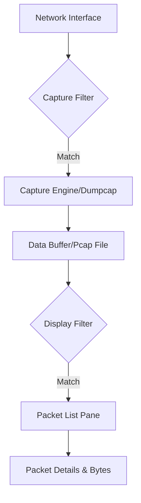

# Wireshark Cheat Sheet :simple-wireshark: :wireless:

Wireshark là công cụ phân tích giao thức mạng mạnh mẽ nhất thế giới. Tài liệu này cung cấp các từ khóa, cú pháp bộ lọc và các kỹ thuật phân tích chuyên sâu.

<!--more-->

!!! info "Định nghĩa"
    Wireshark hoạt động bằng cách bắt các gói tin (packets) đi qua một giao diện mạng (Network Interface) và giải mã chúng sang định dạng con người có thể đọc được.

---

## 1. Quy trình xử lý gói tin (Packet Flow)

Cần hiểu cách Wireshark tiếp nhận dữ liệu để đặt bộ lọc đúng vị trí.



---

## 2. Capture Filters (Bộ lọc khi bắt)

Bộ lọc này sử dụng cú pháp **BPF (Berkeley Packet Filter)**. Nó được thiết lập *trước* khi bắt đầu quá trình capture để giảm tải cho CPU và ổ đĩa.

!!! warning "Lưu ý"
    Nếu một gói tin bị loại bởi Capture Filter, nó sẽ không bao giờ xuất hiện trong file pcap.

### Cú pháp cơ bản
`[not] primitive [and|or] primitive`

| Primitive | Ví dụ | Giải thích |
| :--- | :--- | :--- |
| **host** | `host 192.168.1.1` | Bắt lưu lượng đi/đến từ IP này |
| **net** | `net 192.168.1.0/24` | Bắt lưu lượng trong dải mạng |
| **port** | `port 80` | Bắt cổng 80 (cả TCP và UDP) |
| **portrange** | `portrange 1-1024` | Bắt một dải cổng |
| **proto** | `icmp` | Bắt giao thức cụ thể (tcp, udp, icmp, arp) |
| **src / dst** | `src host 10.0.0.5` | Chỉ định nguồn hoặc đích |

### Ví dụ nâng cao
=== "Lọc hỗn hợp"
    ```bash
    host 192.168.1.10 and port 443
    ```
=== "Loại bỏ nhiễu"
    ```bash
    not arp and not port 53
    ```
=== "Lọc theo dải IP"
    ```bash
    src net 172.16.0.0/16 and (dst port 80 or dst port 443)
    ```

---

## 3. Display Filters (Bộ lọc khi hiển thị)

Đây là công cụ mạnh nhất của Wireshark, dùng để lọc dữ liệu *sau* khi đã capture.

### Toán tử so sánh & logic

| English | Ký hiệu | Ý nghĩa |
| :--- | :--- | :--- |
| **eq** | `==` | Bằng |
| **ne** | `!=` | Khác |
| **gt** | `>` | Lớn hơn |
| **lt** | `<` | Nhỏ hơn |
| **ge** | `>=` | Lớn hơn hoặc bằng |
| **le** | `<=` | Nhỏ hơn hoặc bằng |
| **and** | `&&` | Và (cả 2 điều kiện) |
| **or** | `||` | Hoặc (1 trong 2) |
| **not** | `!` | Phủ định |

### Các bộ lọc phổ biến theo tầng (Layers)

??? details "Tầng liên kết dữ liệu (Data Link Layer)"
    - `eth.addr == 00:70:f4:23:18:c4`: Lọc theo địa chỉ MAC.
    - `eth.src == 00:70:f4:23:18:c4`: MAC nguồn.
    - `eth.type == 0x0800`: Lọc các gói tin IPv4.

??? details "Tầng mạng (Network Layer - IP/ICMP)"
    - `ip.addr == 10.0.0.1`: Lọc IP bất kể nguồn/đích.
    - `ip.src == 10.0.0.1` and `ip.dst == 10.0.0.2`: Lọc cặp IP cụ thể.
    - `ip.ttl < 10`: Tìm các gói tin có TTL thấp (thường dùng trong traceroute).
    - `icmp.type == 8`: Các gói ICMP Echo Request (Ping).

??? details "Tầng vận chuyển (Transport Layer - TCP/UDP)"
    - `tcp.port == 80`: Lọc cổng TCP 80.
    - `udp.port == 53`: Lọc truy vấn DNS.
    - `tcp.flags.syn == 1`: Tìm các gói tin khởi tạo kết nối (SYN).
    - `tcp.flags.reset == 1`: Tìm các kết nối bị ngắt đột ngột (RST).
    - `tcp.analysis.retransmission`: Tìm các gói tin bị truyền lại (chỉ dấu của nghẽn mạng).

??? details "Tầng ứng dụng (Application Layer - HTTP/DNS/TLS)"
    - `http.request.method == "GET"`: Tìm các yêu cầu GET.
    - `http.response.code == 404`: Tìm các lỗi Page Not Found.
    - `dns.qry.name contains "google"`: Tìm các truy vấn DNS chứa từ khóa.
    - `tls.handshake.type == 1`: Tìm gói TLS Client Hello.

---

## 4. Phân tích luồng (Stream Analysis)

Wireshark có khả năng gộp các gói tin lẻ tẻ thành một hội thoại hoàn chỉnh.

### Follow Stream
Chuột phải vào một gói tin -> **Follow** -> **TCP/UDP/HTTP Stream**.
- **Màu đỏ:** Dữ liệu từ Client gửi đi.
- **Màu xanh:** Dữ liệu từ Server phản hồi.

### TCP Window & Sequence Numbers
- `tcp.seq`: Số thứ tự gói tin (dùng để ghép dữ liệu).
- `tcp.ack`: Số xác nhận đã nhận dữ liệu.
- `tcp.window_size`: Khả năng nhận dữ liệu còn lại của thiết bị (nếu = 0 là nghẽn).

---

## 5. Các phím tắt thần thánh (Shortcuts)

| Phím tắt | Chức năng |
| :--- | :--- |
| `Ctrl + K` | Mở menu Capture Options |
| `Ctrl + E` | Bắt đầu/Dừng capture |
| `Ctrl + R` | Reload file capture hiện tại |
| `Ctrl + F` | Tìm kiếm gói tin (bằng string, hex, display filter) |
| `Ctrl + G` | Đi đến gói tin số X |
| `Ctrl + Shift + O` | Mở tùy chọn Preferences |
| `Ctrl + Alt + Shift + T` | Mở bảng thống kê hội thoại (Conversations) |

---

## 6. Chẩn đoán chuyên sâu (Expert Info)

Wireshark tự động phân tích các dấu hiệu bất thường trong mạng và phân loại:

| Level | Ý nghĩa |
| :--- | :--- |
| **Chat** | Các luồng giao tiếp thông thường (SYN, FIN). |
| **Note** | Các sự kiện đáng chú ý (HTTP 200 OK). |
| **Warn** | Các lỗi nhỏ (TCP Retransmission, Window Full). |
| **Error** | Các lỗi nghiêm trọng (Mã lỗi 4xx, 5xx, Checksum error). |

!!! tip "Cách truy cập"
    Nhấp vào biểu tượng hình tròn màu ở góc dưới bên trái thanh trạng thái hoặc vào menu `Analyze -> Expert Information`.

---

## 7. Giải mã lưu lượng mã hóa (TLS/SSL Decryption)

Để đọc được nội dung HTTPS, bạn cần cung cấp Key Log File.

1.  **Thiết lập biến môi trường (Windows/Linux):** `SSLKEYLOGFILE=C:\path\to\sslkeylog.log`.
2.  **Trong Wireshark:** `Edit -> Preferences -> Protocols -> TLS`.
3.  **Pre-Master-Secret log filename:** Trỏ tới file `.log` trên.

---

## 8. TShark - Wireshark dòng lệnh

Dành cho việc tự động hóa hoặc chạy trên server không có giao diện (GUI).

```bash
# Bắt gói tin trên interface eth0 và lưu vào file
tshark -i eth0 -w output.pcap

# Đọc file và lọc theo IP
tshark -r output.pcap -Y "ip.addr == 192.168.1.1"

# Chỉ trích xuất các trường cụ thể (ví dụ: HTTP Host)
tshark -r capture.pcap -T fields -e http.host -e ip.src
```

---

## 9. Thủ thuật "Pro" để xử lý sự cố (Troubleshooting)

### Tìm độ trễ (Latency)
Sử dụng cột `Time Delta` để xem khoảng cách thời gian giữa các gói tin.
- `tcp.time_delta > 0.5`: Tìm các phản hồi TCP mất hơn 0.5 giây.

### Tìm các gói tin bị mất
- `tcp.analysis.lost_segment`: Chỉ ra rằng Wireshark thấy số Sequence nhảy cóc, chứng tỏ có gói bị mất giữa chừng.

### Lọc theo nội dung (String Matching)
- `frame contains "password"`: Tìm từ khóa "password" trong toàn bộ dữ liệu thô của gói tin.
- `http.authbasic`: Tìm các gói tin sử dụng xác thực Basic Auth (thường chứa base64 của user:pass).

---

## 10. Bảng tra cứu nhanh Field Names

| Protocol | Field Name | Mô tả |
| :--- | :--- | :--- |
| **IP** | `ip.version` | Phiên bản (4 hoặc 6) |
| **TCP** | `tcp.flags.push` | Cờ PSH (đẩy dữ liệu ngay) |
| **UDP** | `udp.length` | Độ dài payload UDP |
| **HTTP** | `http.user_agent` | Thông tin trình duyệt/thiết bị |
| **DNS** | `dns.flags.response == 0` | Là câu hỏi (Query) |
| **ARP** | `arp.opcode == 1` | ARP Request |

---

!!! note "Lời khuyên cuối"
    Để nắm sâu Wireshark, đừng chỉ học thuộc lòng bộ lọc. Hãy học về mô hình **OSI 7 lớp** và cách các giao thức (TCP, HTTP, TLS) thực hiện "bắt tay" (handshake). Khi hiểu bản chất giao thức, bạn sẽ tự biết mình cần lọc trường (field) nào.
