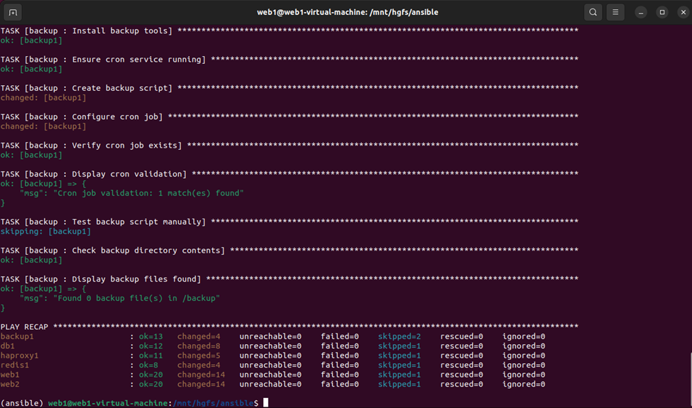

# NT132.Q11.ANTT-Group15 – Infrastructure Automation with Ansible



* Repository: [https://github.com/vuongdat67/NT132.Q11.ANTT-Group15](https://github.com/vuongdat67/NT132.Q11.ANTT-Group15)

---

## Overview

Project này tập trung vào việc **tự động hóa triển khai và cấu hình hệ thống** sử dụng **Ansible**, thay vì cấu hình thủ công.

Mục tiêu chính:

* triển khai hạ tầng nhanh chóng, đồng nhất
* giảm lỗi cấu hình thủ công
* xây dựng nền tảng **Infrastructure as Code (IaC)**

Trong môn Network and Systems Administration, automation là một hướng nâng cao so với các bài lab truyền thống như DHCP/DNS/Web server ([SVUIT][1])

---

## Motivation

Trong thực tế:

* cấu hình thủ công:

  * ❌ dễ sai
  * ❌ khó scale
  * ❌ khó reproduce

* hệ thống hiện đại yêu cầu:

  * automation
  * reproducibility
  * version control

Project này giải quyết bằng cách:

* viết playbook thay cho manual setup
* chuẩn hóa quy trình deploy

---

## Features

### ⚙️ Infrastructure as Code (IaC)

* Sử dụng Ansible để:

  * provisioning server
  * cấu hình dịch vụ
* Code hóa toàn bộ hệ thống

---

### 🔄 Automation Workflow

* Playbook tự động:

  * cài đặt package
  * cấu hình service
  * deploy hệ thống

---

### 🖥️ Multi-service Deployment

* Tự động triển khai:

  * Web server
  * Network services
  * System configuration

---

### 📦 Idempotent Execution

* Chạy nhiều lần không gây lỗi
* Đảm bảo trạng thái hệ thống nhất quán

👉 Đây là core concept của Ansible (rất quan trọng khi đi DevOps)

---

## Architecture

Hệ thống follow mô hình:

```text
Control Node (Ansible)
        ↓
Managed Nodes (Servers)
        ↓
Services (Web / Network / System)
```

* Control node: chạy playbook
* Managed nodes: server được cấu hình
* Không cần agent → dùng SSH

---

## Technical Highlights

### 1. Automation-first mindset

* Không cấu hình thủ công
* Tất cả đều qua script

---

### 2. Reproducibility

* Deploy lại hệ thống trong vài phút
* Không phụ thuộc môi trường

---

### 3. Scalable design

* Có thể mở rộng:

  * nhiều server
  * nhiều môi trường (dev/staging/prod)

---

### 4. DevOps alignment

* Gần với:

  * CI/CD
  * Infrastructure as Code
  * Configuration management

---

## Challenges

* Debug playbook khi lỗi (khó hơn manual)
* Quản lý dependency giữa các role
* Đảm bảo idempotency đúng

---

## Future Improvements

* Tách role rõ ràng (web, db, network)
* Tích hợp CI/CD pipeline
* Deploy lên cloud (AWS / Azure)
* Kết hợp với Terraform

---

## Conclusion

Project này thể hiện rõ:

* tư duy **automation & DevOps**
* khả năng chuyển:

  * manual config → code
* nền tảng cho:

  * System Engineer
  * DevOps Engineer
  * Cloud Engineer

---

## 📌 One-line showcase

> Automated infrastructure provisioning and configuration using Ansible, enabling reproducible and scalable system deployment.

