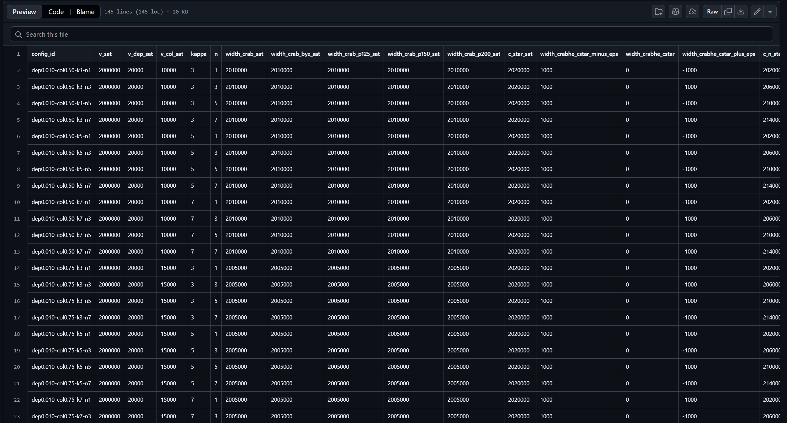

# CRAB-He – Bitcoin HTLC Protocol Implementation



* Repository: [https://github.com/vuongdat67/NT547_G6/tree/Dat](https://github.com/vuongdat67/NT547_G6/tree/Dat)

---

## Overview

CRAB-He là một **proof-of-concept implementation** của giao thức thanh toán nâng cao trên Bitcoin, kết hợp giữa:

* **HTLC (Hash Time-Locked Contract)**
* **Taproot script-path spending**
* **Linked revocation & collateral mechanism**

Project tập trung vào việc:

* hiện thực hóa protocol ở mức transaction-level
* kiểm chứng bằng **on-chain execution (regtest & signet)**
* sinh artifact phục vụ nghiên cứu và publication

---

## Motivation

Trong các hệ thống như Lightning Network:

* HTLC truyền thống gặp vấn đề:

  * collateral lock-up
  * griefing attack
  * inefficiency trong multi-hop

CRAB-He được thiết kế để:

* cải thiện cơ chế collateral
* tăng tính an toàn trong multi-party setting
* hỗ trợ nghiên cứu các biến thể HTLC nâng cao

---

## Features

### 🔗 Advanced HTLC Construction

* Implement HTLC logic với:

  * hash preimage condition
  * multi-party signature (2-of-2 Schnorr)
* Hỗ trợ **linked revocation mechanism**

---

### 🌳 Taproot Script Integration

* Sử dụng **Taproot single-UTXO design**
* Script tree gồm:

  * leaf-CRAB (hash condition)
  * leaf-linked (multi-condition + signatures)

---

### ⛓️ On-chain Execution

* Deploy và test trên:

  * Bitcoin **regtest**
  * Bitcoin **signet**
* Tạo transaction thật + mining block (regtest)

---

### 📊 Experiment & Evaluation Pipeline

* Parameter sweep (multi-hop, collateral threshold)
* Coalition analysis (multi-party adversary model)
* Baseline comparison:

  * MAD-HTLC
  * He-HTLC
  * CRAB standalone

---

### 📦 Artifact Generation

* Xuất dữ liệu:

  * JSON / CSV / LaTeX tables
* Sinh:

  * publication-ready tables
  * SVG figures
* Đồng bộ trực tiếp với paper

---

## Architecture

Cấu trúc project:

```text
cmd/                → CLI tools (main, experiments, orchestration)
internal/
  channel/          → transaction & parameter logic
  htlc/             → HTLC implementation
scripts/            → deployment & automation scripts
artifacts/          → on-chain results & experiment outputs
```

---

## Technical Highlights

### 1. Protocol-level Implementation

* Không chỉ simulate → mà:

  * tạo transaction thật
  * broadcast lên network

---

### 2. Taproot & Script-path Spending

* Sử dụng Schnorr signature + control block
* Thực thi script-path witness:

```text
<sig_B> <sig_A> <pre_b> <r^j_a> <script> <control_block>
```

---

### 3. On-chain Verification

* Có bằng chứng thực:

  * TxID trên regtest & signet
* Không phải mock → là execution thật

---

### 4. Research-grade Experimentation

* Parameter grid + seed orchestration
* Multi-hop analysis (n = 1,3,5,7)
* Coalition feasibility evaluation

---

### 5. Publication Pipeline

* Generate:

  * LaTeX tables
  * SVG figures
* Sync trực tiếp với paper → cực hiếm ở project sinh viên

---

## Security & Research Value

Project này chạm vào:

* ⚡ Payment channel security
* ⚡ Adversarial model (coalition attack)
* ⚡ Collateral optimization

👉 Đây là các vấn đề đang được nghiên cứu trong blockchain scaling

---

## Challenges

* Làm việc với Bitcoin script & Taproot (rất low-level)
* Debug transaction trên regtest/signet
* Đồng bộ logic giữa protocol → implementation → experiment

---

## Future Improvements

* Tích hợp vào Lightning-like network simulation
* Benchmark chi phí (fee, latency)
* Formal verification (protocol correctness)
* Visualization transaction flow

---

## Conclusion

CRAB-He là một project thể hiện:

* khả năng **implement protocol blockchain thực tế**
* tư duy **research + engineering kết hợp**
* kinh nghiệm với:

  * Bitcoin internals
  * Taproot
  * HTLC nâng cao

---

## 📌 One-line showcase

> Implemented and validated an advanced HTLC-based Bitcoin protocol using Taproot, with on-chain execution, multi-hop analysis, and publication-ready evaluation pipeline.

