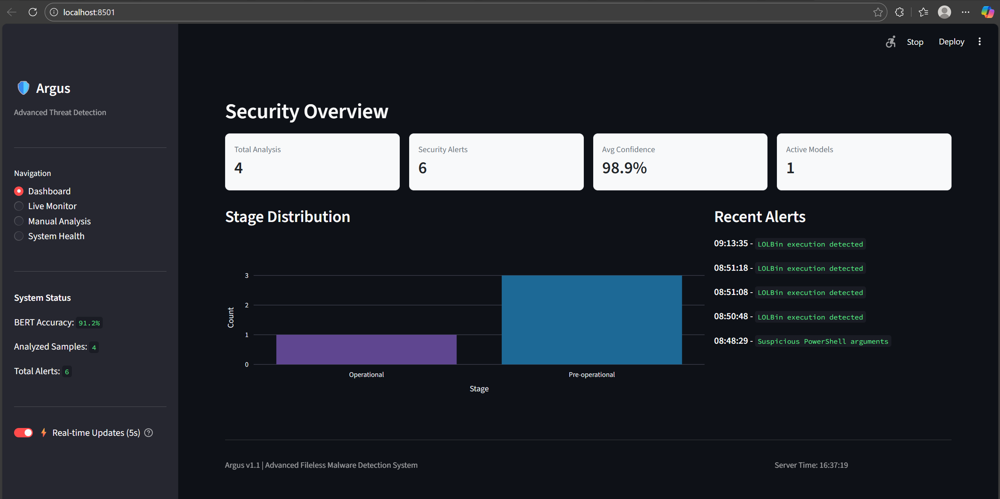

# NT230_FileLess – Fileless Malware Simulation & Analysis



* Repository: [https://github.com/vuongdat67/NT230_FileLess](https://github.com/vuongdat67/NT230_FileLess)

---

## Overview

NT230_FileLess là một project tập trung vào việc **mô phỏng và nghiên cứu kỹ thuật Fileless Malware** — một dạng tấn công không ghi file xuống disk, mà thực thi trực tiếp trong memory.

Project hướng tới:

* hiểu cách attacker bypass detection truyền thống
* phân tích kỹ thuật in-memory execution
* xây dựng môi trường thử nghiệm cho nghiên cứu malware

---

## Motivation

Trong thực tế:

* Antivirus truyền thống:

  * phụ thuộc vào file signature
* Fileless malware:

  * ❌ không tạo file
  * ❌ khó detect bằng scan thông thường

👉 Đây là kỹ thuật được sử dụng nhiều trong:

* APT attacks
* Red team / penetration testing

Project này nhằm:

* tái hiện kỹ thuật attacker
* giúp hiểu rõ cách phòng thủ (Blue Team)

---

## Features

### 🧠 Fileless Execution

* Thực thi payload trực tiếp trong memory
* Không ghi file xuống disk
* Giảm footprint trên hệ thống

---

### 🔐 Offensive Techniques

* Injection / reflective loading
* Script-based execution (PowerShell / memory loader)
* Payload staging

---

### 🔍 Analysis & Observation

* Theo dõi hành vi runtime
* Quan sát process / memory behavior
* Phục vụ nghiên cứu detection

---

### 🧪 Lab Environment

* Môi trường test cô lập
* Dễ dàng reproduce attack scenario
* Phù hợp cho học tập và nghiên cứu

---

## Technical Highlights

### 1. Fileless Malware Concept

* Execution trong RAM thay vì filesystem
* Tránh bị phát hiện bởi signature-based AV

---

### 2. Attack Simulation

* Mô phỏng workflow attacker:

  * load payload
  * execute in-memory
  * persist (optional)

---

### 3. Security Learning Value

* Hiểu rõ:

  * cách malware hoạt động
  * cách hệ thống bị bypass

👉 Đây là kiến thức quan trọng cho:

* Malware Analyst
* Red Team
* Blue Team

---

## Architecture

Flow cơ bản:

```text
Payload → Loader → Memory Execution → Runtime Behavior
```

* Payload: mã độc / shellcode
* Loader: inject hoặc load vào memory
* Execution: chạy trực tiếp trong RAM

---

## Security Considerations

* ⚠️ Chỉ dùng trong môi trường lab
* ⚠️ Không chạy trên hệ thống production
* ✔️ Phục vụ mục đích học tập và nghiên cứu

---

## Challenges

* Debug memory execution (khó hơn file-based)
* Tránh crash process khi inject
* Hiểu low-level OS behavior

---

## Future Improvements

* Tích hợp process hollowing / DLL injection nâng cao
* Hook detection (EDR simulation)
* Memory forensics (Volatility integration)
* Visualization attack flow

---

## Conclusion

NT230_FileLess thể hiện:

* hiểu biết sâu về **malware techniques hiện đại**
* khả năng mô phỏng **real-world attack**
* nền tảng quan trọng cho:

  * Malware Analysis
  * Red Team
  * Threat Detection

---

## 📌 One-line showcase

> Simulated fileless malware techniques with in-memory execution to study modern attack evasion and detection challenges.

