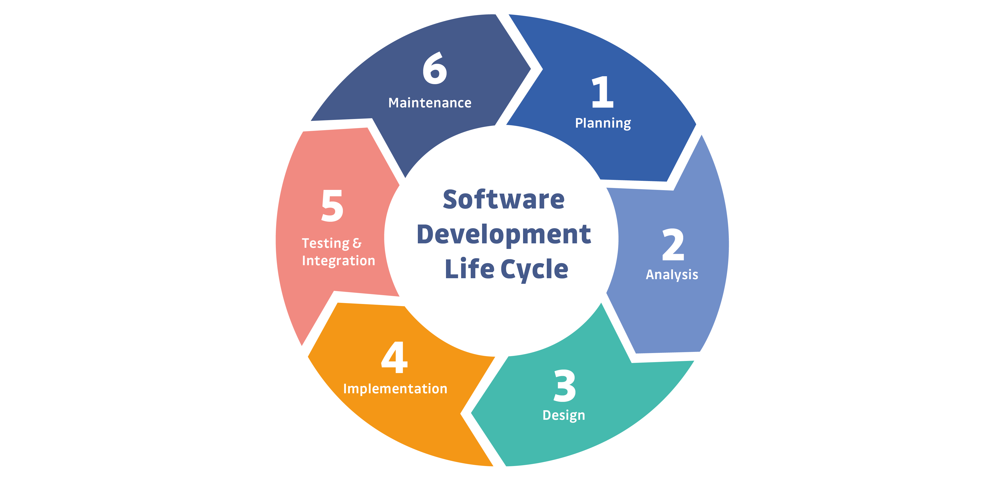

# MCP SSDLC – AI-driven Secure SDLC Framework



* Repository: [https://github.com/vuongdat67/mcp_ssdlc](https://github.com/vuongdat67/mcp_ssdlc)

---

## Overview

MCP SSDLC là một hệ thống **Model Context Protocol (MCP) server** được thiết kế để:

> tích hợp **AI vào toàn bộ Secure Software Development Life Cycle (SSDLC)**

Project xây dựng một pipeline cho phép:

* AI agent tương tác với hệ thống security
* tự động phân tích bảo mật theo từng phase SDLC
* đưa ra recommendation và detection theo ngữ cảnh

---

## Motivation

Trong thực tế phát triển phần mềm:

* Security thường:

  * ❌ bị bỏ qua ở giai đoạn early
  * ❌ phụ thuộc manual review
  * ❌ thiếu integration trong workflow dev

Trong khi đó:

* AI (LLM) có khả năng:

  * hiểu ngữ cảnh hệ thống
  * reasoning về security risk

👉 Project này kết hợp:

* **SSDLC (security process)**
* **MCP (AI-agent protocol)**

để biến security thành **continuous & automated**

---

## Features

### 🔄 Full SSDLC Integration

* Cover toàn bộ lifecycle:

  * Requirement analysis
  * Design review
  * Secure coding
  * Testing
  * Deployment

---

### 🧠 AI-driven Security Analysis

* AI agent gọi MCP tools
* Phân tích:

  * security requirement
  * threat surface
  * code risk

---

### 🧩 Modular MCP Tool System

* Tool-based architecture:

  * `analyze_requirement`
  * `threat_model`
  * `secure_code_check`
  * `security_test`

---

### ⚙️ Continuous Security Feedback

* Feedback real-time cho dev
* Hoạt động giống:

  * security linting system

---

### 🔐 Threat Modeling Support

* Mapping:

  * asset → threat → impact
* Có thể mở rộng:

  * STRIDE
  * attack modeling

---

## Architecture

Pipeline tổng thể:

```text
Developer / AI Agent
        ↓
MCP Server (SSDLC Core)
        ↓
Security Tools (analysis / rules)
        ↓
Findings + Recommendations
```

---

## Technical Highlights

### 1. Security-first System Design

* Thiết kế xoay quanh SSDLC
* Không phải tool đơn lẻ → mà là **framework**

---

### 2. MCP-based AI Integration

* Chuẩn hóa giao tiếp giữa:

  * AI agent ↔ security system
* Tách biệt logic:

  * orchestration vs execution

---

### 3. Context-aware Security Analysis

* Phân tích dựa trên:

  * phase SDLC
  * loại artifact (code, requirement, config)

---

### 4. Extensible Tooling Layer

* Dễ dàng thêm:

  * scanner mới
  * rule mới
  * integration mới

---

### 5. DevSecOps-ready Architecture

* Có thể tích hợp:

  * CI/CD pipeline
  * automated security gate

---

## Security & Safety

* Không thực thi code nguy hiểm
* Phân tích ở mức:

  * static
  * logic
  * metadata

---

## Challenges

* Mapping AI reasoning → security rule chính xác
* Tránh false positives trong automation
* Thiết kế abstraction phù hợp cho MCP tools

---

## Future Improvements

* Tích hợp:

  * OWASP Top 10 ruleset
* Risk scoring (CVSS-like)
* Policy engine (OPA / Rego)
* Dashboard visualization

---

## Conclusion

MCP SSDLC thể hiện:

* khả năng **thiết kế hệ thống security end-to-end**
* tư duy **AI + DevSecOps integration**
* kinh nghiệm với:

  * SSDLC
  * MCP / AI agents
  * security automation

---

## 📌 One-line showcase

> Built an AI-driven SSDLC framework using MCP, enabling continuous, context-aware security analysis across the entire software development lifecycle.

