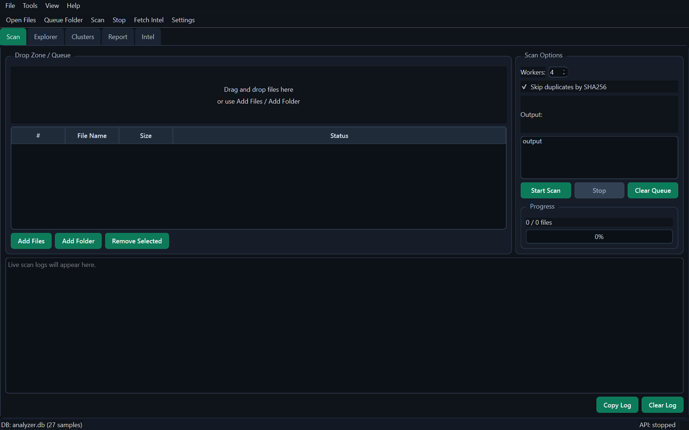

# Malware Static Analyzer

* Repository: [https://github.com/vuongdat67/NT137_G5](https://github.com/vuongdat67/NT137_G5)

---

## Overview

Malware Static Analyzer là một công cụ desktop viết bằng Python, phục vụ **phân tích mã độc tĩnh (static analysis)** cho cả Windows và Android.

Project được xây dựng với mục tiêu:

* hỗ trợ **triage malware nhanh**
* trích xuất feature phục vụ **machine learning**
* xây dựng dataset nội bộ cho nghiên cứu và phân tích

Đây không chỉ là một tool đơn lẻ, mà là một **mini platform cho malware analysis pipeline**.

---

## Motivation

Trong thực tế Blue Team / SOC:

* việc phân tích mẫu malware thường:

  * tốn thời gian
  * thiếu tool tích hợp
* dữ liệu phân tán → khó build dataset

Tool này được xây dựng để:

* tự động hóa quá trình phân tích tĩnh
* chuẩn hóa feature extraction
* hỗ trợ ingest threat intel từ bên ngoài (MalwareBazaar)

---

## Features

### 🔍 Static Analysis

* Hỗ trợ nhiều định dạng: **PE, APK, ELF-like**
* Hashing đa dạng:

  * MD5, SHA1, SHA256
  * TLSH, ssdeep, imphash
* String extraction + URL/IP detection

---

### 🧠 Feature Extraction

* CFG metrics (nodes, edges, cyclomatic complexity)
* Opcode profiling
* API import analysis
* Packer detection (UPX, MPRESS, ASPACK, PETITE, entropy)

---

### 🌐 Threat Intelligence Integration

* Fetch metadata từ **MalwareBazaar**
* Download sample (ZIP protected)
* Auto-scan sau khi ingest

---

### 📊 Dataset & Workflow

* Local database quản lý sample
* Export dataset:

  * JSONL / CSV
* Filtering, tagging, deduplication
* Report generation (HTML/PDF)

---

### 🖥️ Interface & UX

* GUI desktop (dark high-contrast theme)
* CLI đầy đủ cho automation
* Logging tập trung (console + rotating file)

---

## Architecture

Project được thiết kế theo hướng modular:

* `main.py`: entrypoint CLI + GUI
* `malware_analyzer/`: core logic
* `scripts/`: benchmark & tooling
* `tests/`: test skeleton
* `output/`: artifacts + database
* `malware_samples/`: sample storage

---

## Technical Highlights

### 1. Multi-mode operation

* CLI → automation / batch processing
* GUI → analyst workflow

---

### 2. Data pipeline

* Scan → Extract feature → Store → Export → Train ML

---

### 3. ML Integration

* Training pipeline từ dataset nội bộ
* Security gate model (recall-oriented)
* Class balancing cho production use

---

### 4. Cross-platform support

* Windows / Linux / macOS
* Dependency handling theo OS

---

## Security Considerations

* ✔️ **Static analysis only** → không thực thi malware
* ✔️ Tách riêng thư mục sample
* ✔️ Hỗ trợ xử lý archive an toàn
* ⚠️ Khuyến nghị môi trường sandbox khi làm việc

---

## Challenges

* Xử lý nhiều định dạng binary khác nhau
* Cân bằng giữa tốc độ scan và độ chính xác
* Chuẩn hóa feature để dùng cho ML
* Đồng bộ workflow giữa GUI và CLI

---

## Future Improvements

* Tích hợp YARA rules nâng cao
* Dynamic analysis (sandbox integration)
* Visualization (call graph, behavior graph)
* Integration với SIEM / SOC pipeline

---

## Conclusion

Malware Static Analyzer là một project thể hiện rõ:

* tư duy **Blue Team / Malware Analysis**
* khả năng xây dựng **tool end-to-end**
* kết hợp giữa:

  * security
  * data engineering
  * machine learning

---

## 📌 One-line showcase

> Built a cross-platform malware static analysis tool with feature extraction, threat intel integration, and ML-ready dataset pipeline.

