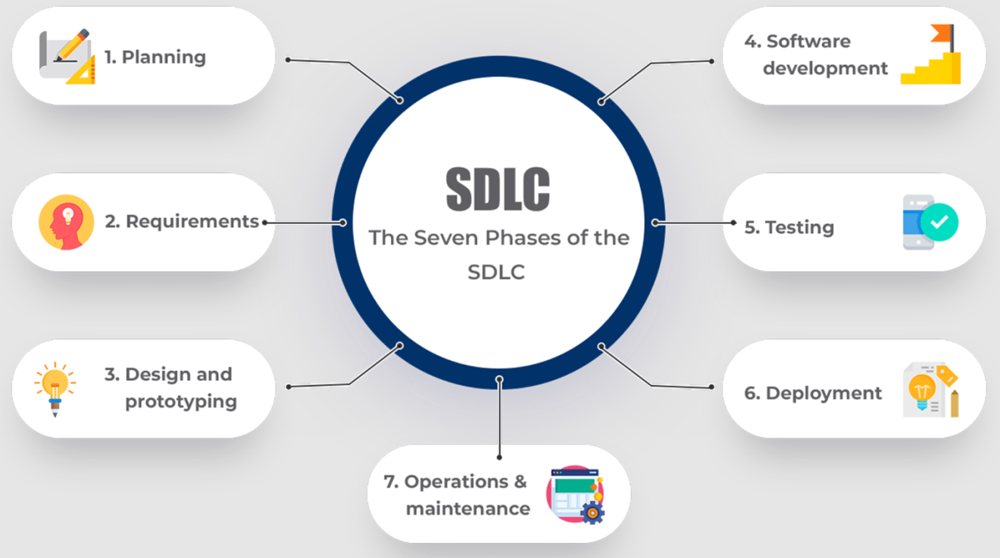

# MCP SSDLC Security Toolkit – Modular Security Engine



* Repository: [https://github.com/vuongdat67/mcp-ssdlc-security-toolkit](https://github.com/vuongdat67/mcp-ssdlc-security-toolkit)

---

## Overview

MCP SSDLC Security Toolkit là một bộ **security tools dạng modular** được thiết kế để:

> cung cấp các capability bảo mật cho MCP SSDLC framework

Project tập trung vào:

* xây dựng các security module độc lập
* plug-and-play vào MCP server
* hỗ trợ nhiều loại phân tích bảo mật

---

## Motivation

Trong hệ thống security:

* Tool thường:

  * ❌ hardcode
  * ❌ khó reuse
  * ❌ khó mở rộng

Cần một approach:

* modular
* scalable
* dễ integrate với AI system

👉 Project này giải quyết bằng:

* **plugin-based security toolkit**

---

## Features

### 🧩 Plugin-based Architecture

* Mỗi tool là một module độc lập
* Dễ dàng:

  * thêm / remove
  * reuse

---

### 🔍 Static Code Analysis

* Detect:

  * hardcoded secrets
  * unsafe patterns
  * injection risk

---

### ⚙️ Configuration Security Check

* Phát hiện:

  * debug mode
  * exposed config
  * misconfiguration

---

### 🧪 Input Validation Engine

* Phân tích:

  * user input
  * API payload
* Detect:

  * injection vectors

---

### 🧠 Threat Detection Utilities

* Mapping attack pattern cơ bản
* Có thể mở rộng:

  * log analysis
  * anomaly detection

---

## Architecture

```text
MCP Server
    ↓
Security Toolkit
    ├── Code Scanner
    ├── Config Checker
    ├── Input Validator
    ├── Threat Analyzer
    ↓
Aggregated Results
```

---

## Technical Highlights

### 1. Modular Security Design

* Tool = atomic unit
* Phù hợp với:

  * microservice mindset
  * plugin ecosystem

---

### 2. MCP Tool Integration

* Expose tools dạng:

  * `scan_code`
  * `check_config`
  * `analyze_input`

---

### 3. Reusable Security Components

* Có thể dùng độc lập ngoài MCP
* Dễ tích hợp vào project khác

---

### 4. Foundation for Security Platform

* Có thể evolve thành:

  * internal security tooling
  * DevSecOps platform

---

### 5. Extensible Detection Engine

* Dễ thêm:

  * rule-based detection
  * ML/AI-based detection

---

## Security & Safety

* Không thực thi payload độc hại
* Chỉ phân tích:

  * code
  * config
  * input

---

## Challenges

* Thiết kế abstraction đủ generic
* Cân bằng giữa flexibility và complexity
* Tránh duplication giữa các tools

---

## Future Improvements

* Dynamic analysis (runtime)
* Fuzzing integration
* CI/CD automation (GitHub Actions)
* Rule engine nâng cao

---

## Conclusion

MCP SSDLC Security Toolkit thể hiện:

* tư duy **modular security engineering**
* khả năng xây dựng:

  * reusable components
  * scalable architecture

---

## 📌 One-line showcase

> Developed a modular security toolkit with plugin-based architecture to enable reusable, scalable security analysis within an AI-driven SSDLC framework.

