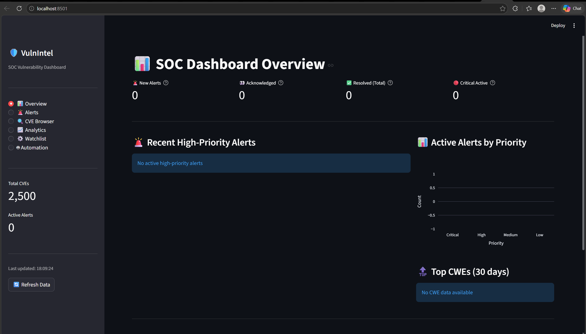

# Vulnerability Intelligence Aggregator



* Repository: [https://github.com/vuongdat67/Vulnerability-Intelligence-Aggregator](https://github.com/vuongdat67/Vulnerability-Intelligence-Aggregator)

---

## Overview

Vulnerability Intelligence Aggregator là một hệ thống thu thập, tổng hợp và phân tích **thông tin lỗ hổng (CVE, exploit, threat intel)** từ nhiều nguồn khác nhau.

Project được thiết kế như một **mini threat intelligence platform**, giúp:

* theo dõi lỗ hổng mới
* chuẩn hóa dữ liệu
* hỗ trợ phân tích và ưu tiên xử lý

Trong thực tế, các hệ thống vulnerability intelligence thường phải kết hợp nhiều nguồn dữ liệu để có cái nhìn đầy đủ hơn về rủi ro ([GitHub][1]).

---

## Motivation

Trong môi trường SOC / Blue Team:

* dữ liệu lỗ hổng nằm rải rác:

  * CVE (NVD, MITRE)
  * exploit database
  * threat feeds
* thiếu một hệ thống tập trung → khó:

  * correlation
  * prioritization
  * automation

Project này giải quyết bằng cách:

* gom dữ liệu về một nơi
* chuẩn hóa format
* hỗ trợ phân tích phục vụ decision-making

---

## Features

### 🌐 Data Aggregation

* Thu thập dữ liệu từ nhiều nguồn vulnerability / threat intel
* Hỗ trợ ingest CVE, exploit, metadata
* Chuẩn hóa dữ liệu về format thống nhất

---

### 📊 Vulnerability Intelligence

* Mapping giữa:

  * CVE
  * CWE
  * exploit / PoC
* Phân loại mức độ nghiêm trọng
* Hỗ trợ enrichment dữ liệu (context, metadata)

---

### 🔍 Search & Analysis

* Tìm kiếm lỗ hổng theo:

  * keyword
  * sản phẩm / vendor
  * severity
* Phân tích và lọc dữ liệu phục vụ triage

---

### ⚙️ Automation & Pipeline

* Xây dựng pipeline:

  * Fetch → Normalize → Store → Query
* Có thể mở rộng để:

  * alerting
  * dashboard
  * integration với SIEM

---

## Technical Highlights

### 1. Data Engineering for Security

* Xử lý dữ liệu từ nhiều nguồn không đồng nhất
* Chuẩn hóa schema → phục vụ downstream analysis

---

### 2. Vulnerability Correlation

* Liên kết:

  * CVE ↔ CWE ↔ exploit
* Giúp hiểu rõ:

  * mức độ ảnh hưởng
  * khả năng khai thác

---

### 3. Intelligence-driven Approach

* Không chỉ scan → mà còn:

  * enrich dữ liệu
  * hỗ trợ quyết định

👉 Đây là mindset đúng trong vulnerability management hiện đại

---

## Architecture

Hệ thống follow pipeline:

```
Data Sources → Collector → Normalizer → Database → Query / Analysis
```

* Collector: lấy dữ liệu từ API / feed
* Normalizer: chuẩn hóa dữ liệu
* Storage: lưu trữ tập trung
* Interface: truy vấn / hiển thị

---

## Security Context

Trong thực tế, việc ưu tiên xử lý lỗ hổng không chỉ dựa vào CVSS mà còn cần:

* exploit availability
* threat actor activity
* context hệ thống ([SOCRadar® Cyber Intelligence Inc.][2])

Project này là bước đầu để xây dựng hệ thống như vậy.

---

## Challenges

* Dữ liệu từ nhiều nguồn không đồng nhất
* Thiếu context nếu chỉ dùng CVE raw
* Đồng bộ dữ liệu theo thời gian thực

---

## Future Improvements

* Tích hợp EPSS / threat scoring
* Dashboard visualization (risk view)
* Alerting system (real-time CVE)
* Integration với SOC / SIEM pipeline
* ML-based prioritization

---

## Conclusion

Vulnerability Intelligence Aggregator thể hiện rõ:

* tư duy **Threat Intelligence / Blue Team**
* khả năng xây dựng **data pipeline cho security**
* hiểu bản chất của vulnerability management

---

## 📌 One-line showcase

> Built a vulnerability intelligence aggregation system that collects, normalizes, and correlates CVE and exploit data for security analysis and prioritization.

